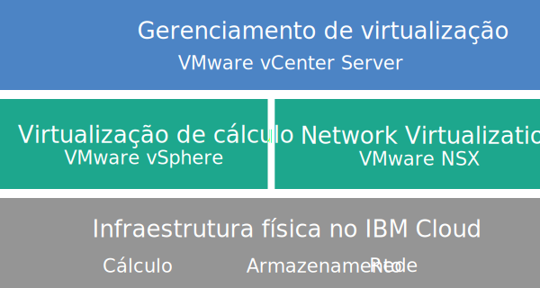

---

copyright:

  years:  2016, 2018

lastupdated: "2018-06-01"

---

# Visão geral do vCenter Server

O VMware vCenter Server on {{site.data.keyword.cloud}} é uma nuvem particular host que fornece a pilha do VMware vSphere como um serviço. O ambiente do VMware é construído no topo de um mínimo de dois (três é o recomendado) {{site.data.keyword.cloud_notm}} {{site.data.keyword.baremetal_short}}, oferece opções de armazenamento compartilhado conectado à rede e de armazenamento definido por software dedicado e inclui a implementação e a configuração automáticas de um firewall de limite lógico fácil de gerenciar que é desenvolvido pelo VMware NSX.

Em muitos casos, o ambiente inteiro pode ser provisionado em menos de um dia e a infraestrutura bare metal pode aumentar e diminuir rápida e elasticamente a capacidade de cálculo, conforme necessário.

Pós-implementação, é possível aumentar o armazenamento compartilhado pedindo compartilhamentos de arquivos NFS (Network File System) adicionais do {{site.data.keyword.slportal}} e conectá-los manualmente a todos os servidores ESXi em um cluster. Se você solicitar o armazenamento dedicado, o [NetApp ONTAP Select on IBM Cloud](../netapp/np_netappoverview.html) será oferecido nas configurações de alto desempenho (tudo SSD) e alta capacidade (tudo SATA).

VMware vSAN também está disponível como uma opção de armazenamento dedicado. Para aumentar a capacidade de armazenamento baseada em vSAN de um cluster vSAN, é possível incluir mais servidores ESXi após a implementação.

Se você tiver comprado a licença do VMware fornecida pela IBM, poderá fazer upgrade da edição do VMware NSX Base para Advanced ou Enterprise Edition e poderá comprar componentes adicionais do VMware, como VMware vRealize Operations.

Será possível incluir Serviços Gerenciados IBM se você quiser transferir as operações diárias e a manutenção da virtualização, o S.O. guest ou camadas de aplicativos. A equipe do IBM Cloud Professional Services também está disponível para ajudá-lo a acelerar sua jornada para a nuvem com os serviços de migração, implementação, planejamento e onboarding.

## Arquitetura do vCenter Server

O gráfico a seguir descreve a arquitetura de alto nível e os componentes de uma implementação do vCenter Server de três nós.

Figura 1. A arquitetura de alto nível do vCenter Server para um cluster de três nós

### Infraestrutura física

Esta camada fornece a infraestrutura física (recursos de cálculo, armazenamento e rede) a ser usada pela infraestrutura virtual.

### Infraestrutura de virtualização (cálculo e rede)

Esta camada virtualiza a infraestrutura física por meio de produtos VMware diferentes:
* O VMware vSphere virtualiza os recursos de cálculo físico.
* VMware NSX é a plataforma de virtualização de rede que fornece componentes de rede lógica e redes virtuais.

### Gerenciamento de virtualização

Esta camada consiste em vCenter Server Appliance (vCSA), NSX Manager, dois NSX ESGs, três NSX Controllers, dispositivo virtual Platform Services Controller (PSC) e máquina virtual IBM CloudDriver.

A oferta de base é implementada com um dispositivo vCenter Server que é dimensionado para suportar um ambiente com até 400 hosts e até 4000 VMs. As mesmas ferramentas e scripts compatíveis com o vSphere API podem ser usados para gerenciar o ambiente do VMware hospedado pela IBM.

No total, a oferta de base requer 38 vCPU e 67 GB de vRAM que são reservados para a camada de gerenciamento de virtualização. A capacidade restante do host para suas VMs depende de vários fatores, como a taxa de alocação excessiva, o dimensionamento da VM e os requisitos de desempenho de carga de trabalho.

<!-- For details about the architecture, read the _Reference documentation_ on the [Virtualization reference architecture](https://www.ibm.com/cloud/garage/content/architecture/virtualizationArchitecture/reference-architecture) page. -->

## VCenter Server especificações técnicas

Os componentes a seguir estão incluídos em sua instância do vCenter Server.

**Nota**: a disponibilidade e a precificação de configurações de hardware padronizadas podem variar com base no {{site.data.keyword.CloudDataCent_notm}} selecionado para implementação.

### Bare Metal Server

É possível pedir três ou mais {{site.data.keyword.baremetal_short}} com uma das configurações a seguir:
*  **Customizado**: {{site.data.keyword.baremetal_short}} com seu modelo de CPU selecionado e tamanho de RAM.   
   * Geração Intel Broadwell de 2 CPUs (Série Intel Xeon E5-2600 v4)
   * Geração Intel Skylake de 2 CPUs (série Intel Xeon 4100/5100/6100)

     **Nota:** se você planeja usar o armazenamento vSAN, a configuração requer quatro {{site.data.keyword.baremetal_short}}.
*  **Pré-configurado**: geração Intel Broadwell de 2 CPUs (série Intel Xeon E5-2600 v4)
   * **Pequeno** (Dual Intel Xeon E5-2620 v4/total de 16 núcleos, 2.1 GHz/128 GB de RAM/2 discos)
   * **Médio** (Dual Intel Xeon E5-2650 v4/total de 24 núcleos, 2.2 GHz/256 GB de RAM/2 discos)
   * **Grande** (Dual Intel Xeon E5-2690 v4/total de 28 núcleos, 2.6 GHz/512 GB de RAM/2 discos).

### Rede

Os componentes de rede a seguir são pedidos:
*  Uplinks duais de rede pública e privada de 10 Gbps
*  Três VLANs (Virtual LANs): uma VLAN pública e duas VLANs privadas
*  Uma VXLAN (Virtual eXtensible LAN) com DLR (Distributed Logical Router) para comunicação leste-oeste potencial entre cargas de trabalho locais conectadas a redes de camada 2 (L2). A VXLAN é implementada como uma topologia de roteamento de amostra, que pode ser modificada, usada para construção ou ser removida. Também é possível incluir zonas de segurança anexando VXLANs adicionais em novas interfaces lógicas no DLR.
*  Dois VMware NSX Edge Services Gateways:
  * Um serviço de gerenciamento seguro VMware NSX Edge Services Gateway (ESG) para tráfego de gerenciamento de saída HTTPS, que é implementado pela IBM como parte da tipologia de rede de gerenciamento. Este ESG é usado pelas máquinas virtuais de gerenciamento da IBM para se comunicar com componentes de gerenciamento externo específicos da IBM relacionados à automação. Para obter mais informações, veja [Configurando sua rede para usar o ESG gerenciado pelo cliente](../vcenter/vc_esg_config.html#configuring-your-network-to-use-the-customer-managed-nsx-esg-with-your-vms).

    **Importante**: esse ESG não está acessível e não pode ser usado. Se você modificá-lo, poderá não ser capaz de gerenciar a instância do vCenter Server do console do {{site.data.keyword.vmwaresolutions_short}}. Além disso, observe que usar um firewall ou desativar as comunicações ESG para os componentes de gerenciamento externo da IBM fará com que o {{site.data.keyword.vmwaresolutions_short}} se torne inutilizável.
  * Um VMware NSX Edge Services Gateway seguro e gerenciado pelo cliente para tráfego de carga de trabalho de entrada e saída HTTPS, que é implementado pela IBM como um modelo que pode ser modificado por você para fornecer acesso VPN ou acesso público. Para obter mais informações, veja [O NSX Edge gerenciado pelo cliente representa um risco de segurança?](../vmonic/faq.html#does-the-customer-managed-nsx-edge-pose-a-security-risk-)

### Virtual Server Instances

Os virtual server instances (VSIs) a seguir são pedidos:
* Um VSI for IBM CloudBuilder, que será encerrado depois que a implementação da instância for concluída.
* (Para instâncias V2.2 e mais recente) É possível escolher implementar um único VSI do Microsoft Windows Server para o Microsoft Active Directory (AD) ou duas VMs de alta disponibilidade do Microsoft Windows no cluster de gerenciamento para ajudar a aprimorar a segurança e robustez.
* (Para instâncias V1.9 a V2.1) Um VSI do Microsoft Windows Server para Microsoft Active Directory (AD), que funciona como o DNS para a instância na qual os hosts e as máquinas virtuais são registrados, é implementado e pode ser consultado.
* (Para instâncias V1.8 e anterior) Um VSI para o backup baseado em captura instantânea dos componentes de gerenciamento, que continua em execução depois que a implementação da instância é concluída.

### Armazenamento

Durante a implementação inicial, é possível escolher entre as opções de armazenamento vSAN e NFS.

A opção vSAN oferece configurações customizadas, com várias opções para tipo de disco e quantidade:
* Quantidade de disco: 2, 4, 6 ou 8
* Disco de armazenamento: SSD SED de 960 GB, SSD SED de 1,9 TB ou SSD SED de 3,8 TB.

  Além disso, também são pedidos 2 discos de cache de 960 GB por host.

  **Nota:** as unidades SSD (Solid State Disk) de 3,8 TB serão suportadas quando forem disponibilizadas geralmente em um data center.

A opção NFS oferece armazenamento compartilhado customizado no nível de arquivo para cargas de trabalho com várias opções para tamanho e desempenho:
* Tamanho: 1, 2, 4, 8 ou 12 TB
* Desempenho: 2, 4 ou 10 IOPS/GB.
* Configuração individual de compartilhamentos de arquivos.

Se você escolher a opção NFS, serão pedidos os seguintes compartilhamentos de arquivos:
* Um compartilhamento de arquivo de 2 TB, 4 IOPS/GB para componentes de gerenciamento.
* Um armazenamento de nível de bloco compartilhado de 2 TB para backups, que pode ter a capacidade aumentada até 12 TB. É possível escolher se você deseja armazenamento para backups selecionando um serviço de backup.

### Licenças (fornecidas pela IBM ou BYOL) e taxas

* VMware vSphere Enterprise Plus 6.5u1
* VMware vCenter Server 6.5
* VMware NSX Service Providers Edition (Base, Advanced ou Enterprise) 6.3
* (Para clusters do vSAN) VMware vSAN Advanced ou Enterprise 6.6
* Taxa de suporte e serviços (uma licença por nó)

## Componentes do nó de expansão do vCenter Server

Cada nó de expansão do vCenter Server implementará e incorrerá em encargos para os componentes a seguir em sua conta do {{site.data.keyword.cloud_notm}}.

### Hardware para nós de expansão

Um Bare Metal Server com a configuração apresentada na seção _Especificações técnicas do vCenter Server_ na [Visão geral do vCenter Server](vc_vcenterserveroverview.html).

### Licenças e taxas para os nós de expansão

* Um VMware vSphere Enterprise Plus 6.5u1
* Um VMware NSX Service Providers Edition (Base, Advanced ou Enterprise) 6.3
* Uma taxa de suporte e de serviços
* (Para clusters do vSAN) VMware vSAN Advanced ou Enterprise 6.6

**Importante**: deve-se gerenciar os componentes do {{site.data.keyword.vmwaresolutions_short}} criados em sua conta do {{site.data.keyword.cloud_notm}} apenas por meio do console do {{site.data.keyword.vmwaresolutions_short}}, não do {{site.data.keyword.slportal_full}} ou de qualquer outro meio fora do console. Se você mudar esses componentes fora do console do {{site.data.keyword.vmwaresolutions_short}}, as mudanças não serão sincronizadas com o console.

**CUIDADO**: gerenciar quaisquer componentes do {{site.data.keyword.vmwaresolutions_short}} que foram instalados em sua conta do {{site.data.keyword.cloud_notm}} quando você pediu a instância, fora do console do {{site.data.keyword.vmwaresolutions_short}} pode desestabilizar seu ambiente. Estas atividades de gerenciamento incluem:
*  Incluindo, modificando, retornando ou removendo componentes
*  Expandindo ou contraindo a capacidade da instância por meio da inclusão ou remoção de servidores ESXi
*  Desativando componentes
*  Reiniciando os serviços

   As exceções a essas atividades incluem o gerenciamento de compartilhamentos de arquivos de armazenamento compartilhado por meio do {{site.data.keyword.slportal}}. Essas atividades incluem: pedido, exclusão (que poderá afetar armazenamentos de dados, se montado), autorização e montagem de compartilhamentos de arquivos de armazenamento compartilhados.

## Links relacionados

* [Lista de materiais do software vCenter Server](vc_bom.html)
* [Planejando instâncias do vCenter Server](vc_planning.html)
* [Pedindo instâncias do vCenter Server](vc_orderinginstance.html)
* [Armazenamento de arquivo e de bloco do {{site.data.keyword.cloud_notm}}](https://www.ibm.com/cloud/garage/content/architecture/virtualizationArchitecture/shared-storage){:new_window}
