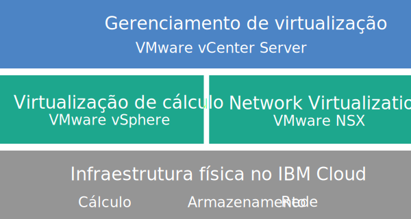

---

copyright:

  years:  2016, 2019

lastupdated: "2019-05-27"

keywords: vCenter Server, vCenter Server architecture, tech specs vCenter Server

subcollection: vmware-solutions

---

{:tip: .tip}
{:note: .note}
{:important: .important}

# Visão geral do vCenter Server
{: #vc_vcenterserveroverview}

O VMware vCenter Server on {{site.data.keyword.cloud}} é uma nuvem particular host que fornece a pilha do VMware vSphere como um serviço. O ambiente do VMware é construído sobre o {{site.data.keyword.cloud_notm}}{{site.data.keyword.baremetal_short}}, oferece armazenamento conectado à rede compartilhada e opções de armazenamento definidas pelo software dedicado e inclui a implementação e a configuração automáticas de um firewall de borda lógica fácil de gerenciar que é desenvolvido com o VMware NSX.

Em muitos casos, o ambiente inteiro pode ser provisionado em menos de um dia e a infraestrutura bare metal pode aumentar e diminuir rápida e elasticamente a capacidade de cálculo, conforme necessário.

Na pós-implementação, é possível aumentar o armazenamento compartilhado pedindo mais compartilhamentos de arquivos do Network File System (NFS) por meio do {{site.data.keyword.slportal}} e conectando-os manualmente a todos os servidores ESXi em um cluster. Se armazenamento dedicado for requerido, o [NetApp ONTAP Select on {{site.data.keyword.cloud_notm}}](/docs/services/vmwaresolutions/netapp?topic=vmware-solutions-np_netappoverview) será oferecido nas configurações de alto desempenho (todas SSD) e de alta capacidade (todas SATA).

VMware vSAN também está disponível como uma opção de armazenamento dedicado. Para aumentar a capacidade de armazenamento baseada em vSAN de um cluster vSAN, é possível incluir mais servidores ESXi após a implementação.

Se você comprou o licenciamento do VMware fornecido pela IBM, será possível fazer upgrade da edição Base do VMware NSX para a edição Advanced ou Enterprise e será possível comprar mais componentes do VMware, como o VMware vRealize Operations.

Será possível incluir o IBM Managed Services se você quiser transferir as operações diárias e a manutenção da virtualização, do S.O. guest ou das camadas de aplicativo. A equipe do {{site.data.keyword.cloud_notm}} Professional Services também está disponível para ajudá-lo a acelerar sua jornada para a nuvem com serviços de migração, implementação, planejamento e onboarding.

## Arquitetura do vCenter Server
{: #vc_vcenterserveroverview-archi}

O gráfico a seguir descreve a arquitetura de alto nível e os componentes de uma implementação do vCenter Server de três nós.

### Infraestrutura física
{: #vc_vcenterserveroverview-physical-infras}

Esta camada fornece a infraestrutura física (recursos de cálculo, armazenamento e rede) a ser usada pela infraestrutura virtual.

### Infraestrutura de virtualização (cálculo e rede)
{: #vc_vcenterserveroverview-virtualization-infras}

Esta camada virtualiza a infraestrutura física por meio de produtos VMware diferentes:
* O VMware vSphere virtualiza os recursos de cálculo físico.
* VMware NSX é a plataforma de virtualização de rede que fornece componentes de rede lógica e redes virtuais.

### Gerenciamento de virtualização
{: #vc_vcenterserveroverview-virtualization-mgmt}

Essa camada consiste no vCenter Server Appliance (vCSA) com o Platform Services Controller (PSC) integrado, no NSX Manager, em dois NSX ESGs, em três NSX Controllers e na instância de servidor virtual do IBM CloudDriver (VSI). A VSI do CloudDriver é implementada sob demanda conforme necessário para determinadas operações, como inclusão de hosts no ambiente.

A oferta de base é implementada com um dispositivo vCenter Server que é dimensionado para suportar um ambiente com até 400 hosts e até 4000 MVs. As mesmas ferramentas e scripts compatíveis com o vSphere API podem ser usados para gerenciar o ambiente do VMware hospedado pela IBM.

No total, a oferta de base requer 38 vCPU e 67 GB de vRAM que são reservados para a camada de gerenciamento de virtualização. A capacidade restante do host para suas MVs depende de vários fatores, como a taxa de alocação excessiva, o dimensionamento da MV e os requisitos de desempenho de carga de trabalho.

Para obter mais informações sobre a arquitetura, consulte [Referência de arquitetura do {{site.data.keyword.vmwaresolutions_short}}](/docs/services/vmwaresolutions/archiref/solution?topic=vmware-solutions-solution_overview).

## Especificações técnicas para instâncias do vCenter Server
{: #vc_vcenterserveroverview-specs}

Os componentes a seguir estão incluídos em sua instância do vCenter Server.

A disponibilidade e a precificação de configurações padronizadas de hardware podem variar com base no {{site.data.keyword.CloudDataCent_notm}} que é selecionado para implementação.
{:note}

### Bare Metal Server
{: #vc_vcenterserveroverview-bare-metal}

É possível pedir três ou mais {{site.data.keyword.baremetal_short}} com uma das configurações a seguir:
* **Skylake**: servidores de geração do Intel Skylake de 2 CPUs (série Intel Xeon 4100/5100/6100) com o seu modelo de CPU selecionado e o tamanho de RAM.
* **Certificado pela SAP**: servidores de geração Intel Skylake ou Intel Broadwell (série Intel Xeon 6140/E5-2690/E7-8890) com seu modelo de CPU selecionado.
* **Broadwell**: servidores de geração Intel Broadwell de 4 CPUs (Intel Xeon série E7-4800) com o seu modelo de CPU e tamanho de RAM selecionados.

Se você planeja usar o armazenamento vSAN, a configuração requer um mínimo de quatro {{site.data.keyword.baremetal_short}}.
{:note}

### Rede
{: #vc_vcenterserveroverview-networking}

Os componentes de rede a seguir são pedidos:
*  Uplinks duais de rede pública e privada de 10 Gbps
*  Três VLANs (Virtual LANs): uma VLAN pública e duas VLANs privadas
*  Uma VXLAN (Virtual eXtensible LAN) com DLR (Distributed Logical Router) para comunicação leste-oeste potencial entre cargas de trabalho locais conectadas a redes de camada 2 (L2). A VXLAN é implementada como uma topologia de roteamento de amostra, que pode ser modificada, usada para construção ou ser removida. Também é possível incluir zonas de segurança conectando VXLANs extras a novas interfaces lógicas no DLR.
*  Dois VMware NSX Edge Services Gateways:
  * Um serviço de gerenciamento seguro VMware NSX Edge Services Gateway (ESG) para tráfego de gerenciamento de saída HTTPS, que é implementado pela IBM como parte da tipologia de rede de gerenciamento. Este ESG é usado pelas máquinas virtuais de gerenciamento da IBM para se comunicar com componentes de gerenciamento externo específicos da IBM relacionados à automação. Para obter mais informações, veja [Configurando sua rede para usar o ESG gerenciado pelo cliente](/docs/services/vmwaresolutions/vcenter?topic=vmware-solutions-vc_esg_config#configuring-your-network-to-use-the-customer-managed-nsx-esg-with-your-vms).

    Esse ESG é denominado **mgmt-nsx-edge**, ele não é acessível para você e não é possível usá-lo. Se você modificá-lo, poderá não ser capaz de gerenciar a instância do vCenter Server do console do {{site.data.keyword.vmwaresolutions_short}}. Além disso, o uso de um firewall ou a desativação das comunicações do ESG com os componentes de gerenciamento externos da IBM, pode fazer com que o {{site.data.keyword.vmwaresolutions_short}} se torne não utilizável.
    {:important}
  * Um VMware NSX Edge Services Gateway seguro gerenciado pelo cliente para tráfego de carga de trabalho HTTPS de entrada e de saída. Esse gateway é implementado pela IBM como um modelo que pode ser modificado por você para fornecer acesso à VPN ou acesso público. Para obter mais informações, veja [O NSX Edge gerenciado pelo cliente representa um risco de segurança?](/docs/services/vmwaresolutions/vmonic?topic=vmware-solutions-faq#faq-customer-nsx)

### Virtual Server Instances
{: #vc_vcenterserveroverview-vsi}

Os virtual server instances (VSIs) a seguir são pedidos:
* Um VSI for IBM CloudBuilder, que será encerrado depois que a implementação da instância for concluída.
* (Para instâncias V2.2 e mais recente) É possível escolher implementar um único VSI do Microsoft Windows Server para o Microsoft Active Directory (AD) ou duas MVs de alta disponibilidade do Microsoft Windows no cluster de gerenciamento para ajudar a aprimorar a segurança e robustez.
* (Para instâncias V1.9 à V2.1) Um Microsoft Windows Server VSI for Microsoft Active Directory (AD) é implementado e pode ser consultado. O VSI funciona como o DNS para a instância em que os hosts e as máquinas virtuais são registrados.
* (Para instâncias V1.8 e anterior) Um VSI para o backup baseado em captura instantânea dos componentes de gerenciamento, que continua em execução depois que a implementação da instância é concluída.

### Armazenamento
{: #vc_vcenterserveroverview-storage}

Durante a implementação inicial, é possível escolher entre as opções de armazenamento vSAN e NFS.

Para instâncias V2.8 e mais recente, é possível incluir compartilhamentos de armazenamento NFS em um cluster NFS
ou vSAN existente. Para obter mais informações, consulte a seção *Incluindo armazenamento NFS em instâncias do
vCenter Server* em
[Expandindo
e reduzindo capacidade para instâncias do vCenter Server](/docs/services/vmwaresolutions/vcenter?topic=vmware-solutions-vc_addingremovingservers#adding-nfs-storage-to-vcenter-server-instances).
{:note}

#### Armazenamento vSAN
{: #vc_vcenterserveroverview-vsan-storage}

A opção vSAN oferece configurações customizadas com várias opções para tipo de disco, tamanho e quantidade:
* Quantidade de disco: 2, 4, 6 ou 8
* Disco de armazenamento: SSD SED de 960 GB, SSD SED de 1,9 TB ou SSD SED de 3,8 TB.

  Além disso, também são pedidos dois discos de cache de 960 GB por host.

  As unidades SSD (Disco de Estado Sólido) de 3,8 TB serão suportadas quando forem geralmente disponibilizadas em um data center.
  {:note}
* Opção Intel Optane de alto desempenho, que fornece dois compartimentos de disco de capacidade extra para um total de 12 discos de capacidade. Essa opção depende do modelo de CPU.

#### Armazenamento NFS
{: #vc_vcenterserveroverview-nfs-storage}

A opção NFS oferece armazenamento compartilhado customizado no nível de arquivo para cargas de trabalho com várias opções para tamanho e desempenho:
* Tamanho: 20 GB a 24 TB
* Desempenho: 0,25, 2, 4 ou 10 IOPS/GB.
* Configuração individual de compartilhamentos de arquivos.

  O nível de desempenho de 10 IOPS/GB é limitado a uma capacidade máxima de 4 TB por compartilhamento de arquivo.
  {:note}

Se você escolher a opção NFS, um compartilhamento de arquivo de 2 TB e 4 IOPS/GB para componentes de gerenciamento será pedido.

#### Armazenamento de disco local
{: #vc_vcenterserveroverview-local-disk-storage}

A opção de discos locais, disponível somente para a configuração Bare Metal do processador Quad Intel Xeon E7-8890 v4 **certificado pela SAP**, oferece configurações customizadas com várias opções para contagem de disco e tipo de disco.

### Licenças (fornecidas pela IBM ou BYOL) e taxas
{: #vc_vcenterserveroverview-license-and-fee}

* VMware vSphere Enterprise Plus 6.5u2 ou 6.7u1
* VMware vCenter Server 6.5
* VMware NSX Service Providers Edition (Base, Advanced ou Enterprise) 6.4
* (Para clusters do vSAN) VMware vSAN Advanced ou Enterprise 6.6
* Taxa de suporte e serviços (uma licença por nó)

## Especificações técnicas para nós de expansão do vCenter Server
{: #vc_vcenterserveroverview-expansion-node-specs}

Cada nó de expansão do vCenter Server implementa e incorre em encargos para os componentes a seguir em sua conta do {{site.data.keyword.cloud_notm}}.

### Hardware para nós de expansão
{: #vc_vcenterserveroverview-expansion-node-hardware}

Um Bare Metal Server com a configuração apresentada em [Especificações técnicas para instâncias do vCenter Server](/docs/services/vmwaresolutions/vcenter?topic=vmware-solutions-vc_vcenterserveroverview#vc_vcenterserveroverview-specs).

### Licenças e taxas para os nós de expansão
{: #vc_vcenterserveroverview-expansion-node-license-and-fee}

* Um VMware vSphere Enterprise Plus 6.5u2 ou 6.7u1
* Um VMware NSX Service Providers Edition (Base, Advanced ou Enterprise) 6.4
* Uma taxa de suporte e de serviços
* (Para clusters do vSAN) VMware vSAN Advanced ou Enterprise 6.6

Deve-se gerenciar os componentes do {{site.data.keyword.vmwaresolutions_short}} que são criados em sua conta do {{site.data.keyword.cloud_notm}} somente por meio do console do
{{site.data.keyword.vmwaresolutions_short}}, não do {{site.data.keyword.slportal}} ou de qualquer outro meio fora do console. Se você mudar esses componentes fora do console do {{site.data.keyword.vmwaresolutions_short}}, as mudanças não serão sincronizadas com o console.
Gerenciar quaisquer componentes do {{site.data.keyword.vmwaresolutions_short}}, que foram instalados em sua conta do {{site.data.keyword.cloud_notm}} quando você pediu a instância, de fora do console do {{site.data.keyword.vmwaresolutions_short}} pode tornar o seu ambiente instável. Estas atividades de gerenciamento incluem:
*  Incluindo, modificando, retornando ou removendo componentes
*  Expandindo ou contraindo a capacidade da instância por meio da inclusão ou remoção de servidores ESXi
*  Desativando componentes
*  Reiniciando serviços
      As exceções a essas atividades incluem gerenciar os compartilhamentos de arquivo de armazenamento compartilhado por meio do {{site.data.keyword.slportal}}. Essas atividades incluem: pedido, exclusão (que poderá afetar armazenamentos de dados, se montado), autorização e montagem de compartilhamentos de arquivos de armazenamento compartilhado.
   {:important}

## Links relacionados
{: #vc_vcenterserveroverview-related}

* [Lista de materiais do software vCenter Server](/docs/services/vmwaresolutions/vcenter?topic=vmware-solutions-vc_bom)
* [Planejando instâncias do vCenter Server](/docs/services/vmwaresolutions/vcenter?topic=vmware-solutions-vc_planning)
* [Pedindo instâncias do vCenter Server](/docs/services/vmwaresolutions/vcenter?topic=vmware-solutions-vc_orderinginstance)
* [Armazenamento conectado para o vCenter Server](/docs/services/vmwaresolutions/services?topic=vmware-solutions-storage-benefits#storage-benefits)
* [ Expandindo Capacidade de Compartilhamento de Arquivo ](/docs/infrastructure/FileStorage?topic=FileStorage-expandCapacity#expandCapacity)
