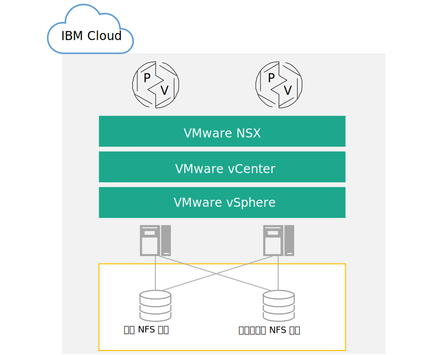

---

copyright:

  years:  2016, 2018

lastupdated: "2018-09-24"

---

# 连接的存储器基础架构设计

{{site.data.keyword.vmwaresolutions_full}} 提供了可在全球范围内的 {{site.data.keyword.CloudDataCents_notm}} 中自动部署的 VMware 技术。在 {{site.data.keyword.cloud_notm}} 解决方案组合中，基本 VMware vCenter Server on {{site.data.keyword.cloud_notm}} 产品由多达 10 个集群组成（每个集群包含最多 59 个 vSphere 主机）、一个 Platform Services Controller (PSC) 和一个 vCenter Server Appliance 组成。一个 vCenter Server Appliance 最多可管理 400 个主机和 4,000 个虚拟机。

此处介绍的体系结构通过将连接的存储器添加为环境的共享存储设备，以补充 vCenter Server 解决方案。连接的存储设备与 vCenter Server 部署位于相同的 {{site.data.keyword.CloudDataCent_notm}} 中，并且包含单个网络文件系统 (NFS) 共享或来自 {{site.data.keyword.cloud_notm}} 的多个 NFS 导出。

下图描述了 vCenter Server 部署上连接的存储器的总体体系结构。

图 1.{{site.data.keyword.cloud_notm}} 上连接的存储器的高级别体系结构

## 物理基础架构设计

物理基础架构包含三个主要组件：物理计算、物理存储器和物理网络。这包括 {{site.data.keyword.cloud_notm}} 服务网络以及基础架构使用的物理存储器。

## 物理网络设计

物理联网由 {{site.data.keyword.cloud_notm}} 进行处理。此部分描述了 {{site.data.keyword.cloud_notm}} 提供的物理网络，因为该网络与连接的存储器有关。

### IBM Cloud 网络概述

{{site.data.keyword.cloud_notm}} 的物理网络分为三种不同的网络：公用网络、专用网络和管理网络。有关公用网络、专用网络和管理网络的更多信息，请参阅[解决方案概述](../solution/solution_overview.html)。

有关 {{site.data.keyword.cloud_notm}} 网络的更多信息，请参阅 [{{site.data.keyword.cloud_notm}} 网络](https://www.ibm.com/cloud-computing/bluemix/our-network){:new_window}。

服务网络是专用网络的一部分。有关服务网络的描述，请查看以下信息。

### 专用服务网络

{{site.data.keyword.cloud_notm}} 包含专用服务网络，该网络提供公共服务，例如块存储器、文件存储器、对象存储器、DNS 解析器和 NTP 服务器。此专用网络独立于客户专用网络，能够使环境无缝连接到位于 {{site.data.keyword.cloud_notm}} 中的服务。专用网络分为多层，其中服务器和其他基础架构组件都连接到聚集的后端客户交换机 (BCS)。这些聚集的交换机会连接到一对单独的路由器（后端客户路由器或 BCR）来进行 L3 联网。专用网络还支持使用巨型帧 (MTU 9000) 进行物理主机连接。

### VLAN

有关 VLAN 的更多信息，请参阅[物理基础架构设计](../solution/design_physicalinfrastructure.html)中的_物理网络设计_部分。

## 物理存储器设计

此部分介绍了 {{site.data.keyword.cloud_notm}} 中存在的连接存储设备的配置。连接的存储设备是对现有 vCenter Server 解决方案的补充。因此，未介绍物理主机内部的本地连接磁盘。

## 连接的存储器性能

性能和耐久性存储器是 {{site.data.keyword.cloud_notm}} 存储解决方案，可用于为需要可预测性能级别的高级 I/O 应用程序提供支持。要实现这种可预测性能，可以将协议级别的每秒输入/输出操作数 (IOPS) 分配给单个卷。

可供应的 IOPS 范围从 100 到 48,000，存储大小范围从 20 GB 到 12 TB。性能和耐久性存储卷适用于块存储器和文件存储器。

在此设计中，vCenter Server 解决方案会为连接的存储器提供耐久性存储器。因此，您可以选择和附加（通过自动化）大小范围从 20 GB 到最大 12 TB 的耐久性 NFS 导出。{{site.data.keyword.cloud_notm}} 最多允许 64 个 vSphere ESXi 主机连接到单个耐久性 NFS 导出。

耐久性有三个 IOPS 性能层，分别支持不同的应用程序需求。请注意，在供应 NFS 共享后，无法调整其大小或对其重新配置来允许更多或更少的 IOPS。

有关详细的 IOPS 选项，请参阅[订购 vCenter Server 实例](../../vcenter/vc_orderinginstance.html)中的_存储设置_部分。

除了存储器层，{{site.data.keyword.cloud_notm}} 耐久性存储器还支持一系列应用程序需求，包括快照和复制，以及 {{site.data.keyword.CloudDataCent_notm}} 位置中的静态加密。

### 相关链接

* [解决方案概述](../solution/solution_overview.html)
