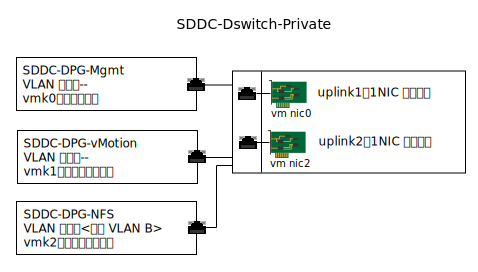

---

copyright:

  years:  2016, 2019

lastupdated: "2019-02-13"

subcollection: vmware-solutions

---

{:tip: .tip}
{:note: .note}
{:important: .important}

# 连接的存储器基础架构管理
{: #storage-infra-mgmt}

基础架构管理是指用于管理 vSphere ESXi 基础架构的 VMware 组件。

有关这些组件的更多信息，请参阅[虚拟基础架构设计](/docs/services/vmwaresolutions/archiref/solution?topic=vmware-solutions-design_virtualinfrastructure)中的“图 2. NSX Manager 网络概述”。

## 虚拟联网设计
{: #storage-infra-mgmt-visual-net-design}

此设计中使用的网络虚拟化使用与专用网络相关联且在 [{{site.data.keyword.vmwaresolutions_full}} 体系结构](/docs/services/vmwaresolutions/archiref/solution?topic=vmware-solutions-solution_overview)中指定的现有 vSphere 分布式交换机 (vDS)。

## vSphere 分布式交换机
{: #storage-infra-mgmt-vsphere-ds}

另一个 VLAN 在 vCenter Server 解决方案内创建，用于将 NFS 安装点连接到现有集群中的 ESXi 主机。vCenter Server 解决方案已具有与专用网络相关联的 vSphere 分布式交换机，因此会创建另一个端口组，并使用附加 VLAN 编号进行标记，因为此附加 VLAN 不是本机的。

下表描述了这个新端口组的缺省设置。

请不要更改这些缺省设置。
{:important}

表 1. NFS 端口组摘要

|端口组名称|SDDC-DPG-NFS|
|:--------------- |:------------ |
|端口绑定|静态|
|VLAN 类型|专用 VLAN B|
|负载均衡|基于始发虚拟端口进行路由|
|活动的上行链路|上行链路 1 和上行链路 2|

除了创建 vDS 端口组来运行 NFS 存储流量之外，还会在部署期间在每个 vSphere ESXi 主机上创建一个 VMkernel 端口，并将其分配给 SDDC-DPG-NFS 端口组。对于该 VMkernel 端口，还会为其分配一个与连接存储器 VLAN 相关联的专用可移植子网的 IP 地址，也就是，将专用 VLAN B 及其 MTU 设置为 9000 来支持巨型帧。

图 1. 专用 vDS 端口组和上行链路

### vSphere 主机静态路由
{: #storage-infra-mgmt-vsphere-routing}

虽然为 vDS 配置了新端口组并将 VMkernel 端口分配给了该端口组，解决方案仍会在部署中的每个 vSphere ESXi 主机上创建一个静态路由，以便所有 NFS 流量都能遍历 NFS 的 VLAN 和子网。该静态路由在 `/etc/rc.local.d/local.sh` 中创建，这样即使主机重新启动，该路由也不会丢失。

## 相关链接
{: #storage-infra-mgmt-related}

* [解决方案概述](/docs/services/vmwaresolutions/archiref/solution?topic=vmware-solutions-solution_overview)
