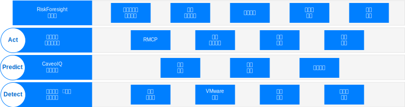

---

copyright:

  years:  2016, 2019

lastupdated: "2019-02-14"

subcollection: vmwaresolutions

---

# Caveonix RiskForesight 体系结构概述
{: #caveonix-arch}

下图中显示了 Caveonix RiskForesight 体系结构。

图 1. Caveonix RiskForesight 体系结构

Caveonix RiskForesight 体系结构包含四层：
-	检测 -“检测”模块完全集成到 VMware 堆栈和许多公共云中。通过插件，RiskForesight 将 vCenter 和 NSX Manager 用作资产存储库，以收集有关虚拟机 (VM)、网络和网络流的详细信息。远程收集器会扫描工作负载、操作系统和应用程序，以允许显示合规性和漏洞的“全堆栈”视图。
-	预测 -“预测”模块使用分析来确定有风险的资产，并通过风险降低模型确定缓解步骤，从而改善风险状态。
-	行动 -“行动”模块基于优先级划分来实施缓解步骤，并实施自动保护措施，以主动保护工作负载免受网络威胁所带来的风险。
    - RMCP - 风险管理控制平面 (RMCP) 通过监视专用、公用和受管云数据中心内的全堆栈，提供对工作负载的持续、主动保护。
    - 策略管理器 - 目前支持每个组织执行三种类型的机器学习作业：Caveo 日志、Caveo 网络和 Caveo 扫描。根据在数据中找到的异常，用户可以将策略配置为基于用户定义的条件来执行操作；选择作业类型，为异常分数配置布尔条件，并定义条件为 true 时的操作。例如：
        - 作业：“Caveo 日志”异常分数大于 90 时，将资产标记为隔离，并向 Slack 通道发送通知。
        - 作业：“Caveo 网络”异常分数大于 95 时，隔离资产并发送电子邮件通知，另外还发送 UI 通知。
- 仪表板 - 仪表板通过基于角色的访问权为服务提供者（例如，IT 部门）提供了将 IT 资产分配给租户或业务单位的能力。然后，业务单位可将这些 IT 资产分配给应用程序。这些应用程序与业务和 IT 服务相匹配，并受业务影响评估的约束，同时遵循合规性体制，例如：NIST、NESA、PCI、ISO 和 HIPAA。然后，这些应用程序须经过若干扫描（例如，漏洞、NSX 流、软件和日志数据扫描），以逐渐了解正在运行的内容，以及与应用程序关联的网络与合规性风险。合规性和安全用户通过这些仪表板向下钻取，可以查看划分了优先级的缓解操作列表，并启用“预测”和“行动”模块中可自动执行的实施操作。RiskForesight 为这两个模块提供了一个统一的仪表板，用于识别混合云中的资产，还提供了热图分析，用于分析网络风险、合规性配置风险、关键趋势和安全操作度量值。它使用直观、功能强大的可视化工具，支持用户快速确定风险的性质和位置以及要执行的操作。这些仪表板提供了以下功能：
  - 通过“检测”、“预测”和“行动”仪表板视图，提供划分了优先级的跨混合云中网络风险和合规性风险的视图。
  - 用户能够直观地与数据进行交互，以基于风险优先级快速确定存在风险的资产。
  - 易于使用的图形、度量值和过滤器，可用于获取针对已确定风险的洞察。
  - 通过交互式向下钻取功能，可更深入地了解有关各个位置、组织、应用程序和资产上的应用程序数据流、漏洞或配置问题的信息。
  - 支持用户掌握包含基础架构、平台、应用程序和数据的操作堆栈的完整知识。
  - 能够对混合云中网络、虚拟机或应用程序的分段策略进行可视化并强制实施。

## 区域
{: #caveonix-arch-zones}

Caveonix RiskForesight 具有区域的概念：

图 2. Caveonix RiskForesight 区域

-	管理或服务提供者区域 - 管理或服务提供者区域包含以下组件：
    - RiskForesight 应用程序 - 此应用程序包含多个组件，并在“应用程序组件”部分中进行了详细描述。
    - 中央收集器 - 从云提供者和租户区域收集信息。
- 云提供者 - 此区域提供托管应用程序的基础架构：
    - 专用 - VMware on {{site.data.keyword.cloud}} 和内部部署 VMware 基础架构平台。这两个平台通过 vCenter、NSX Manager、VMware Cloud Director (vCD) 或 vRealize Automation (vRA) 集成到 RiskForesight 中。
    - 公共 - 目前支持的唯一公共云提供者是 AWS。{{site.data.keyword.cloud_notm}} 即将可用。
    - 容器 - 目前仅支持 AWS Elastic Kubernetes Service (EKS)。{{site.data.keyword.cloud_notm}} Private 和 {{site.data.keyword.cloud_notm}} Kubernetes Services (IKS) 即将可用。
-	租户或客户环境区域 - 这些区域用于隔离租户、客户或业务单位。工作负载位于这些区域中，因此需要远程收集器。对于最小部署，需要一个远程收集器，但对于常规部署，每个租户/客户/业务单元需要一个远程收集器。

## 相关链接
{: #caveonix-arch-related}

*   [VMware vCenter Server on {{site.data.keyword.cloud_notm}} with Hybridity Bundle](/docs/services/vmwaresolutions/archiref/vcs?topic=vmware-solutions-vcs-hybridity-intro)
*   [Caveonix 详细设计](/docs/services/vmwaresolutions/archiref/caveonix?topic=vmware-solutions-caveonix-detailed)
