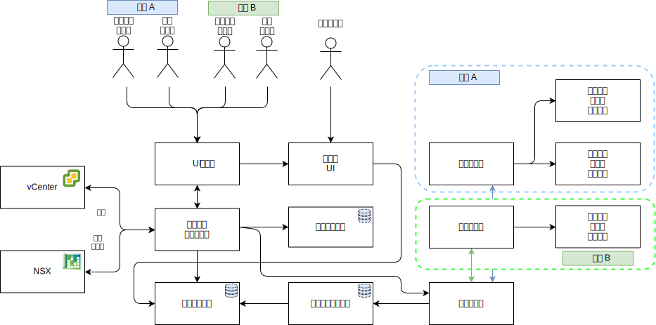

---

copyright:

  years:  2016, 2019

lastupdated: "2019-03-05"

subcollection: vmwaresolutions

---

# 详细设计
{: #caveonix-detailed}

下图和描述提供了有关 RiskForesight 应用程序组件的信息。

图 1. 应用程序组件

-	图形用户界面 - 可用于访问 RiskForesight 应用程序的 Web 界面。
-	中央收集器 - 收集来自插件的不同类型的数据有效内容，并使其在消息传递存储中可用。RiskForesight 支持以下类型的有效内容：
    - 扫描
    - 日志
    - 网络流
    - 软件
    - 工作负载元数据
- 中央路由器 - 管理与 VMware 编排层的所有集成触点。所有 RiskForesight 插件都必须与中央路由器进行通信，才能获得与 RiskForesight 生态系统进行通信的权限。
-	API 服务器 - REST 端点中间件，用于连接 GUI 和后端数据存储。此外，还可验证用户访问请求并管理 RBAC。
-	vCenter 数据收集器 - 此插件从 vCenter 中抽取虚拟机 (VM) 详细信息。此通用插件使用 VMware API 来连接到 vCenter，并抽取与工作负载相关的信息。在这些信息可用后，此插件会打包有效内容，并将其发送到中央收集器。
-	vCD 数据收集器 - 此插件从 VMware vCloud Director 中抽取 VM 详细信息。此通用插件使用 VMware API 来连接到 VMware vCloud Director，并抽取与工作负载相关的信息。在这些信息可用后，此插件会打包有效内容，并将其发送到中央收集器。
-	vCD 网络数据收集器 - 此插件从 VMware vCD 中抽取网络流详细信息。此通用插件使用 VMware API 来连接到 VMware NSX，并抽取网络、防火墙、安全规则和安全组信息。在这些信息可用后，此插件会打包有效内容，并将其发送到中央收集器。
-	网络数据收集器 - 此插件从 VMware vCenter 中抽取网络流详细信息。此通用插件使用 VMware API 来连接到 VMware NSX，并抽取网络、防火墙、安全规则和安全组信息。在这些信息可用后，此插件会打包有效内容，并将其发送到中央收集器。
-	远程收集器 - 位于租户环境中，或位于对租户 VM 具有网络访问权的其他位置。用于处理所有合规性和网络风险扫描。
-	关系数据存储 - 维护以下类型的元数据：
    - 云服务供应商
    - 租户
    - 资产
    - 扫描结果
    - 软件
    - 每日或每周聚集的数据集
- 消息传递数据存储 - RiskForesight 使用持久消息传递队列来实现零数据丢失并减轻对组件的反压。
- 索引数据存储 - 对每个租户的入局原始数据进行索引编制和存储，以供进一步分析，从而支持多租户功能。
- 插件 - 位于应用程序路由服务器中，并包含 VMware 组件的设置和集成，以同步所有 VM 及其租户信息。

下表显示了每个组件所需的端口和协议。

表 1. 端口和协议

|组件|协议/端口|
|---|---|
|UI|443|
|API|443，1337|
|RiskForesight|8082，8083，8084|
|中央收集器（集群）|8080|
|远程收集器|8081|
|关系数据存储（主或辅助）|5432|
|消息传递数据存储（集群）|9092|
|索引数据存储（主节点）|9200，9300，5601，443|

下图显示了具有与专用 VLAN A 关联的 Caveonix 可移植专用子网的网络拓扑。您负责管理此子网的 IP 地址空间，以便可以根据需要手动横向扩展：从“一体化”到完全分布式部署模型，一直到部分分布式模型。

图 2. 网络图

下表中描述了 IP 子网和 VLAN 分配。

表 2. VLAN 和子网

|VLAN|子网类型	|描述|
|---|---|---|
|公用|主|分配给物理主机以用于公用网络访问。在初始部署时未使用。|
|公用|可移植|分配供 customer-nsx-esg 上的上行链路和 NAT 使用。|
|公用|可移植|分配供 mgmt-nsx-esg 上的上行链路 NAT 使用。|
|公用|可移植|分配供 hcx-mgmt-esg 上的上行链路 NAT 使用（如果选择了 Hybridity Bundle）。|
|专用 A|主|分配给由 {{site.data.keyword.cloud}} 分配的物理主机。通过管理接口用于 vSphere 管理流量。|
|专用 A|可移植|分配给充当管理组件的 VM。|
|专用 A|可移植|分配给 NSX VTEP。|
|专用 A|可移植|分配给 HCX 供内部使用（如果选择了 Hybridity Bundle）。|
|专用 A|可移植|分配供 customer-nsx-esg 上的上行链路使用。|
|专用 A|可移植|分配给 HCX（如果选择了 Hybridity Bundle）。|
|专用 A|可移植|分配给 Zerto VRA（如果选择了 Zerto 选项）。|
|专用 A|可移植|分配给 Caveonix RiskForesight（如果选择了 Caveonix 选项）。|
|专用 B|主|在初始部署时未使用。|
|专用 B|可移植|分配用于 vSAN（如果在使用 vSAN）。|
|专用 B|可移植|分配用于 NAS（如果在使用 NAS）。|
|专用 B|可移植|分配用于 vMotion。|

## 相关链接
{: #caveonix-detailed-related}

* [VMware vCenter Server on {{site.data.keyword.cloud_notm}} with Hybridity Bundle](/docs/services/vmwaresolutions/archiref/vcs?topic=vmware-solutions-vcs-hybridity-intro)
