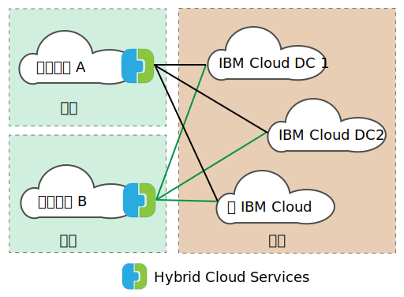

---

copyright:

  years:  2016, 2019

lastupdated: "2019-05-06"

subcollection: vmware-solutions

---
# VMware HCX on IBM Cloud 概述
{: #hcx-archi-overview}

VMware HCX on IBM Cloud 将内部部署 vSphere® vCenter™ 网络无缝集成到 IBM Cloud for VMware Solutions 部署中。通过混合联网，内部部署 vSphere vCenter 网络可扩展到 IBM Cloud，以支持双向虚拟机 (VM) 移动性。

HCX 拥有源和目标加密与解密过程，可确保一致的安全性，并为混合工作流程（例如，虚拟机迁移和网络扩展）提供许可。

此产品可创建经过优化的软件定义的 WAN，以提高延伸网络性能，使性能接近 LAN 速度。HCX 还支持双向工作负载以及将 VMware NSX® 安全策略迁移到 IBM Cloud。HCX 与 vSphere vCenter 集成，并通过 vSphere Web Client 进行管理。

## 第 2 层网络扩展
{: #hcx-archi-overview-layer-2-net}

HCX 允许现有的内部部署 vSphere 资产安全地将网络从其内部部署 vCenter 延伸到运行 VMware vCenter Server 的 IBM Cloud Data Center。此功能通过以下各项启用：
* HCX 提供称为第 2 层集中器 (L2C) 的设备。
* 通过扩展网络链接到部署在 VMware vCenter Server 上的 IBM Cloud NSX Edge 设备。
* 可以部署多个标准第 2 层集中器，以实现可扩展性并提高内部部署 vCenter 的吞吐量。
* 通过云网关和延伸的第 2 层迁移的虚拟机可以保留其 IP 和 MAC 地址。

## 虚拟机迁移
{: #hcx-archi-overview-vm-mig}

HCX 提供了三种虚拟机迁移方法：短停机时间迁移、vSphere vMotion 迁移和冷迁移。

### 短停机时间迁移
{: #hcx-archi-overview-low-downtime-mig}

短停机时间迁移依赖于 vSphere 复制；vSphere 复制是 VMware ESX®/ESXi® 系统管理程序中实施的一种分布式技术。内部部署 HCX 部署在 IBM Cloud 中创建活动虚拟机的副本，然后执行转换以关闭源虚拟机的电源，并打开所迁移虚拟机的电源。

迁移路径始终通过云网关执行。传输可以通过因特网、第 2 层延伸网络或 Direct Connect 线路执行。

虚拟机可以在任一方向多次进行迁移。

### vMotion 迁移
{: #hcx-archi-overview-vmotion-mig}

可以在延伸到 IBM Cloud 的网络上使用 vMotion 迁移来传输活动虚拟机。vMotion 迁移也称为零停机时间迁移或跨云 vMotion。

### 冷迁移
{: #hcx-archi-overview-cold-mig}

借助冷迁移，可以通过使用第 2 层集中器创建的延伸网络，将已关闭电源的 VM 传输到 IBM Cloud。

### 共同迁移功能
{: #hcx-archi-overview-cold-mig-features}

所有三种类型的迁移中都可用的其他功能包括软件定义的 WAN 优化，可提高迁移吞吐量和速度。此外，迁移可以安排在指定时间执行，并且可以保留虚拟机的主机名和/或虚拟机名称。

## 联网功能
{: #hcx-archi-overview-net-features}

以下联网功能内置于云网关和第 2 层集中器中。

### 智能流量路由
{: #hcx-archi-overview-intel-flow-routing}

此功能根据因特网路径自动选择最佳连接，对整个连接高效地处理洪流，以便尽快迁移工作负载。较大的流量（例如，备份或复制）会导致 CPU 争用，而较小的流量则路由到繁忙程度较低的 CPU，从而提高交互式流量的性能。

### 邻近路由
{: #hcx-archi-overview-prox-routing}

邻近路由确保连接到内部部署和云中延伸网络和路由网络的虚拟机之间的转发是对称的。此功能需要在客户内部部署和云之间配置具有动态路由的高级网络服务。

用户将其网络扩展到云时，第 2 层连接会延伸到 IBM Cloud 网络。但是，在不优化路径的情况下，第 3 层通信请求必须返回到内部部署网络源进行路由。这种往返行为称为_长号传输_或_发夹传输_。

“长号传输”效率低下，因为包必须在网络源和云之间来回传输，即使源和目标虚拟机都位于云中也是如此。

除了效率低下外，如果转发路径包含有状态防火墙或必须看到连接两端的其他内联设备，那么通信可能会失败。云的流出路径可能是延伸的第 2 层网络或组织路由网络时，会发生虚拟机通信（如果未优化路径）失败。内部部署网络并不知道延伸网络“快捷方式”。此问题称为非对称路由。解决方案是启用邻近路由，使内部部署网络可以了解来自 IBM Cloud 的路径。

云网关会维护云中虚拟机的清单。它还会了解 VM 的状态，可以是下列某个状态：
* 已使用 vMotion 传输到 IBM Cloud（零停机时间迁移）。
* 已使用基于主机的复制迁移到云（短停机时间迁移）。
* 已在云中创建（在延伸网络上）。

### 安全性
{: #hcx-archi-overview-sec}

云网关提供符合 Suite B 标准的带有 IKEv2 的 AES-GCM、AES-NI 卸载和基于流量的许可控制。此外，HCX 还拥有源和目标加密与解密过程，这可确保对混合工作流程（例如，虚拟机迁移和网络扩展）提供一致的安全性和管理。已定义且分配给内部部署虚拟机的安全策略可随虚拟机一起迁移到 IBM Cloud。

策略迁移仅在以下条件下可用：
* 内部部署数据中心必须运行的是 NSX 6.2.2 或更高版本。
* 在 vSphere 中，安全策略是单个“NSX 部分”，可以包含许多规则。
* 可以指定一组 IP 地址或 MAC 地址来参与策略。“MAC 集”或“IP 集”的名称不能超过 218 个字符。
* 支持的规则将第 3 层 IP 地址或 IP 集，或将第 2 层 MAC 地址或 MAC 集指定为源或目标。

## HCX 的组件
{: #hcx-archi-overview-comp-hcx}

VMware HCX on IBM Cloud 服务会部署 4 个虚拟设备，内部部署数据中心和 IBM Cloud 目标上都会安装并配置这些设备。此部分描述了所需的 4 个虚拟设备中的每一个设备。（可选）有可能会需要 Edge 设备，具体取决于实现设计。

### HCX Manager
{: #hcx-archi-overview-hcx-man}

HCX Manager 虚拟设备是内部部署 vCenter 的扩展。此设备会部署为虚拟机，其文件结构包含其他混合服务虚拟设备。HCX Manager 监管内部部署和 IBM Cloud 中的云网关、第 2 层集中器和 WAN 优化虚拟设备的部署与配置。

### Hybrid Cloud Gateway
{: #hcx-archi-overview-hcg}

Hybrid Cloud Gateway (CGW) 在内部部署 vSphere 资产和 IBM Cloud 之间维护一个安全通道。HCX 使用高强度加密来引导与 IBM Cloud 的站点到站点连接。

通过 vSphere 和 IBM Cloud 之间的安全通道，可防止联网“中途”安全问题。云网关还采用了 vSphere 复制技术，用于执行双向迁移。

### WAN 优化
{: #hcx-archi-overview-wan-opt}

WAN 优化设备是用于执行 WAN 调节以减少等待时间所产生影响的组件。它还包含前向纠错功能，可解决丢包问题，并可执行冗余流量模式去重。总而言之，这些设备可减少带宽使用量，并确保最充分地利用可用网络容量来加速与 IBM Cloud 之间的数据传输。

务必注意的是，虚拟机迁移依赖于云网关和 WAN 优化设备的组合，以实现 vSphere 内部部署和 IBM Cloud 之间无与伦比的移动性。此外，当数据路径通过云网关路由时，第 2 层扩展可受益于 WAN 优化。

### 第 2 层集中器
{: #hcx-archi-overview-layer-2-conc}

通过第 2 层集中器 (L2C) 设备，能够将第 2 层网络从内部部署 vSphere 数据中心扩展到 IBM Cloud。第 2 层集中器具有两个接口：
* 内部中继接口 - 使用映射到 IBM Cloud 中对应延伸网络的转换网桥，处理扩展网络的内部部署虚拟机流量。
* 上行链路接口 - HCX 使用此接口发送封装的 IBM Cloud 进出覆盖流量。应用程序数据通过此接口进行传输。

## 部署体系结构 - 使用公用因特网连接到 IBM Cloud
{: #hcx-archi-overview-connect-pub-internet}

此部分描述 IBM Cloud 中 HCX 组件以及内部部署客户机的布局。在此设计中，体系结构指定了源环境和 IBM Cloud 之间存在的轴辐式模型。因此，源资产将充当轴心来连接到不同的 IBM Cloud 环境，如下图所示。

源也可以置于 IBM Cloud 环境中；在此设计中，辐条始终是云部署，如下图所示。

### 用法概述
{: #hcx-archi-overview-usage-ovw}

通过 vSphere Web Client 完成以下任务：
* 部署 HCX 虚拟设备，并配置软件定义的 WAN 组件。
* 将内部部署 VLAN 和 VXLAN 网络从内部部署 vCenter 扩展到云 (IBM Cloud)。
* 将工作负载迁移到云以及从云迁移回来。

### 基本设计依赖项
{: #hcx-archi-overview-base-design}

在更详细地描述组件之前，必须了解此设计中所需的基本部署。
* 源环境必须包含由 vCenter Server 管理的 vSphere 实施。Hybrid Cloud Services 需要受支持的 vCenter 5.5U3 或 vCenter 6.0U2 及更高版本（带 ESXi 5.5 或更高版本）。
* 如果使用了 NSX，版本须为 V6.2.2 或更高版本。策略迁移需要 NSX。
* 如果打算使用跨云 vMotion，那么适用于内部部署的相同亲缘关系限制也适用于跨云的情况。
* 源环境必须有方法可连接到云环境。这包括使用 IBM Cloud Direct Link 进行公用因特网访问或专用连接。除了公用因特网外，与其他云供应商的连接将不作讨论。
* 源环境 VM 和要迁移或延伸的网络必须位于虚拟分布式交换机或 Cisco Nexus 1000v 虚拟分布式交换机中的端口组上。
* IBM Cloud 必须包含至少一个 VMware vCenter Server 实例。
* 有足够的资源用于虚拟设备。
* 网络必须允许设备与本地和远程虚拟设备以及其他虚拟机进行通信。
* “端口访问需求”（附录 A）列出了必须打开的端口，只有打开这些端口，Hybrid Cloud Services 虚拟设备才能成功安装。
* 分配有“管理员”vCenter Server 系统角色的 vSphere 服务帐户。
* 有足够的磁盘空间用于安装 Hybrid Cloud Services 和关联的服务设备。
* 有足够的 IP 地址用于在安装期间供应的内部部署 VM。
* 如果 SSO 服务器是远程服务器，那么必须识别运行外部查找服务的 vCenter、外部 SSO 服务器或 Platform Services Controller (PSC) 的 URL。向 vCenter 注册 HCX 服务时，必须提供此 URL。

## 相关链接
{: #hcx-archi-overview-related}

* [VMware HCX on IBM Cloud 简介](/docs/services/vmwaresolutions/archiref/hcx-archi?topic=vmware-solutions-hcx-archi-intro)
