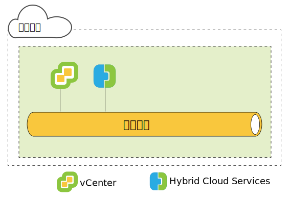
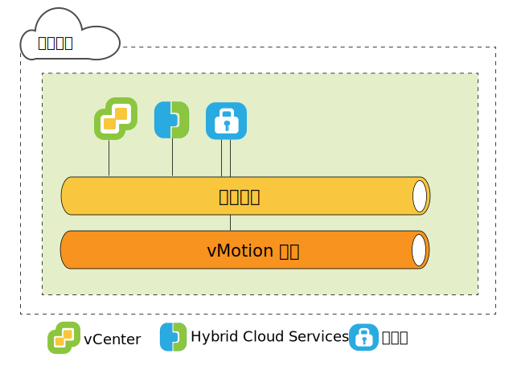
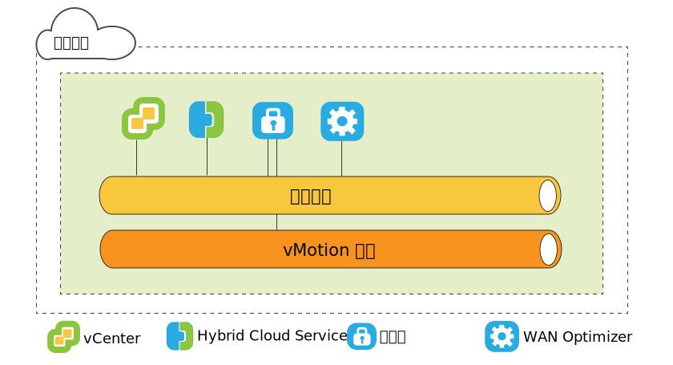
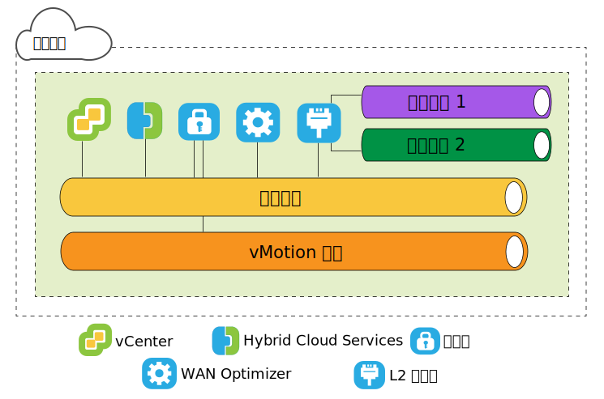
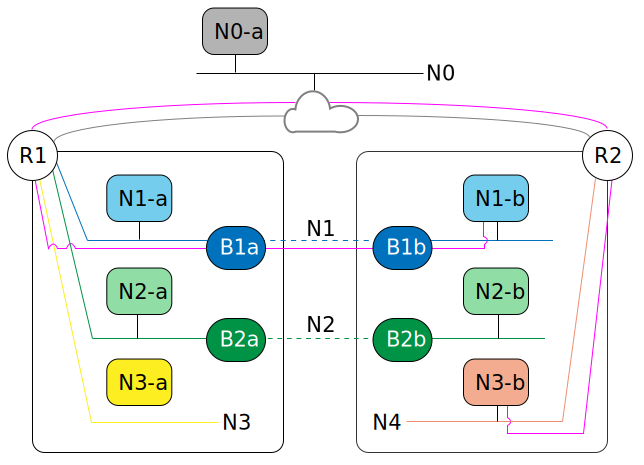

---

copyright:

  years:  2016, 2019

lastupdated: "2019-01-23"

---

{:tip: .tip}
{:note: .note}
{:important: .important}

# VMware HCX on IBM Cloud 源端体系结构

此部分描述源环境中部署的每个 HCX 组件的体系结构。

## HCX 简介

通过 HCX 技术，vSphere vCenter 网络可无缝集成到 IBM Cloud VCF 或 VCS 平台中。借助混合联网，内部部署 vSphere vCenter 网络可扩展到 IBM Cloud，并支持双向虚拟机 (VM) 移动性。

本简介概述了可以完成的任务以及用于支持和增强迁移和网络扩展的功能。

* HCX 拥有源和目标加密与解密过程，可确保一致的安全性，并为混合工作流程（例如，虚拟机迁移和网络扩展）提供许可。
* HCX 可创建经过优化的软件定义的 WAN，以提高延伸网络性能，使性能接近 LAN 速度。
* HCX 还支持双向工作负载以及将 VMware NSX 安全策略迁移到 IBM Cloud 联网服务。
* HCX 与 vSphere vCenter 集成，并通过 vSphere Web Client 进行管理。

## 第 2 层网络扩展

* 将网络从 vCenter 安全地延伸到 IBM Cloud。
* HCX 提供了高吞吐量第 2 层集中器 (HT L2C)。
* 通过扩展网络链接到 IBM Cloud NSX Edge 设备。
* 可以部署多个标准第 2 层集中器，以实现可扩展性并提高吞吐量。
* 通过云网关和延伸的第 2 层迁移的虚拟机可以保留其 IP 和 MAC 地址。

## 虚拟机迁移方法

### 短停机时间迁移

短停机时间迁移依赖于 vSphere 复制；vSphere 复制是 VMware ESX/ESXi 系统管理程序中实施的一种分布式技术。HCX 创建实时虚拟机的副本，将该副本迁移到 IBM Cloud，然后执行转换以关闭源虚拟机的电源，并打开所迁移虚拟机的电源。
* 迁移路径始终通过云网关执行。传输可以通过因特网、第 2 层延伸网络或 Direct Connect 线路执行。
* 虚拟机可以在任一方向多次进行迁移。

### vMotion 迁移

vMotion 迁移使用 vMotion 在延伸到 IBM Cloud 的网络中传输实时虚拟机。vMotion 迁移也称为零停机时间迁移或跨云 vMotion。

### 冷迁移

通过延伸网络将已关闭电源的虚拟机传输到 IBM Cloud。

### 共同特性

* 可选的软件定义的 WAN 优化（如果已安装）可提高迁移、吞吐量和速度。
* 迁移可以安排在指定时间执行。
* 所迁移虚拟机可以保留其主机名和/或虚拟机名称。

## 联网功能

以下联网功能内置于云网关和第 2 层集中器中。

### 智能流量路由

根据因特网路径自动选择最佳连接，对整个连接高效地处理洪流，以便尽快迁移工作负载。较大的流量（例如，备份或复制）会导致 CPU 争用，而较小的流量则路由到繁忙程度较低的 CPU，从而提高交互式流量的性能。

### 邻近路由

确保连接到内部部署和云中延伸网络和路由网络的虚拟机之间的转发是对称的。

### 安全性

云网关提供符合 Suite B 标准的带有 IKEv2 的 AES-GCM、AES-NI 卸载和基于流量的许可控制。

HCX 拥有源和目标加密与解密过程，可确保一致的安全性，并为混合工作流程（例如，虚拟机迁移和网络扩展）提供许可。

在内部部署 vCenter 中定义且分配给虚拟机的安全策略可随虚拟机一起迁移。

## 了解 HCX

HCX 支持内部部署 vCenter 和 IBM Cloud 之间的多对多关系。支持链接方式下的 vCenter Server。本主题是对安装程序如何与内部部署数据中心及 IBM Cloud 进行交互的高级概述。

在安装期间，将导入 HCX Manager 虚拟设备，并将其配置为内部部署 vCenter 的插件。然后，此插件用于配置软件定义的 WAN 服务部署。在内部部署 vCenter 中，自动配置将每个混合服务设备作为虚拟机进行供应，并在 IBM Cloud 中部署相应的虚拟机。

成功的部署需要：
* 有足够的资源用于虚拟设备。
* 网络必须允许设备与本地和远程虚拟设备以及其他 VM 进行通信。

## 部署概述

首先安装的是 HCX Manager 虚拟机，此虚拟机用于管理内部部署和云中其他任何服务虚拟机设备的安装。

下面是基本安装任务的摘要：
1. 获取 Hybrid Cloud Enterprise 虚拟设备 OVA 文件。
2. 在 vSphere Web Client 中，将 HCX Manager 服务虚拟设备安装在连接到 IBM Cloud 的内部部署 vCenter 中。
3. 在 vSphere Web Client 中，使用 HCX 插件注册 IBM Cloud 端点。注册操作会建立内部部署 HCX 与 IBM Cloud 上 HCX 实例之间的一对一关系。
4. 安装并配置服务虚拟设备。
5. 对于内部部署安装的每个设备，安装程序会在目标 IBM Cloud 中供应相应的服务虚拟设备。
6. 安装后，HCX Manager 可控制本地和远程服务虚拟设备。在 IBM Cloud 中，HCX 可将供应的软件定义的 WAN 组件作为服务进行管理。

### 部署组件性能注意事项

体系结构规划包括要迁移的 VM、用于处理虚拟机流量的网络以及要扩展的网络。本主题概述了部署组件的一些最大值和最小值。
* vSphere vCenter。在需要混合服务的 vCenter 上必须安装 HCX Manager 设备。每个 vCenter 只能部署一个 HCX。此限制适用于链接方式，并且 HCX 管理设备仅安装在主 vCenter 中。HCX 在链接方式下最多支持注册 5 个 vCenter。
* 云注册。最大云端点数为 10 个。为了查找端点数，Hybrid Cloud Services 将跟踪 vCenter 与云的连接。

### 最大迁移数和网络扩展数

* 最大并发短停机时间迁移任务数 - 15
* 最大并发 L2C 延伸任务数 - 1
* 最大并发 vMotion 迁移任务数 - 1

### HCX Management Enterprise

HCX Management Enterprise OVA 部署在源环境中，并注册为管理源 vSphere 基础架构的 vCenter Server 的插件。然后，此插件用于配置支持跨云迁移和 L2 网络延伸所需的迁移和网络服务。

每个 vCenter 只能部署一个 HCX。此限制适用于链接方式：HCX Manager 设备仅安装在主 vCenter 中。HCX Manager 在链接方式下最多支持注册 5 个 vCenter。
{:note}

图 1. 源 Hybrid Cloud Services

### HCX 虚拟设备

安装包是一个包含 Hybrid Cloud Services 插件的 OVA 文件。此 Hybrid Cloud Services 管理设备安装并配置后，接着用于配置服务设备虚拟机。
* HCX Manager
* Hybrid Cloud Gateway
* 第 2 层集中器
* WAN Optimizer

### HCX Manager

HCX Manager 插件仅内部部署，用于管理 SD-WAN 的服务虚拟设备。HCX Manager 虚拟设备是源 vCenter 的扩展，部署为虚拟机。此设备的文件结构包含所有混合服务虚拟设备。HCX Manager 监管内部部署和云中的云网关、第 2 层集中器和 WAN 优化虚拟设备的部署与配置。

虚拟设备可以安装为使用硬盘驱动器的精简配置或密集配置。缺省情况下，服务虚拟设备的硬盘驱动器为精简配置。

完成服务和虚拟设备的配置与部署后，登录到此虚拟机即可使用 Hybrid Cloud Services 管理门户网站。

### HCX 云网关

HCX 云网关在 vSphere 和 IBM Cloud 之间建立并维护一个安全通道。

HCX 使用高强度加密来引导与 IBM Cloud 的站点到站点连接。通过 vSphere 和 IBM Cloud 之间的安全通道，对于无法识别租户的 vSphere 协议，可实现多租户，并能防止联网“中途”安全问题。

云网关还采用了 vSphere 复制技术，用于执行双向迁移。

图 2. 源云网关

### WAN Optimizer

HCX 还提供了软件定义的 WAN 优化。WAN 优化设备是强烈建议使用的组件，用于执行 WAN 调节，以减少等待时间产生的影响。它还包含前向纠错功能，可解决丢包问题，并可执行冗余流量模式去重。总而言之，这些设备可以减少带宽使用量，并确保最充分地利用可用网络容量来加速与 IBM Cloud 之间的数据传输。

虚拟机迁移依赖于云网关和 WAN 优化设备的组合，以实现 vSphere 内部部署和 IBM Cloud 之间无与伦比的移动性。

图 3. 源 WAN Optimizer

### 第 2 层集中器

网络扩展服务由第 2 层集中器 (L2C) 提供。它将第 2 层网络从内部部署 vSphere 数据中心扩展到 IBM Cloud，支持在数据中心与云之间进行无缝迁移。需要第 2 层集中器将内部部署网络延伸到 IBM Cloud。

第 2 层集中器设备有两个接口：
* 内部中继接口：使用映射到 IBM Cloud 中对应延伸网络的转换网桥，处理扩展网络的内部部署虚拟机流量。
* 上行链路接口：HCX 使用此接口发送封装的 IBM Cloud 进出覆盖流量。应用程序数据通过此接口进行传输。

图 4. 源 L2 集中器

### 仅迁移

执行迁移的最低配置仅需要 HCX Manager 和云网关设备。可以在不使用网络扩展的情况下迁移虚拟机。在这种情况下，虚拟机在迁移后，会使用“访客定制”服务来获取新的 IP 地址。

要延伸网络并保留原始 IP 地址，必须在内部部署 vSphere vCenter 中配置分布式虚拟交换机。

WAN 优化在所述情况下可提高速度；将云网关配置为使用高速线路（例如，Direct Connect），可通过为 WAN 优化的流量提供更高带宽的链路来提高速度。

将扩展网络上的虚拟机迁移到 IBM Cloud 十分有利，因为这可以减少停机时间，并且虚拟机上的配置不会更改。虚拟机可以保留 IP 地址、MAC 地址、计算机名称和虚拟机名称。保留这些属性将极大地简化向 IBM Cloud 的迁移，并且支持轻松迁移回内部部署数据中心。网络扩展功能需要 vSphere 分布式交换机，vSphere Enterprise Plus Edition 中提供有 vSphere 分布式交换机。

### IP 地址需求

要部署 HCX，必须在内部部署和目标 IBM Cloud 中提供适当数量的 IP 地址。

* vMotion 地址
  保留单独的网络用于 vMotion 是内部部署数据中心的常见做法。云网关必须有权访问 vMotion 网络。如果无权访问，那么需要额外的 IP 地址与 vMotion 网络进行通信。

* 内部部署
  * 一个 IP 地址用于 HCX Manager 设备。
  * 每个云网关一个 IP 地址，如果有单独的 vMotion 网络，请添加一个 IP 地址。
  * 每个标准第 2 层集中器一个 IP 地址。

* IBM Cloud
  * 每个连接到 IBM Cloud 的 HCX Manager 设备两个 IP 地址。这两个地址可用于连接到因特网或者一个或多个 Direct Connect 线路。
  * 如果有单独的 vMotion 网络连接，请添加一个 IP 地址。

### 邻近路由

邻近路由是一种联网功能，可在配置云网关时启用。

邻近路由确保连接到内部部署和云中延伸网络和路由网络的虚拟机之间的转发是对称的。此功能需要在客户内部部署和云之间配置动态路由。

用户将其网络扩展到云时，第 2 层连接会延伸到 IBM Cloud。但是，在不优化路径的情况下，第 3 层通信请求必须返回到内部部署网络源进行路由。这种往返行为称为“长号传输”或“发夹传输”。

“长号传输”效率低下，因为包必须在网络源和云之间来回传输，即使源和目标虚拟机都位于云中也是如此。除了效率低下外，如果转发路径包含有状态防火墙或必须看到连接两端的其他内联设备，那么通信可能会失败。云的流出路径可以是延伸的第 2 层网络或通过 VCS/VCF NSX Edge 网关执行时，会发生虚拟机通信（未优化路径）失败。内部部署网络并不知道延伸网络“快捷方式”。此问题称为非对称路由。解决方案是启用邻近路由，使内部部署网络可以了解来自 IBM Cloud 的路径。

为了防止“长号传输”，HCX 使用智能路径管理功能来选择适用于虚拟机状态的路径。云网关会维护云中的虚拟机清单。它还会了解虚拟机状态，状态可以是：
* 已使用 vMotion 传输到云（零停机时间迁移）。
* 已使用基于主机的复制迁移到云（短停机时间迁移）。
* 已在云中创建（在延伸网络上）。

### 使用邻近路由的非对称路由解决方案

在下图中，左侧的 N*a 组件位于内部部署数据中心，右侧的 N*b 组件位于云中。

R1 是 N1-b 的缺省网关，因此，N1-b 必须返回到 R1，以通过 R2 路由流量。为了防止非对称路由，HCX 将主机路径注入到 IBM Cloud VCS/VCF 部署的 NSX 覆盖网络中。如果虚拟机是在云中新创建的，或者是通过短停机时间迁移进行迁移的，那么会立即注入主机路径。

如果虚拟机是使用 vMotion 传输的，那么要到该虚拟机重新引导后，才会注入该路径。等待重新引导可确保在虚拟机重新引导之前，内部部署有状态设备可继续为现有会话提供服务。重新引导后，内部部署和云中的路由信息一致。

也就是说，R1 可以使用路由通过 R2 访问特定的虚拟机，而不使用本地连接的扩展网络。启用邻近路由后，R2 完全拥有用于访问虚拟机的其他网络的路径。

图 5. 使用邻近路由的非对称路由解决方案

### MAC 地址保留

* 用于保留 MAC 地址的选项在迁移向导中是一个复选框。仅对于基于复制的迁移，此选项才会显示。
* 缺省情况下，如果源虚拟机位于延伸网络中，那么**保留 MAC** 已启用；如果网络未延伸，那么“保留 MAC”已禁用。如果未保留 MAC 地址，那么迁移完成后，虚拟机将获取新地址。保留 MAC 地址或获取新地址的决定可能会影响迁移过程以及迁移后的网络流量。
* 出于以下原因，需要保留 MAC 地址：
  * 基于 MAC 地址的许可证：某些软件将许可证与 VM 的 MAC 地址配对。更改虚拟机的 MAC 地址会使许可证失效。
  * Linux NIC 顺序：在 Linux 中，如果在虚拟机上更改了 MAC 地址，那么虚拟机重新引导后，NIC 以太网设备号可能会更改。设备号更改可能会变更操作系统中的 NIC 显示顺序，从而使依赖于 NIC 顺序的应用程序或脚本发生中断。
  * 对于延伸网络的情况，可减少停机时间：如果虚拟机通过延伸网络进行迁移，那么启用**保留 MAC** 可最大限度地减少停机时间，因为网络不必了解新的 MAC 地址。
  * 迁移操作期间，此复选框位于“选择目标网络”页面上。

### 安全策略迁移

通过策略迁移功能，NSX 分布式防火墙规则可从内部部署 vCenter 迁移到支持 VCF/VCS HCX 的云。使用短停机时间迁移或 vMotion 通过利用高吞吐量第 2 层集中器延伸的网络迁移虚拟机时，可以进行策略迁移。
* 内部部署数据中心必须运行的是 NSX 6.2.2 或更高版本。
* 在 vSphere 中，安全策略是单个“NSX 部分”，可以包含许多规则。每个“组织 vDC”只能有一个“部分”（策略）。
* 可以确定一组 IP 地址或 MAC 地址来参与策略。“MAC 集”或“IP 集”的名称不能超过 218 个字符。
* “部分”中的所有规则都必须具有唯一名称。不要使规则名称留空。支持的规则将第 3 层 IP 地址或 IP 集或者第 2 层 MAC 地址或 MAC 集指定为源或目标。

不会迁移用于为源或目标指定安全组或应用程序组的规则。
{:note}

对所迁移策略的任何更改都会传播到使用该策略的所有 VM。

### 相关链接

* [在源上安装和配置](/docs/services/vmwaresolutions/archiref/hcx-archi/hcx-archi-install-cfg-src.html)
