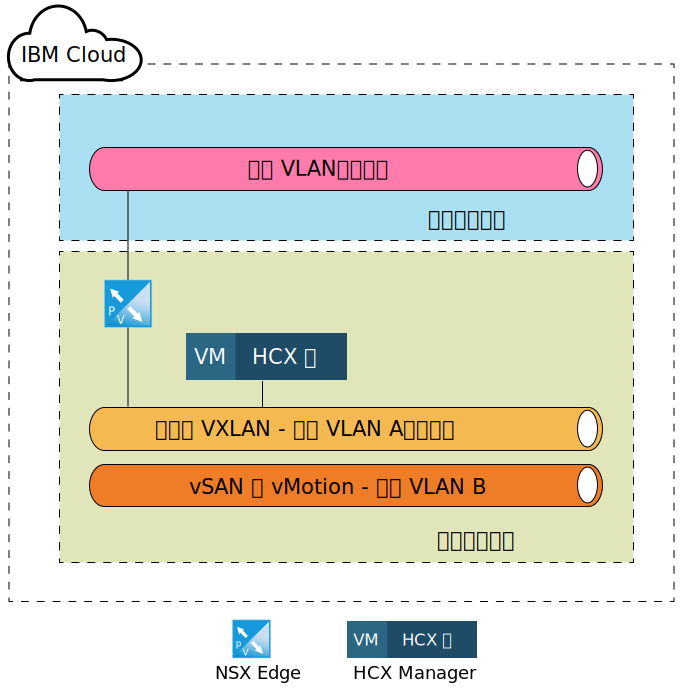
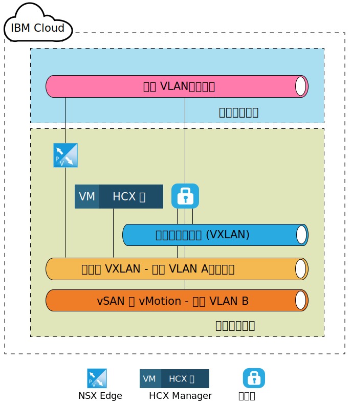
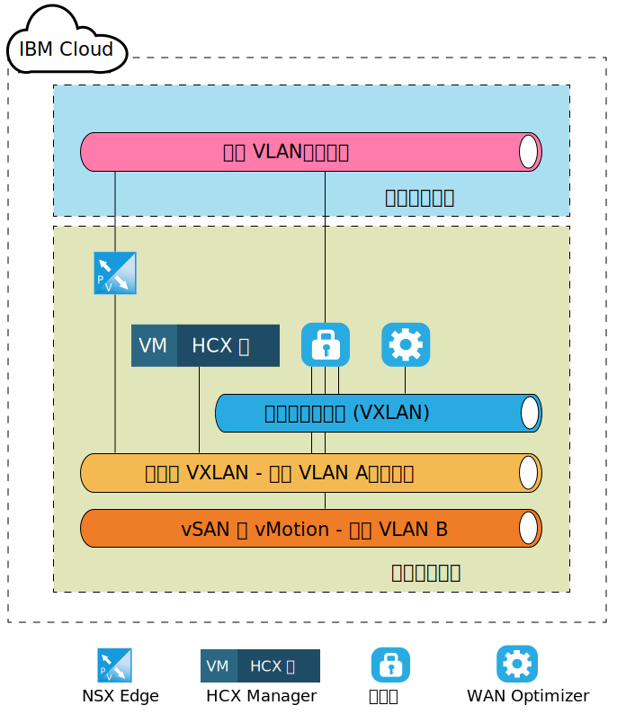
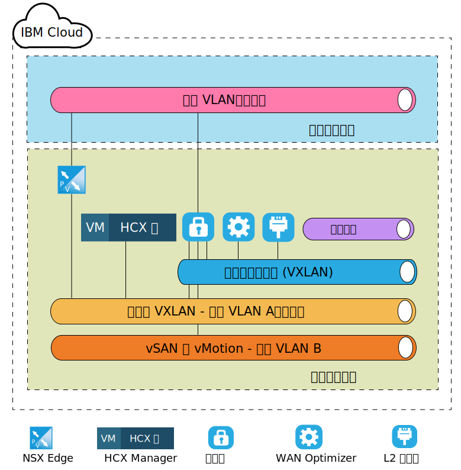

---

copyright:

  years:  2016, 2019

lastupdated: "2019-01-23"

---
# VMware HCX on IBM Cloud 组件级别目标体系结构

此部分描述 IBM Cloud 环境中部署的每个 HCX 组件的体系结构。将讨论 IBM Cloud 中的辐条（目标）部署模型。

## NSX Edge

IBM Cloud 中配置的第一个组件是一对 NSX Edge 虚拟机。务必注意的是，所有 IBM Cloud for VMware Solutions 部署都会安装并配置 Edge 设备，以用于 IBM CloudDriver 出站通信。但是，虽然此 ESG 可以复用于 Hybrid Cloud Services 通信，但建议部署一对新的 ESG。

NSX Edge 虚拟机配置为一对主动/被动超大型 NSX Edge 设备。这些设备用于通过公用因特网连接来连接到 IBM Cloud VMware 环境。对于内部环境，选择了超大型 NSX Edge，原因是它适用于具有能处理数百万个并发会话（并不一定需要高吞吐量）的负载均衡器的环境。在配置过程中，NSX Edge 会连接到 IBM Cloud 公用 VLAN 以及指定用于管理基础架构的 IBM Cloud 专用 VLAN。

表 1. NSX Edge 部署

|组件|配置|
|-----------|---------------|
|CPU|6 个 vCPU|
|RAM|8 GB|
|磁盘|4.5 GB VMDK，位于共享存储器上，具有 4 GB 交换空间|

由于 NSX Edge 在内部或专用部署中配置为主动/被动，因此用户必须创建 vSphere 分布式资源调度程序 (DRS) 反亲缘关系规则，以确保 NSX Edge 不会在其各自的同级设备所在的主机上运行。

表 2. NSX Edge 反亲缘关系规则

|字段|值|
|-----------|---------------|
|名称|NSX Edge 外部网关|
|类型|独立虚拟机|
|成员|NSX Edge 1|
|           |NSX Edge 2|

除了在 IBM Cloud 中部署的 NSX Edge 设备之外，如果订购了 VMware HCX on IBM Cloud 服务，那么还会部署 HCX Manager 虚拟设备。部署此设备后，NSX Edge 将启用负载均衡，并通过应用程序概要文件进行配置，这些概要文件使用证书来处理来自源的入站连接。NSX Edge 还会配置为使用负载均衡池，以指向 HCX Manager、vCenter 和 PSC 设备。此外，会创建虚拟服务器以使用公共接口上的虚拟 IP 地址 (VIP)，其中包含用于将池与 VIP 连接的规则。NSX Edge 上的虚拟服务器配置和池配置样本如以下各表所示。

表 3. NSX Edge 的 VIP 配置 - 虚拟服务器

|字段|值|
|-----------|---------------|
|虚拟服务器标识|virtualServer-1|
|名称|HCX-VIP|
|描述|LB-VIP|
|缺省池|pool-1|
|IP 地址|254|
|协议|https|
|端口|443|

表 4. NSX Edge 的 VIP 配置 - 虚拟服务器详细信息

|字段|值|
|-----------|---------------|
|描述|LB-VIP|
|连接限制|0|
|服务插入状态|已禁用|
|应用程序概要文件|applicationProfile-1|
|连接速率限制|0|
|加速状态|已禁用|
|服务概要文件状态|  |

表 5. NSX Edge 的 VIP 配置 - 规则

|字段|值|
|-----------|---------------|
|规则标识|applicationRule-1|
|名称|appRule1|
|脚本|acl isHibridity url_beg /hibridity     acl isWebSso url_beg /websso     acl isVCenter url_beg /vsphere-client     use_backend nspPool001 if isHybridity     use_backend vcPool001 if isVCenter     use_backend ssoPool001 if isWebSso|

表 6. NSX Edge 的池配置 - 池摘要

|池标识|名称|算法|监视器标识|
|---------|------------|-------------|------------|
|pool-1|nspPool001|循环法|            |
|pool-3|ssoPool001|循环法|            |
|pool-2|vcPool001|循环法|            |

表 7. NSX Edge 的池配置 - 池详细信息

|字段|值|
|-----------------|-----------|
|描述|           |
|透明|已禁用|
|名称|HCX-CLOUD|
|权重|1|
|监视器端口|8443|
|最大连接数|0|
|最小连接数|0|

## HCX Manager

在目标上配置 NSX Edge 设备后，部署的第一个设备是 HCX Manager 组件。此设备用作源组件的云环境的主接口，并提供抽象的联网用户界面，可以使用此界面来添加、编辑和删除网络，以及设计和配置路由，而无需直接使用 NSX。vCenter 与 NSX 集成后，会为 HCX Manager 设备分配管理 VLAN 上的专用可移植 IP 地址。

此外，HCX Manager 还配置为通过特定用户访问 vCenter 和 NSX。务必注意的是，HCX Manager 的 IP 地址与 NSX Edge 中用于负载均衡的 IP 地址相同。

在部署并配置了 HCX Manager 云组件后，源组件会通过 NSX ESG 中配置的 VIP 地址来创建与 HCX Manager 的连接。建立此连接后，即可在 IBM Cloud 中部署云网关和 WAN Optimizer 设备。

图 1. 目标 - Hybrid Cloud Services 设备

## 云网关

建立了从源到目标云的连接后，会部署一个虚拟设备。此设备为云网关 (CGW)，用于在指定为源的 vSphere 环境与 IBM Cloud 之间维护一个安全通道。“表 3. 云网关部署”中列出了 IBM Cloud 中部署的 CGW 设备的大小调整规范。

表 8. 云网关部署

|组件|配置|
|-----------|---------------|
|CPU|8 个 vCPU|
|RAM|3 GB|
|磁盘|2.0 GB VMDK，位于共享存储器上|

此云网关部署并配置为位于 IBM Cloud for VMware Solutions 部署的管理 VLAN（专用可移植子网）以及 vMotion VLAN（专用可移植子网）上。此外，会在公用 VLAN（公用可移植）上配置另一个接口，用于通过公用因特网建立的连接。如果有直接连接（实施了专用连接），那么无需公共访问权。与云网关关联的最后一个连接是在站点配对时创建并配置的逻辑交换机。

此逻辑交换机是一个不可路由的专用网络，用作云网关和 WAN Optimizer 之间的通信通道，这会在“4.1.4 WAN（待定）”中进行讨论。

下图描绘了云网关设备和所分配连接的高级组件图。

图 2. 云网关部署

## WAN Optimizer

部署的第二个组件是 WAN 优化设备。虽然 WAN 优化设备是可选的，但此设备可执行 WAN 调节，以减少等待时间所产生的影响。它还包含前向纠错功能，可解决丢包问题，并可执行冗余流量模式去重。

总而言之，这些设备可减少带宽使用量，并确保最充分地利用可用网络容量来加速与 IBM Cloud 之间的数据传输。WAN Optimizer 是磁盘密集型设备，需要足够数量的 IOPS 才能正常运行。因此，WAN Optimizer 会位于 VCF 环境中的 vSAN 存储器上以及耐久性存储器上，在 vCenter Server 部署中支持大于 2,000 的 IOPS。WAN 优化设备的大小调整规范如下表所示。

表 9. WAN Optimizer 设备大小调整

|组件|配置|
|-----------|---------------|
|CPU|8 个 vCPU|
|RAM|14 GB|
|磁盘|30 GB VMDK + 70 GB VMDK，位于共享存储器上|

与云网关不同的是，WAN 优化设备仅连接到逻辑交换机，以支持自身与云网关之间的通信。如果在源环境中正在使用 WAN 优化，那么此设备是必需的。有关网络布局的视图，请参阅下图。

图 3. WAN Optimizer 部署

## 第 2 层集中器

第三个组件称为第 2 层集中器 (L2C)，是网络扩展服务的一部分。L2C 是允许将内部部署数据中心网络扩展到 IBM Cloud 的虚拟机。L2C 用于延伸内部部署 VLAN 和/或 VXLAN。每个 L2C 最多可以延伸到 4096 个 VLAN。每个 L2C 与其内部部署合作伙伴配对后，每个“流”最高可提供 1 Gbps，并且每个 VLAN（或 VXLAN）最高可提供总计 4 Gbps。如果需要更高网络吞吐量，支持部署更多 L2C 设备。

作为此设计的一部分，将部署 L2C 设备，以便客户可以通过公用因特网或通过利用 Direct Link 的专用网络，将多个 VLAN 和 VXLAN 延伸到 IBM Cloud。下表中列出了 IBM Cloud 上 L2C 设备的大小调整规范。

表 10. HT L2C 设备大小调整

|组件|配置|
|-----------|---------------|
|CPU|8 个 vCPU|
|RAM|38 GB|
|磁盘|2 GB VMDK，位于共享存储器上|

L2C 设备部署在管理 VLAN 以及公用 VLAN 上。公共接口用于处理流向扩展网络的源的应用程序流量。在源管理员发起将网络扩展到 IBM Cloud 的操作之后，会创建更多连接（如扩展网络），并且这些连接会连接到 L2C 设备。这些网络和连接的示例如下图所示。

图 4. L2 集中器部署

### 相关链接

* [在源上安装和配置](/docs/services/vmwaresolutions/archiref/hcx-archi/hcx-archi-source.html)
