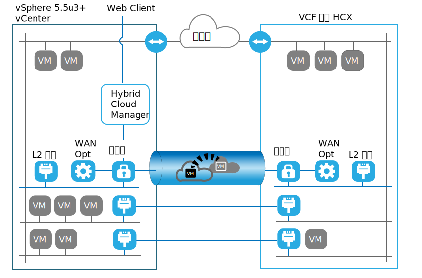

---

copyright:

  years:  2016, 2019

lastupdated: "2019-06-17"

subcollection: vmware-solutions

---

# VMware HCX on IBM Cloud 简介
{: #hcxclient-vcs-intro}

通过 VMware HCX on IBM Cloud 服务，可以在 IBM Cloud for VMware Solutions 与内部部署 VMware 虚拟化数据中心之间创建无缝连接。

IBM Cloud for VMware Solutions 包括在 IBM Cloud 中以完全自动化的方式快速部署 VMware vCenter Server (VCS)。这些产品是对内部部署基础架构的补充，允许现有和未来的工作负载在 IBM Cloud 中运行，而无需进行转换，使用的工具、技能和流程与内部部署使用的相同。有关更多信息，请参阅 [Virtualization for extending virtualized private cloud](https://www.ibm.com/cloud/garage/architectures/virtualizationArchitecture)。

VMware HCX on IBM Cloud 服务使这一混合性更上一层楼，通过支持创建无缝网络扩展和双向迁移工作负载，将 vCenter Server 实例与现有的内部部署虚拟化数据中心混合在一起。

VMware HCX on IBM Cloud 组件（在 IBM Cloud VMware 目标站点中部署为虚拟机）支持建立与安装在对等内部部署源站点中的 VMware HCX on IBM Cloud 组件的连接。

此连接将在内部部署和 IBM Cloud 之间创建松散耦合的互连，并支持以下功能：
* 简单互连 - 通过任何物理连接（例如，公用因特网、专用 VPN 或直接链路）轻松建立逻辑网络连接。
* 第 2 层扩展 - 内部部署网络扩展到云中。这些网络包括内部部署子网和 IP 寻址。
* 加密 - 安全地加密两个站点之间的网络流量。
* 优化的网络 - 选择最佳连接并高效处理洪流连接，以便网络流量尽快移动。
* 数据去重 - 最高可以减少 50% 的网络流量。
智能路由 - 移动工作负载时，邻近路由可以更改网络路径（即网关），以便网络流量使用目标站点网关，而不会发生“发夹”问题而返回到源站点。
* 零停机时间迁移 - 可以使用 vMotion 将正在运行的系统移至云或从云移回原处。
* 安排的迁移 - 可以将任意数量的虚拟机复制到目标站点，然后在该站点上的指定时间激活，以替换在源站点上运行的系统。
* 安全策略迁移 - 如果 NSX 是以内部部署方式使用的，那么任何安全策略或防火墙都会随工作负载一起移动。

## 相关链接
{: #hcxclient-vcs-intro-related}

* [HCX 组件和术语的词汇表](/docs/services/vmwaresolutions/services?topic=vmware-solutions-hcxclient-components)
* [准备安装环境](/docs/services/vmwaresolutions/services?topic=vmware-solutions-hcxclient-planning-prep-install)
* [HCX 客户机部署](/docs/services/vmwaresolutions/services?topic=vmware-solutions-hcxclient-vcs-client-deployment)
* [HCX 内部部署服务网](/docs/services/vmwaresolutions/services?topic=vmware-solutions-hcxclient-vcs-mesh-deployment)
* [VMware 混合云迁移](/docs/services/vmwaresolutions/services?topic=vmware-solutions-hcxclient-migrations)
* [监视参数和组件](/docs/services/vmwaresolutions/services?topic=vmware-solutions-hcxclient-monitoring)
* [HCX 故障诊断](/docs/services/vmwaresolutions/services?topic=vmware-solutions-hcxclient-troubleshooting)
