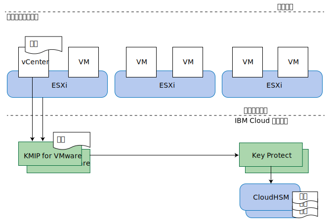

---

copyright:

  years:  2016, 2019

lastupdated: "2019-04-02"

subcollection: vmware-solutions

---

{:tip: .tip}
{:note: .note}
{:important: .important}

# KMIP for VMware 设计
{: #kmip-design}

KMIP for VMware on {{site.data.keyword.cloud}} 使用 [IBM Key Protect](/docs/services/key-protect?topic=key-protect-getting-started-tutorial) 或 [IBM Cloud Hyper Protect Crypto Services](/docs/services/hs-crypto?topic=hs-crypto-get-started#get-started) 提供根密钥和数据密钥存储器，从而提供与 VMware vSAN 加密和 VMware vSphere 加密兼容的密钥管理服务。Key Protect 和 Hyper Protect Crypto Services 在此解决方案中充当密钥管理服务。

## 存储加密选项
{: #kmip-design-storage-options}

KMIP for VMware 与 VMware vSAN 加密和 vSphere 加密兼容。这两种解决方案都是在系统管理程序层中实现的，但提供的功能略有不同。请根据您的需求来评估其功能。

### VMware vSAN 加密
{: #kmip-design-vsan-encrypt}

VMware vSAN 加密仅适用于 vSAN 数据存储。使用此解决方案时，VMware vCenter 和 VMware ESXi 主机将连接到密钥管理服务器（例如，KMIP for VMware）来获取加密密钥。这些密钥用来保护用于 vSAN 数据存储的各个磁盘驱动器，包括高速缓存和容量磁盘。vSAN 加密的实现方式保留了 vSAN 压缩和去重的优点。

由于 vSAN 加密是在数据存储级别运行的，因此其主要目标是在发生物理磁盘驱动器丢失时，防止数据泄露。此外，vSAN 加密与所有虚拟机备份和复制技术（例如，vSphere 复制、跨 vCenter vMotion、VMware HCX、Zerto、Veeam 和 IBM Spectrum Protect Plus）完全兼容。

**注**：
* vSAN 加密不会加密集群中的主机到主机 vSAN 复制通信。
* vSAN 加密不适用于其他存储解决方案，例如 {{site.data.keyword.cloud_notm}} 耐久性文件存储器和块存储器。
* vSAN 加密需要 vSAN Enterprise 许可证。

* vSAN 运行状况检查可能会定期发出警告，指示无法从一个或多个 vSphere 主机连接到 KMS 集群。出现这些警告是因为 vSAN 运行状况检查连接超时过快。您可以忽略这些警告。
有关更多信息，请参阅 [vSAN KMS 运行状况检查间歇性失败并返回 SSL 握手超时错误](https://kb.vmware.com/s/article/67115){:new_window}。

### vSphere 加密
{: #kmip-design-vsphere-encrypt}

VMware vSphere 加密适用于所有类型的 VMware 存储器，包括 vSAN 存储器以及 {{site.data.keyword.cloud_notm}} 耐久性文件存储器和块存储器。

使用此解决方案时，vCenter Server 和 ESXi 主机将连接到密钥管理服务器（例如，KMIP for VMware）来获取加密密钥。这些密钥用于根据虚拟机 (VM) 存储策略来保护各个 VM 磁盘。

vSphere 加密是在虚拟机磁盘级别运行的，因此在发生物理磁盘驱动器丢失或 VM 磁盘丢失时，可防止数据泄露。许多备份和复制技术会因为提供的数据已加密而无法有效地备份或复制。

因此 vSphere 加密与 vSphere 复制、跨 vCenter vMotion、VMware HCX、Zerto 或 IBM Spectrum Protect Plus 不兼容。但是，正确配置后，Veeam Backup and Replication 可与 vSphere 加密兼容。

### 更多注意事项
{: #kmip-design-considerations}

在 vSphere 集群中启用任一类型的加密后，VMware 会创建一个额外的密钥用于加密 ESXi 核心转储，因为这些转储可能包含敏感数据，例如密钥管理凭证、加密密钥或解密的数据。您应该熟悉 [vSphere 虚拟机加密和核心转储](https://docs.vmware.com/en/VMware-vSphere/6.5/com.vmware.vsphere.security.doc/GUID-63728E8B-810D-418B-B1AA-6A0A2F92AABE.html)。

KMIP for VMware 与 vSAN 加密或 vSphere 加密一起使用时，存在多层密钥保护。

如果您计划轮换密钥，请查看以下有关可以轮换密钥的级别的信息：
* 客户根密钥 (CRK) 用于保护所有 VMware 密钥。可以在与 KMIP for VMware 实例关联的 IBM Key Protect 或 Hyper Protect Crypto Services 实例中轮换这些密钥。
* KMIP for VMware 使用 CRK 来保护它生成并分发给 VMware 的密钥。VMware 将这些密钥视为“密钥加密密钥”(KEK)。
  * 如果使用的是 vSphere 加密，那么可以通过 **Set-VMEncryptionKey** PowerShell 命令来轮换密钥。
  * 如果使用的是 vSAN 加密，那么可以在 vSAN 用户界面上轮换密钥。
* VMware 使用这些 KEK 来保护它用于加密磁盘驱动器和 VM 磁盘的实际密钥。您可以使用 VMware 称之为“深度”再加密的方式来轮换这些密钥。此操作会重新加密所有加密数据，因此可能需要很长时间。
  * 如果使用的是 vSphere 加密，那么可以通过 **Set-VMEncryptionKey** PowerShell 命令来执行深度再加密。
  * 如果使用的是 vSAN 加密，那么可以使用 vSAN 用户界面执行深度再加密。

## KMIP for VMware
{: #kmip-design-kmip-for-vmware}

VMware vSAN 加密和 vSphere 加密与许多密钥管理服务器兼容。KMIP for VMware 提供的是 IBM 管理的密钥管理服务，该服务使用 IBM Key Protect 或 Hyper Protect Crypto Services 让您对自己的密钥有完全控制权。此外，其他 {{site.data.keyword.cloud_notm}} 服务（例如，Cloud Object Storage）也与 Key Protect 和 Hyper Protect Crypto Services 集成，从而使其成为 {{site.data.keyword.cloud_notm}} 中密钥管理的中央控制点。

### 密钥中的密钥
{: #kmip-design-keys}

密钥管理系统通常使用称为*包络加密*的技术，以通过其他密钥来包装或保护密钥。这些密钥称为*根密钥*或*密钥加密密钥* (KEK)。要访问密钥，您需要使用其对应的根密钥来解密或解包密钥。销毁根密钥是使受其保护的所有密钥失效的有效方法。这些密钥不需要存储在根密钥附近。控制对根密钥的访问非常重要。

{{site.data.keyword.cloud_notm}} Key Protect 和 Hyper Protect Crypto Services 使用*客户根密钥* (CRK) 来提供此服务。Key Protect 将 CRK 专门存储在 {{site.data.keyword.cloud_notm}} CloudHSM 硬件中，无法从该硬件中抽取 CRK；Hyper Protect Crypto Services 将密钥存储在 IBM zSeries HSM 中。然后，这些 CRK 用于包装更多加密密钥，例如由 KMIP for VMware 为 VMware 实例生成的加密密钥。

VMware 对其密钥实现此相同的概念。KMIP for VMware 根据请求向 VMware 提供密钥，然后 VMware 使用此密钥作为 KEK 来包装或加密最终密钥；最终密钥用于加密 vSAN 磁盘驱动器或虚拟机磁盘。这些最终密钥称为数据加密密钥 (DEK)。

所以我们最终得到以下加密链：
* 客户根密钥 (CRK)，永久存储在 IBM Key Protect 或 Hyper Protect Crypto Services 中。
* 密钥加密密钥 (KEK)，由 KMIP for VMware 生成并提供给实例中的 vCenter Server 和 ESXi 主机。
* 数据加密密钥 (DEK)，由 VMware 生成并随 vSAN 磁盘或虚拟机磁盘一起存储。

KMIP for VMware 将包装形式的 KEK 存储在 IBM Key Protect 或 Hyper Protect Crypto Services 中。虽然 KEK 由 CRK 以加密方式进行保护，并且不需要存储在 HSM 中，但如果将 KEK 存储在密钥管理服务中，那么您可以看到这些 KEK，并且如果需要撤销单个密钥，可以将其删除。

### 认证和授权
{: #kmip-design-authentication}

构成存储加密解决方案的三个组件为：VMware 集群、KMIP for VMware 实例和 Key Protect 或 Hyper Protect Crypto Services 实例。

VMware vCenter 和 ESXi 使用创建密钥管理服务器 (KMS) 连接时在 VMware vCenter 中安装或生成的证书，向 KMIP for VMware 实例进行认证。您可将公共证书安装到 KMIP for VMware 中，以识别允许连接的 vCenter 客户机。每个客户机都有权使用存储在该 KMIP for VMware 实例中的所有密钥。

通过使用已授予对 Key Protect 或 Hyper Protect Crypto Services 实例的访问权的 {{site.data.keyword.cloud_notm}} Identity and Access Management (IAM) 服务标识，可授权 KMIP for VMware 实例访问上述实例。该服务标识必须至少具有对密钥管理器实例的平台“查看者”访问权和服务“管理者”访问权。KMIP for VMware 使用您在密钥管理器实例中选择的客户根密钥 (CRK)，并将代表 VMware 生成的所有 KEK 以包装形式存储在密钥管理器实例中。

### 拓扑
{: #kmip-design-topology}

KMIP for VMware 在若干个 {{site.data.keyword.cloud_notm}} 多专区区域 (MZR) 中可用。有关完整列表，请参阅[订购 KMIP for VMware](/docs/services/vmwaresolutions/services?topic=vmware-solutions-kmip_standalone_ordering)。

在每个 MZR 中，KMIP for VMware 都会在 {{site.data.keyword.cloud_notm}} 专用网络上提供两个网络服务端点，以实现高可用性。请将 vCenter 密钥管理服务器 (KMS) 配置中的这两个端点配置为 KMS 集群。有关每个 MZR 中的端点的列表以及 KMIP 服务器证书签名的信息，请参阅 [KMIP for VMware 服务文档](/docs/services/vmwaresolutions/services?topic=vmware-solutions-kmip_standalone_ordering)。

要通过专用网络访问 KMIP for VMware，必须为 {{site.data.keyword.cloud_notm}} 基础架构帐户启用虚拟路由和转发 (VRF)，并且必须将 {{site.data.keyword.cloud_notm}} 网络服务端点路径添加到帐户的 VRF 路径中。有关更多信息，请参阅[使用 IBM Cloud CLI 支持帐户使用服务端点](/docs/services/service-endpoint?topic=service-endpoint-getting-started#cs_cli_install_steps)。

KMIP for VMware 还可使用 {{site.data.keyword.cloud_notm}} 专用网络（而不是公用因特网）来连接到 {{site.data.keyword.cloud_notm}} Key Protect。

图 1. KMIP for VMware on {{site.data.keyword.cloud_notm}} 的组件

使用 IBM Cloud Hyper Protect Crypto Services 时，密钥是存储在 IBM zSeries HSM 中，而不是存储在 CloudHSM 中。此外，KMIP for VMware 与 {{site.data.keyword.cloud_notm}} Hyper Protect Crypto Services 之间的连接通过公用网络建立，但受 TLS 加密和认证保护。

## 相关链接
{: #kmip-design-related}

* [解决方案概述](/docs/services/vmwaresolutions/archiref/kmip?topic=vmware-solutions-kmip-overview)
* [实现和管理](/docs/services/vmwaresolutions/archiref/kmip?topic=vmware-solutions-kmip-implementation)
* [IBM Key Protect](/docs/services/key-protect?topic=key-protect-getting-started-tutorial)
