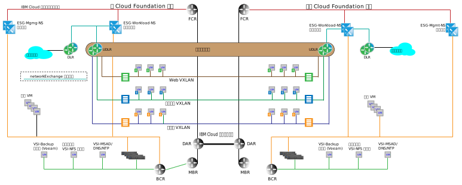

---

copyright:

  years:  2016, 2018

lastupdated: "2018-10-29"

---

# 多站点体系结构

{{site.data.keyword.cloud}} 与其他云产品之间的一个关键区别在于，它能够在全球供应专用计算能力，并自动将随需应变的基础架构与专用 {{site.data.keyword.cloud_notm}} 帐户中的网络相连接。VMware vCenter Server 和 VMware Cloud Foundation 的软件定义的网络功能与 {{site.data.keyword.cloud_notm}} 一起提供了可以在数天内完成构建的精细全球基础架构。以下各部分描述了多站点体系结构示例，说明可以通过 vCenter Server 或 Cloud Foundation 的开箱即用功能实现哪些内容。

## 跨 vCenter NSX 环境

跨 vCenter NSX 功能支持以主/辅助关系链接最多 9 个 NSX Manager：1 个主 NSX Manager 和 8 个辅助 NSX Manager。虽然整个 vCenter NSX 正常运行无需采用增强链接方式 (ELM) 关系的 vCenter Server，但具有这样的 vCenter Server 可提供以下优点：

* 使用单点登录 (SSO) 凭证简化了主/辅助关系创建
* vCenter Server 和 Cloud Foundation 自动化配置用于链接在一起的所有站点的 DNS 名称解析
* 在所有站点中，通过一个窗格，对 NSX 和常规 vCenter 功能进行管理

## 多站点示例

以下示例将 NSX 通用传输专区添加到先前部分中讨论的基本管理和工作负载拓扑，此外还有以下特征：

* 通用传输专区跨一个 {{site.data.keyword.CloudDataCent_notm}} 中的两个 {{site.data.keyword.CloudDataCents_notm}} 或 POD。
* 添加传输专区后，将添加多个 VXLAN 以及跨新 VXLAN 的通用分布式路由器。
* 必须在两个站点中配置工作负载 ESG 的上行链路。此配置允许本地站点中的虚拟机 (VM) 遍历到其本地 ESG。
* 对于入站流量，需要一个全局负载均衡器。请参阅 {{site.data.keyword.cloud_notm}} 全局负载均衡产品以满足此需求。
* 此示例需要 VMware NSX Enterprise Edition。

图 1. 多站点拓扑

### 相关链接

* [{{site.data.keyword.cloud_notm}} 上的联网服务](networking_services.html)
