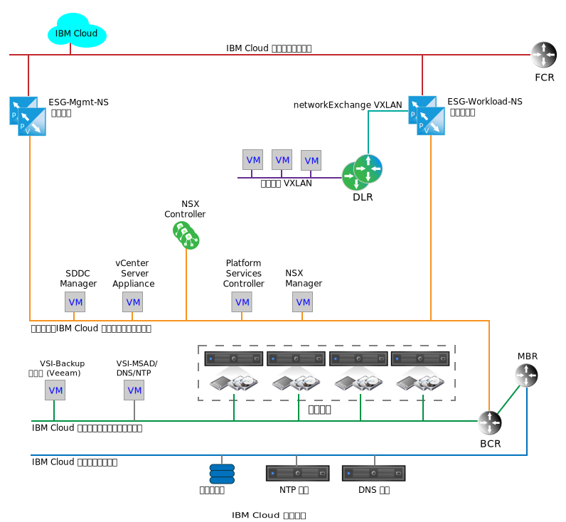
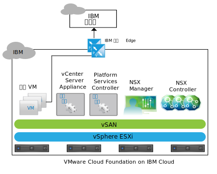
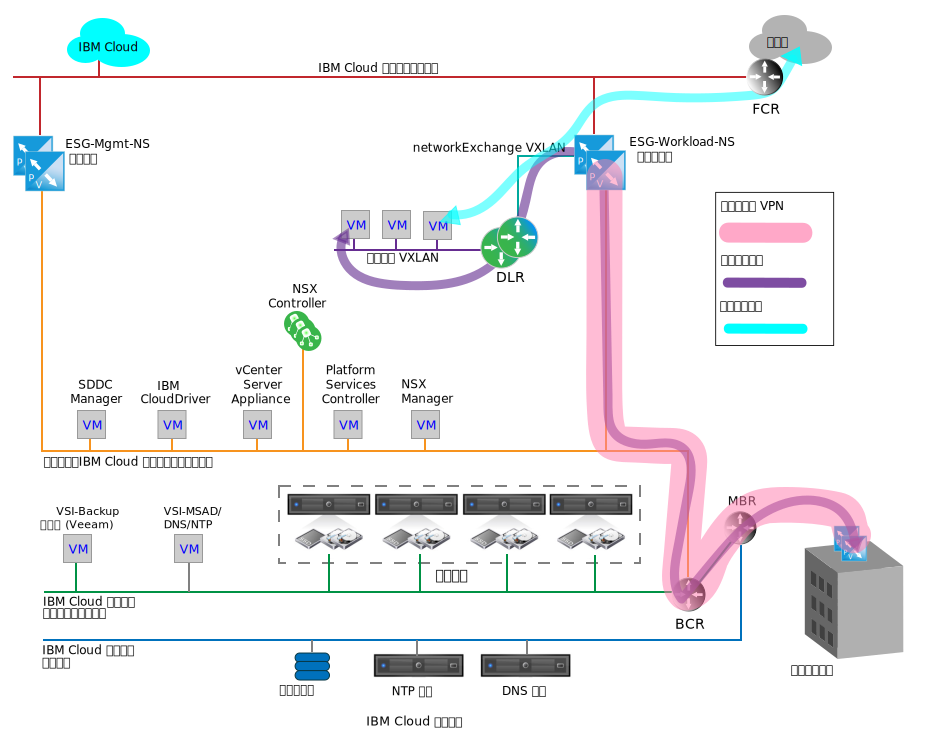

---

copyright:

  years:  2016, 2019

lastupdated: "2019-04-02"

subcollection: vmware-solutions

---

{:tip: .tip}
{:note: .note}
{:important: .important}

# IBM Cloud 上的联网服务
{: #nsx-networking_services}

{{site.data.keyword.cloud}} 上的联网服务由两对 VMware NSX Edge 服务网关 (ESG) 组成，用于通过虚拟专用网 (VPN) 在 {{site.data.keyword.cloud_notm}} 和公用因特网或客户内部部署网络之间进行通信。这些 ESG 已隔离，以支持内部 {{site.data.keyword.cloud_notm}} 管理功能和流出流量（即与客户相关的网络流量的流入）。

下图是简化的网络图，描绘了管理对和工作负载 ESG 对。图中还显示了 NSX 分布式逻辑路由器 (DLR) 和工作负载 VXLAN。这些组件旨在作为客户工作负载的初始着陆点，而无需特定知识在 NSX 中设置这些组件。DLR 通常用于路由 VMware vCenter Server 之间的流量，以及路由实例内不同的第 2 层网络之间的东-西流量。此行为与 ESG 不同，ESG 用于支持遍历进出 vCenter Server 实例的南-北网络流量。

图 1. vCenter Server 上的云联网服务

虽然单个 ESG 可能足以应对管理和客户的工作负载流量，但隔离管理和客户流量是一项设计决策，可防止意外的管理 ESG 配置错误。

对管理 ESG 进行错误配置或将其禁用并不会妨碍 vCenter Server 实例正常运行，但会禁用所有门户网站管理功能。
{:note}

## IBM 管理服务 NSX Edge
{: #nsx-networking_services-mgmt-serv-nsx-edge}

IBM 管理 ESG 是一种专用 NSX Edge 集群，仅用于 {{site.data.keyword.cloud_notm}} 管理网络流量。它不适用于非 vCenter Server 自动化所部署和管理的任何组件的流量遍历。

管理 ESG 提供了位于 vCenter Server 实例中的附加组件服务虚拟机 (VM) 与 {{site.data.keyword.cloud_notm}} 中 IBM Automation 基础架构之间的通信路径，如下图中针对 vCenter Server 所示。

图 2. vCenter Server 上的管理 Edge 通信

由于某些附加组件服务 VM 与其相应的许可和计量系统之间的通信负载较轻，因此 NSX ESG 可在主动/被动高可用性 (HA) 对的大型配置中调整大小，并部署在 vCenter Server 集群的管理资源池中。下表提供了 IBM 管理 NSX ESG 部署的摘要。

表 1. IBM 管理 NSX ESG 规范

|IBM 管理 NSX Edge|vCPU|内存|磁盘大小|存储位置|
|:----------------------- |:---- |:------ |:--------- |:---------------- |
|IBM 管理 NSX ESG 1|2|1 GB|1 GB|用于管理的 vSAN 数据存储或共享连接的存储器|
|IBM 管理 NSX ESG 2|2|1 GB|1 GB|用于管理的 vSAN 数据存储或共享连接的存储器|

### 管理服务
{: #nsx-networking_services-mgmt-services}

需要对以下服务进行出站访问：

* Zerto Virtual Manager。如果已安装，那么 Zerto on {{site.data.keyword.cloud_notm}} 需要对因特网进行出站访问以获取许可激活和使用情况报告。
* Veeam Backup and Replication。如果已安装，那么 Veeam on {{site.data.keyword.cloud_notm}} 需要对因特网进行出站访问以下载产品和许可证更新。
* FortiGate Virtual Appliance on {{site.data.keyword.cloud_notm}} 需要对因特网进行出站访问以获取许可激活和许可监视。
* F5 on {{site.data.keyword.cloud_notm}} 需要对因特网进行出站访问以获取许可激活。

### Edge 接口
{: #nsx-networking_services-edge-interfaces}

ESG 接口的配置定义了 ESG 有权访问的 L2 网络。要实现 vCenter Server 生命周期管理，需要允许放置在管理 VLAN 上的特定 VM 遍历到公用 VLAN。部署时定义了以下接口：

表 2. NSX ESG 接口配置

|接口|接口类型|连接到|描述|
|:--------- |:-------------- |:------------ |:----------- |
|公共上行链路|上行链路|**SDDC-DportGroup-External**|面向公用因特网的接口|
|专用上行链路|上行链路|**SDDC-DportGroup-Mgmt**|面向内部专用网络的接口|
|内部|内部|工作负载 HA VXLAN|用于 ESG HA 对脉动信号的内部接口；**SDDC-Dswitch-Private** 上的端口组|

### 子网
{: #nsx-networking_services-subnets}

以下子网用于管理 ESG：

表 3. NSX ESX IP 配置

|接口|接口类型|IPv4 子网类型|范围|描述|
|:--------- |:-------------- |:----------------- |:----- |:----------- |
|公共上行链路|上行链路|{{site.data.keyword.cloud_notm}} 可移植公共|/30 - 提供一个可分配的 IP 地址|面向公用因特网的接口|
|专用上行链路|上行链路|{{site.data.keyword.cloud_notm}} 可移植专用（现有管理）|/26 - 提供 61 个可分配的 IP 地址|面向内部专用网络的接口|
|内部|内部|本地链接|169.254.0.0/16|用于 ESG HA 对通信的内部接口|

### 网络地址转换定义
{: #nsx-networking_services-nat-definitions}

在管理 ESG 上，网络地址转换 (NAT) 用于允许网络流量在不同 IP 地址空间之间遍历。这样做通常是为了保护因特网可路由 IP 地址，或出于安全原因对公共 IP 地址隐藏内部 IP 地址。NAT 还用于支持传输控制协议 (TCP) 和用户数据报协议 (UDP) 端口重定向。管理流量始终从 vCenter Server 实例内部发起，只需要在管理 ESG 上定义源 NAT (SNAT) 即可。对于托管需要从实例中流出流量的服务的每个内部 VM，不会为其创建单独的 SNAT。

表 4. NSX ESG NAT 配置

|在接口上应用|源 IP 范围|转换的源 IP|
|:-------------------- |:--------------- |:-------------------- |
|公共上行链路|管理可移植 /26 上的各个 IP 地址|{{site.data.keyword.cloud_notm}} 可移植公共|

### 路由
{: #nsx-networking_services-routing}

由于通过管理 ESG 遍历所需的 VM 中的服务还可能需要访问客户 {{site.data.keyword.cloud_notm}} 专用网络中的 {{site.data.keyword.cloud_notm}} 服务，因此需要以下配置来实现此通信。

虽然难以预测需要哪个目标 IP 范围来作为面向因特网的连接的目标，但由 {{site.data.keyword.cloud_notm}} 部署并管理的任何服务都会指向作为其缺省网关的管理 ESG。对于需要外部网络连接的服务，需要使用静态路由强制通过 {{site.data.keyword.cloud_notm}} BCR 进行通信。

对于使用管理 ESG 来遍历 vCenter Server 实例流出流量的任何服务，都建议使用以下配置：
* 缺省网关为管理 ESG。
* 内部 {{site.data.keyword.cloud_notm}} 目标需要静态路由。

如果需要服务或 VM 来访问客户 ESG，那么必须在单个服务或 VM 内维护静态路由，并使其指向客户 ESG。

当前未配置管理 ESG 的自动路由协议。

### VXLAN 定义
{: #nsx-networking_services-vlan-definitions}

“管理 HA”对需要通过网络连接到内部接口，支持使用现有 vSwitch、端口组或 VXLAN。对于此设计，将为管理 ESG HA 对的 HA 脉动信号通信创建专用 VXLAN。

表 5. NSX ESG VXLAN 定义

|NSX ESG VXLAN 定义|传输区域|类型|
|:------------------------- |:-------------- |:---- |
|管理 HA|transport-1|全局|

### 防火墙规则
{: #nsx-networking_services-firewall-rules}

缺省情况下，管理 ESG 配置为拒绝所有流量。

**拒绝**：当任何先前（在顺序中较高）规则或规则集不允许流量遍历防火墙时，会丢弃所有这些流量而不提供响应。系统将选择自动生成规则以允许控制流至 ESG 对的流量。

除了设置了自动生成的规则之外，还设置了以下防火墙规则：

表 6. NSX ESG 防火墙配置

|服务|源|目标|协议|操作|
|:------- |:------ |:----------- |:-------- |:------ |
|Zerto on {{site.data.keyword.cloud_notm}}|Zerto 管理 VM|任意|端口 443|允许|
|Veeam on {{site.data.keyword.cloud_notm}}|Veeam Backup and Replication VM|任意|端口 443|允许|
|FortiGate Virtual Appliance on {{site.data.keyword.cloud_notm}}|服务 VM|任意|端口 443|允许|
|F5 on {{site.data.keyword.cloud_notm}}|服务 VM|任意|端口 443|允许|
|任意|任意|任意|任意|拒绝|

## IBM 工作负载 NSX Edge
{: #nsx-networking_services-wkld-nsx-edge}

IBM 工作负载 ESG 是用于工作负载网络通信的简单拓扑的一部分。以下部分描述了在何处将工作负载连接到 vCenter Server 实例中网络的设计意图。这是将内部部署网络和 IP 空间连接到特定 vCenter Center 实例的起点，也是真正的混合云体系结构的基础。

同时连接到公用和专用 {{site.data.keyword.cloud_notm}} 网络的客户网络不仅支持工作负载访问面向因特网的进出流量，还支持通过公用或专用 {{site.data.keyword.cloud_notm}} 网络创建站点到站点 VPN。这将使与连接到内部部署网络相关的价值实现时间大幅缩短，因为由于客户安全性需求，这可能需要数月时间来部署专用广域网 (WAN)。但是，在专用链路就位后，可以对 VPN 执行翻转以遍历该链路，而不会影响 VPN 隧道内部或者 vCenter Server 实例中的覆盖网络。完成此操作后，可以根据需要，从安全性透视图中除去工作负载 ESG 的公共接口。

下图中的拓扑包含以下 NSX 组件：
* NSX Edge 设备 (ESG)
* 分布式逻辑路由器 (DLR)
* VXLAN（叠加在 L3 上的 L2）

图 3. 示例网络流程图

### IBM 工作负载 NSX Edge 的 Edge 接口
{: #nsx-networking_services-edge-interfaces-workload}

与管理 ESG 一样，ESG 接口的配置也会定义 ESG 有权访问的 L2 网络。工作负载拓扑的设计意图中，有一部分是实现软件定义的联网 (SDN) 覆盖，以将工作负载与底层的 {{site.data.keyword.cloud_notm}} 地址空间相隔离。此设计是实现 BYOIP 设计的基础。因此，部署时定义了以下接口：

表 7. 工作负载 Edge 接口配置

|接口|接口类型|连接到|描述|
|:--------- |:-------------- |:------------ |:----------- |
|公共上行链路|上行链路|SDDC-DportGroup-External|面向公用因特网的接口|
|专用上行链路|上行链路|SDDC-DportGroup-Mgmt|面向内部专用网络的接口|
|传输上行链路|上行链路|Workload-Trasit|工作负载 ESG 与工作负载 DLR 之间的传输 VXLAN|
|内部|内部|工作负载 HA VXLAN|用于 ESG HA 对脉动信号的内部接口|

在此设计中，利用 DLR 来支持在本地工作负载连接的 L2 网络之间进行潜在的东-西路由。由于此拓扑旨在作为简单示例，因此仅描述了一个用于工作负载的 L2 网络。通过添加连接到 DLR 上新接口的更多 VXLAN，就可以实现添加更多安全专区。下表显示了要配置的 DLR 接口：

表 8. DLR 接口

|接口|接口类型|连接到|描述|
|:--------- |:-------------- |:------------ |:----------- |
|传输上行链路|上行链路|Workload-Trasit|工作负载 ESG 与工作负载 DLR 之间的传输 VXLAN|
|工作负载上行链路|上行链路|工作负载|用于工作负载连接的 VXLAN|
|内部|内部|工作负载 HA VXLAN|用于 ESG HA 对脉动信号的内部接口|

### IBM 工作负载 NSX Edge 的子网
{: #nsx-networking_services-subnets-workload}

以下子网用于工作负载 ESG：

表 9. DLR 和工作负载 ESG IP 配置

|接口|接口类型|IPv4 子网类型|范围|描述|
|:--------- |:-------------- |:----------------- |:----- |:----------- |
|公共上行链路 (ESG)|上行链路|{{site.data.keyword.cloud_notm}} 可移植公共|/30 - 提供一个可分配的 IP 地址|面向公用因特网的接口（客户可以单独订购更多 IP 地址） |
|专用上行链路 (ESG)|上行链路|{{site.data.keyword.cloud_notm}} 可移植专用（现有管理）|/26 - 提供 61 个可分配的 IP 地址|面向内部专用网络的接口|
|内部（ESG 和 DLR）|内部|本地链接|169.254.0.0/16|用于 ESG HA 对通信的内部接口|
|传输上行链路（ESG 和 DLR）|上行链路|由客户分配|待定|用于 ESG 到 DLR 的传输网络连接|
|工作负载 (DLR)|上行链路|由客户分配|待定|工作负载子网|

### IBM 工作负载 NSX Edge 的 NAT 定义
{: #nsx-networking_services-nat-definitions-nsx-edge}

在工作负载 ESG 上，NAT 用于允许网络流量在不同 IP 地址空间之间遍历。对于工作负载 ESG, 需要 NAT 不仅允许与因特网目标进行通信，还允许与任何以 {{site.data.keyword.cloud_notm}} 为源的 IP 范围进行通信。对于此设计，允许工作负载流量流出到因特网，但不允许流出到管理或任何 {{site.data.keyword.cloud_notm}} 网络。因此，只需要在工作负载 ESG 上定义 SNAT。整个工作负载可移植子网会配置为遍历 SNAT。

虽然可以使用 NAT 来支持在 vCenter Server 的多个实例之间进行工作负载通信，但当许多工作负载需要跨实例进行连接时，这种做法会变得不切实际。有关使用高级 NSX 功能在 vCeter Server 实例中创建 L2 覆盖传输网络的示例，请参阅[多站点体系结构](/docs/services/vmwaresolutions/archiref/nsx?topic=vmware-solutions-nsx-multi_site)。

表 10. 工作负载 ESG NAT 规则

|在接口上应用|源 IP 范围|转换的源 IP|启用或禁用 NAT|
|:-------------------- |:--------------- |:-------------------- |:----------------------- |
|公共上行链路（工作负载 ESG）|客户定义|{{site.data.keyword.cloud_notm}} 可移植公共 IP|客户定义（缺省为禁用）|

### IBM 工作负载 NSX Edge 的路由
{: #nsx-networking_services-routing-wkld}

在此设计中，对于遍历 DLR 到工作负载 ESG 的工作负载，唯一要求是可访问因特网。工作负载 ESG 需要了解在 DLR 后面创建的工作负载 VXLAN 的路径以及任何未来工作负载 VXLAN/子网的路径。虽然这可以通过 ESG 上的静态路由实现，但工作负载拓扑的目的是展示最佳实践设计。因此，将在工作负载 ESG 与下游 DLR 之间配置开放式最短路径优先协议 (OSPF)。

有关该配置的更多信息，请参阅[配置 OSPF 协议](https://pubs.vmware.com/NSX-6/index.jsp?topic=%2Fcom.vmware.nsx.admin.doc%2FGUID-6E985577-3629-42FE-AC22-C4B56EFA8C9B.html)。

表 11. 动态路由

|区域|OSPF 类型|OSPF 接口 IP|OSPF 认证|
|:---- |:--------- |:----------------- |:------------------- |
|51|存根|为传输 RFC1918 网络上的每个 DLR 和 ESG 分配一个 IP|无|

### IBM 工作负载 NSX Edge 的防火墙规则
{: #nsx-networking_services-firewall-wkld}

缺省情况下，工作负载 ESG 配置为拒绝所有流量。

**拒绝**：当任何先前（在顺序中较高）规则或规则集不允许流量遍历防火墙时，会丢弃所有这些流量而不提供响应。系统将选择自动生成规则以允许控制流至 ESG 对的流量。

除了设置了自动生成的规则之外，还设置了以下防火墙规则。

表 12. 工作负载 ESG 防火墙规则

|服务|源|目标|协议|操作|
|:------- |:------ |:----------- |:-------- |:------ |
|工作负载|工作负载子网|任意|任意|允许|
|任意|任意|任意|任意|拒绝|

### IBM 工作负载 NSX Edge 的 VXLAN 定义
{: #nsx-networking_services-vxlan-definitions}

工作负载拓扑 ESG 和 DLR HA 对需要 L2 分段 (VXLAN) 来连接内部接口、在两个接口之间传输数据，以及用于工作负载。

表 13. 工作负载 ESG 内部接口

|VXLAN 名称|vCenter Server 传输专区|类型|
|:---------- |:------------------------------------------------- |:---- |
|工作负载 HA|transit-1|全局|
|工作负载传输|transit-1|全局|
|工作负载|transit-1|全局|

### IBM 工作负载 NSX Edge 的 ESG DLR 设置
{: #nsx-networking_services-esg-dlr-sett}

缺省情况下，在所有新的 NSX Edge 设备上都会启用日志记录。缺省日志记录级别为 NOTICE。

## 相关链接
{: #nsx-networking_services-related}

* [NSX Edge 服务网关设计](/docs/services/vmwaresolutions/archiref/nsx?topic=vmware-solutions-nsx_design)
* [多站点体系结构](/docs/services/vmwaresolutions/archiref/nsx?topic=vmware-solutions-nsx-multi_site)
