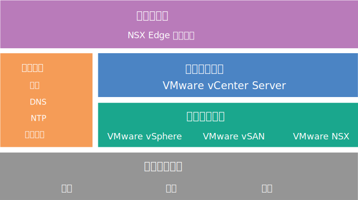

---

copyright:

  years:  2016, 2019

lastupdated: "2019-03-01"

---

{:tip: .tip}
{:note: .note}
{:important: .important}

# NSX Edge 服务网关设计
{: #nsx_design}

NSX Edge Services Gateway on {{site.data.keyword.cloud}} 解决方案提供了在全球范围内的 {{site.data.keyword.CloudDataCents_notm}} 中部署的 VMware 技术。{{site.data.keyword.vmwaresolutions_short}} 提供了两种与 NSX Edge 服务网关相关的解决方案体系结构。

## 内部体系结构设计
{: #nsx_design-internal-archi}

内部体系结构指定在 VMware Cloud Foundation 融合集群或 VMware vCenter Server 集群的资源池中必需 NSX Edge 组件的部署。

在下图中 VMware vSAN 是可选的。
{:note}

图 1. {{site.data.keyword.cloud_notm}} 上的云联网服务

## 专用体系结构设计
{: #nsx_design-dedicated-archi}

专用体系结构在专用于 NSX Edge 的单独双节点 vSphere 集群中部署必需的 NSX Edge 组件，并提供与物理网络基础架构的关键交互。专用体系结构具有下列特征和功能：

* 提供与物理网络之间的“入口匝道”和“出口匝道”连接。例如，NSX Edge 虚拟设备上的南-北 L3 路由。
* 允许与通过 NSX L2 桥接连接到物理网络中 VLAN 的物理设备进行通信，并托管用于分布式逻辑路由器 (DLR) 路由的控制虚拟机 (VM)。
* 可以具有集中式逻辑或物理服务。例如，防火墙、负载均衡器、虚拟专用网 (VPN) 监视组件和日志洞察 VM。
* 专用 vCenter 用于管理计算和边缘资源时，NSX Controller 可在边缘集群中进行托管。
* 边缘集群资源具有反亲缘关系需求，可在故障期间保护主动/备用配置或保持带宽可用性。

## IBM Cloud 专用 IP 地址范围和自带 IP 地址范围
{: #nsx_design-ip-addr-ranges}

RFC1918 专用 IP 地址范围专门保留了网络范围供组织内部使用，这些范围从不用于因特网。{{site.data.keyword.cloud_notm}} 物理网络基础架构在所有全球位置中使用特定 RFC1918 专用地址空间 10.x.x.x/8。这些 IP 地址范围不会在不同客户帐户之间或在某个 {{site.data.keyword.cloud_notm}} 客户帐户内重叠。在一个客户帐户中，如果启用了虚拟路由和转发 (VRF)，那么 {{site.data.keyword.cloud_notm}} 分配的任何专用 IP 地址空间都可以路由到任何 {{site.data.keyword.CloudDataCents_notm}} 中的其他任何 {{site.data.keyword.cloud_notm}} 专用 IP 地址范围。

虽然这会使得在您的帐户内设置全球范围连接的基础架构变得简单，但当您要使用与 {{site.data.keyword.cloud_notm}} 相同的专用地址空间通过路由将数据中心扩展到 {{site.data.keyword.cloud_notm}} 时，固定 IP 地址空间可能会发生问题。解决方案是使用 NSX 在 Cloud Foundation 或 vCenter Server 基础架构上创建覆盖拓扑，从而将您的自带 IP (BYOIP) 地址空间与使用 {{site.data.keyword.cloud_notm}} 分配的专用 IP 地址空间进行的交互相隔离。NSX 可以提供 L2 VPN，以在外部可能重叠的 IP 地址空间上的隧道内跨越内部 BYOIP 地址空间。

## 相关链接
{: #nsx_design-related}

* [解决方案概述](/docs/services/vmwaresolutions/archiref/solution?topic=vmware-solutions-solution_overview)
