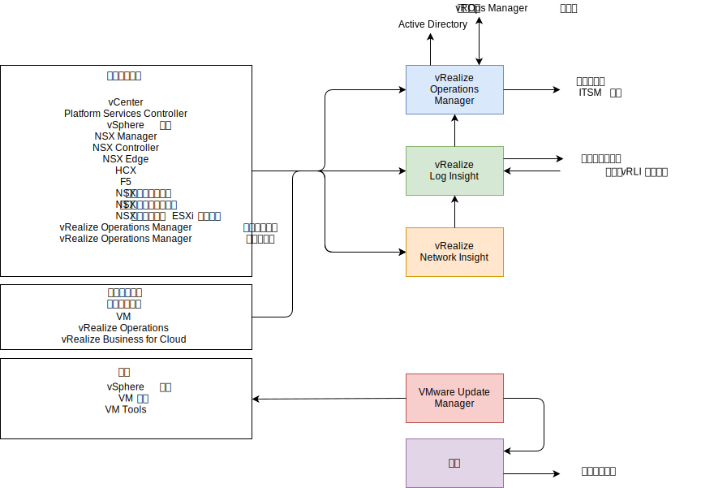

---

copyright:

  years:  2016, 2019

lastupdated: "2019-06-03"

---

# 操作管理体系结构概述
{: #opsmgmt-arch}
操作管理层中的产品体系结构通过 {{site.data.keyword.vmwaresolutions_full}} 的日志记录数据提供集中监视。操作管理层实时监视物理基础架构、虚拟基础架构以及（可选）客户机的计算工作负载。

在高级别，将收集以下信息：
* 拓扑数据，例如物理和虚拟计算、联网和存储对象。
* 监视数据，例如：
  * 度量值 - 结构化数据，例如性能和容量
  * 日志 - 非结构化数据，例如系统事件

## 操作管理流程
{: #opsmgmt-arch-flows}

下图显示了操作管理工具的关键交互和集成。

{{site.data.keyword.vmwaresolutions_short}} 操作管理包含以下步骤：
* 监视 - vRealize Operations Manager (vROps) 使用分析算法来跟踪和分析 {{site.data.keyword.vmwaresolutions_short}} 体系结构中多个对象的操作。这些算法有助于 vROps 了解并预测这些对象的行为。系统管理员可使用视图、报告和仪表板来访问这些信息。

  环境中存在问题时，vROps 会生成三种影响类型的警报：
    * 运行状况警报 - 指示影响环境运行状况，并需要立即关注的问题。
    * 风险警报 - 指示不会立即带来威胁，但需要在不久的将来予以解决的问题。
    * 效率警报 - 用于提高性能或回收资源的信息。

  vROps 警报是数据分析指示与标准度量值偏离，或者在某个受监视组件发生问题时，在受监视对象上发生的事件。vROps 警报会分配有以下其中一种类别：
    * 严重 - 必须立即采取行动。
    * 立即 - 必须尽快采取行动。
    * 警告 - 必须在时间允许时进行检查。

* 日志记录 - vRealize Log Insight (vRLI) 通过基于机器学习的智能分组、高性能搜索以及对 {{site.data.keyword.vmwaresolutions_short}} 体系结构中的物理和虚拟对象进行故障诊断，提供实时日志管理和日志分析。vRLI 通过使用 `syslog` 协议从 vSphere 主机收集数据。它还会收集其他 VMware 产品（如 vCenter Server）的事件、任务和警报数据。它与 vROps 集成，以发送通知事件并支持在上下文中启动。{{site.data.keyword.vmwaresolutions_short}} 体系结构中能够发送 `syslog` 数据的其他对象会指向 vRLI。（可选）客户机可以配置能够发送 syslog 数据的任何系统，以将这些数据转发到 vRLI。

* 网络运行状况 - vRealize Network Insight 是一个分析工具，专注于主动启用：
  * 网络运行状况和性能监视。
  * 端到端故障诊断。
  * 360 度透视和分析。
  * 基于微分段的合规性管理。

* 修补和升级 - vSphere Update Manager (VUM) 为 VMware vSphere 主机和虚拟机 (VM)（非操作系统和应用程序）提供集中的自动补丁和版本管理。

## 操作管理联网
{: #opsmgmt-arch-network}

下图显示了网络概述。

* 供应了工具专用可移植子网，以提供用于初始供应工具 VM 的 {{site.data.keyword.cloud_notm}} IP 地址空间。供应之后，由客户负责管理用于横向扩展工具的 IP 地址空间。此子网上的 VM 需要对在管理子网和内部管理子网上托管的组件的访问权。
* 工具 VXLAN 子网用于提供用于初始供应工具 VM 的 BYOIP IP 地址空间，但在此之后，由客户负责管理用于横向扩展工具的 IP 地址空间。此子网上的 VM 需要对在覆盖子网上托管的组件的访问权。ESG 提供 {{site.data.keyword.cloud_notm}} 和 BYOIP 地址空间之间的 NAT。
* 如果客户要利用 vROps 来监视其计算 VM，那么由客户来部署 vROps 远程收集器。
* vRLI 转发器将日志消息从覆盖组件中继到 vRLI 集群。客户还可以将其计算 VM 配置为使用这些转发器（如果需要）。
* VMware Update Manager (VUM) 提供对 vSphere 主机和 VM 硬件及工具的更新。VUM 使用代理来获取对因特网存储库的访问权。

vROps 从环境中的对象收集数据。收集的每条数据都称为度量值观察或值。vROps 使用 vCenter 适配器从 vCenter 中收集原始度量值。除了收集度量值外，vROps 还会计算容量度量值、徽章度量值以及用于监视系统运行状况的度量值。警报定义是症状和建议的组合，用于识别问题区域并生成警报，您可根据警报对这些区域采取行动。

## 受监视组件
{: #opsmgmt-arch-components}

### 监视 vCenter
{: #opsmgmt-arch-components-vcenter}

通过 vROps 和 VMware SDDC Health Management Pack 来完成对 vCenter 的监视。vRLI 从 vCenter 中收集日志数据，vSphere 的内容包将特定理解添加到日志，并转而向 vROps 发送警报。

VMware SDDC Health Management Pack 监视 SDDC 管理堆栈，并为与 SDDC 产品组件（包括 vCenter）的配置和合规性相关的运行状况和警报提供徽章。

### 监视 vSphere 主机
{: #opsmgmt-arch-components-hosts}

使用 vROps 通过 vCenter 来完成对 vSphere 主机的监视，并通过 vRLI 来收集日志。

### 监视 vSAN
{: #opsmgmt-arch-components-vsan}

要监视 vSAN，将使用 vROps 和 vRLI。在 vCenter 中，可以使用一组额外的 vSAN 运行状况检查。安装 Management Pack for vSAN 可提供更多仪表板来帮助监视 vSAN。

如果 VMware vSAN 适配器监视的存储区域网络中的 SDDC 产品组件发生问题，那么 vROps 会生成警报。与配置合规性和运行状况相关的警报会通过 VMware vSAN Management Pack 中的 VMware SDDC Health Solution Management Pack 传递。vSAN 使用 vSAN 适配器通过 vCentre 设备与 vROps vSAN Management Pack 一起进行监视。缺省收集时间间隔为 5 分钟，并且 vSAN 适配器还会从 vSphere 对象中收集运行状况检查服务和性能服务度量值。运行状况检查服务时间间隔在 vSphere 界面中进行配置，缺省情况下为 60 分钟。

要确保 vSAN 适配器可以收集所有性能数据，必须在 vSphere 中启用 vSAN 性能服务。

### 监视 NSX for vSphere
{: #opsmgmt-arch-components-nsxv}

为了监视 NSX，实现了以下工具：
* vRealize Operations Manager (vROps)
* vRealize Log Insight (vRLI)
* vRealize Network Insight (vRNI)

这使系统管理员能够对 VMware NSX 进行监视、管理和故障诊断。vROps Management Pack for VMware NSX 提供了对网络拓扑的透视。通过 NSX 仪表板，可快速了解 NSX 环境及其组件运行状况的概况。NSX 对象与 vSphere 对象之间的相关性支持轻松进行故障诊断。

vROps 使用 Management Pack 来轮询 VMware NSX，以获取配置、性能和支持数据。Management Pack 代表 vROps 将轮询请求转换为 REST API 调用，以从 NSX Manager 中检索所需的数据。

NSX 组件需要配置为将 syslog 发送到 vRLI。

* NSX Manager - [Specify Syslog Server](https://pubs.vmware.com/NSX-6/topic/com.vmware.nsx.admin.doc/GUID-EA70974C-07F8-469D-8A9D-0ED54F0C8F34.html#GUID-EA70974C-07F8-469D-8A9D-0ED54F0C8F34){:new_window}。
* NSX Controller - [配置 NSX Controller](https://kb.vmware.com/s/article/2092228){:new_window}。
* NSX Edge - [Configure Remote Syslog Servers](https://pubs.vmware.com/NSX-6/topic/com.vmware.nsx.admin.doc/GUID-9C25E097-E2CC-461A-9DA6-E8118D16EE62.html#GUID-9C25E097-E2CC-461A-9DA6-E8118D16EE62){:new_window}。
* 防火墙 - 必须为已启用防火墙的每个集群配置远程 syslog 服务器。远程 syslog 服务器在 `Syslog.global.logHost` 属性中指定。

NSX 流监视可以在 NSX Manager 中使用，以确定哪些流已核准，哪些流被阻止。如果需要，可以为 vSphere 分布式交换机配置端口镜像。

### 监视 NSX-T
{: #opsmgmt-arch-components-nsxt}

为了监视 NSX-T，实现了以下工具：

* vRealize Operations Manager (vROps)
* vRealize Log Insight (vRLI)

VMware SDDC Health Management Pack 监视以下组件：
* 逻辑交换机 - 监视逻辑交换机的管理状态。
* 控制器集群 - 监视已部署的 HA 集群节点计数，并维护定额。
* 控制器节点 - 监视与控制器集群和管理器节点的节点连接。
* Edge 节点 - 监视处于“正在运行”状态的 Edge 节点及其与控制器集群和管理器节点的连接。
* NSX-T 管理服务。
* T0 路由器服务 - 监视静态路由、NAT、BGP、BFD 和路径重新分发服务。
* T1 路由器服务 - 监视静态路由、NAT 和路径公布服务。

### 监视 vRealize Operations Manager
{: #opsmgmt-arch-components-vrops}

VMware SDDC Health Management Pack 具有针对以下事件的警报定义：
* 对于给定负载，vRealize Operations Manager 节点的当前大小调整不足。
* 集群节点配置未遵循 vRealize Operations Manager 大小调整准则。
* 对于给定负载，远程收集器的当前大小调整不足。
* 远程收集器配置未遵循 vRealize Operations Manager 大小调整准则。
* vRealize 操作集群已超过建议的分析节点数。

### 监视 vRealize Log Insight
{: #opsmgmt-arch-components-vrli}

vRLI 支持触发有关其运行状况的通知的警报，并在发生重要系统事件（例如，磁盘空间几乎耗尽，以及 vRealize Log Insight 必须开始删除或归档旧日志文件）时生成通知。

## 系统需求
{: #opsmgmt-arch-requirements}

此设计使用的设备数量和大小如下：

表 1. 操作工具摘要系统需求

||vROps|vRLI|vRNI|代理|
|---|---|---|---|---|---|
|VM 数量|4|4|1+1|1|
|vCPU|8|8|4 + 8|4|
|RAM GB| 32 |16|12 + 32|0.5|
|磁盘 GB|254|1042|158 + 1000|80|

## 软件版本
{: #opsmgmt-arch-versions}

表 2. 操作工具软件版本

|产品名称|版本|
|---|---|
|VMware vRealize Operations Manager Advanced 或更高版本|7.0|
|vRealize Operations Management Pack for NSX for vSphere|3.5.2|
|vRealize Operations Management Pack for Storage Devices|7.0.0|
|vRealize Operations Management Pack for Site Recovery Manager|8.1.1|
|VMware vRealize Log Insight|4.7|
|vRealize Log Insight Content Pack for NSX for vSphere|3.8|

## 相关链接
{: #opsmgmt-arch-components-related}

* [vCenter Server on {{site.data.keyword.cloud_notm}} with Hybridity Bundle 概述](/docs/services/vmwaresolutions/archiref/vcs?topic=vmware-solutions-vcs-hybridity-intro)
