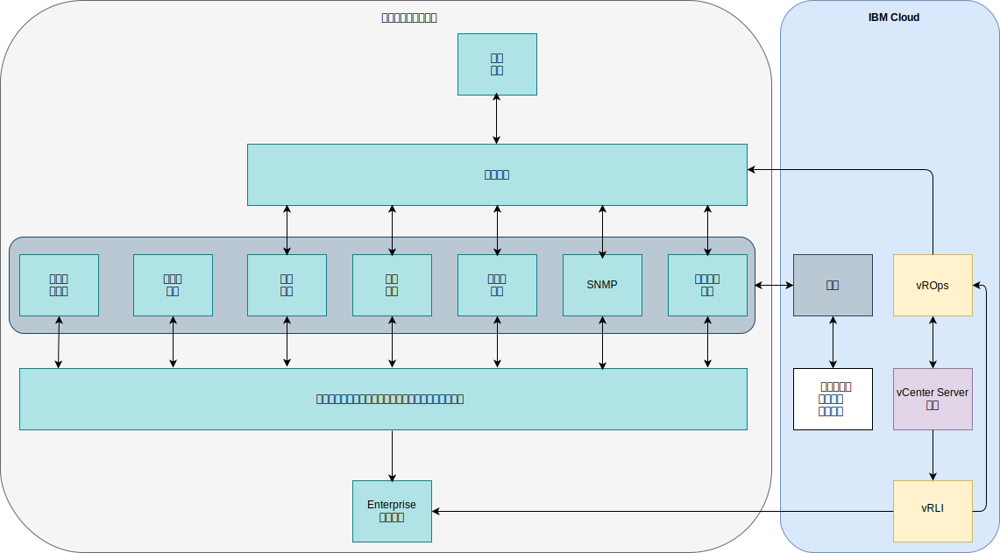

---

copyright:

  years:  2016, 2019

lastupdated: "2019-08-05"

---

# 集成
{: #opsmgmt-integration}

本主题的重点是设计的“操作管理”层。但是，某些企业可能希望将此层与其服务管理层集成。此部分提供了有关此集成的指导信息。在此设计中，vROps 是显示所有警报的中心点。

可以使用以下类别的集成：
* 北向 - 从 vROps 集成到其他工具：
  * 向 SMTP 服务器或工具（如 Slack 或 PagerDuty）发出警报通知。
  * 凭单集成到服务台工具（如 ServiceNow）中。
  * 启动 vRealize Orchestrator 工作流程，以修复 vROps 发现的问题。
* 南向 - 从服务管理或云管理工具集成：
  * vRealize Automation 在添加新工作负载时配置监视。
  * 使用来自外部源的事件扩充来更新 vROps 对象。

vROps 提供以下出站警报插件：
* 自动操作 - 缺省情况下已启用。
* 标准电子邮件 - 使用简单电子邮件传输协议 (SMTP) 通过电子邮件向相关个人发送 vRealize Operations Manager 警报通知。
* SNMP 陷阱 - 记录 SNMP 陷阱服务器上的警报。
* REST 通知 - 将 vROps 警报发送到在其中构建 REST Web Service 的其他支持 REST 的应用程序，以接受这些消息。
* 日志文件 - 支持 vROps 将警报记录到每个 vRealize Operations Manager 节点上的文件。如果已将 vRealize Operations Manager 安装为多节点集群，那么每个节点会处理并记录所监视的对象的警报。每个节点记录所处理的对象的警报。
* 智能 SAM 通知 - 向 EMC Smarts Server Assurance Manager 发送警报通知。
* 网络共享 - 将报告发送到共享位置，支持 SMB V2.0。

通知是在北向发送到外部系统之前，满足通知规则中过滤条件的警报通知。通知规则配置用于必需的出站警报，以便可以在将这些警报发送到所选外部系统之前，对其进行过滤。通知列表用于管理这些规则。

## 集成用例
{: #opsmgmt-integration-usecase}

此示例用例基于企业使用的现有通用服务管理层。客户供应 vCenter Server 实例时选择了 Operations Management 选项，并且希望将此平台集成到自己的服务管理平台中。客户使用事件聚集系统来集成从特定于域的监视工具生成的警报：

* 工具集，用于在其 UNIX、Linux 和 Windows 工作负载中监视操作系统、中间件和应用程序，但此工具不会监视 VMware、联网设备或存储器等基础架构组件。
* SNMP 管理器，用于从其网络基础架构接收 SNMP 陷阱。此工具还会收集 SNMP 度量值，以支持性能和容量警报。
* 备份管理工具，用于管理其备份。
* 存储管理工具，用于管理其存储阵列。
* 可用性工具，使用 ping 操作来测试设备可访问性。

客户的服务管理层还包含：

* 服务器容量和性能工具，用于收集度量值以提供报告。
* 修补和合规性服务器，用于更新操作系统、中间件和应用程序，并度量这些平台上的合规性。
* 凭单工具，用于管理突发事件、问题和更改的凭单。此工具也是企业的配置管理数据库 (CMDB)。此工具能够向操作团队发送电子邮件，也可以发送 SMS 消息。
* 企业日志记录系统，用于捕获所有系统的日志，并由安全团队进行管理。

既然客户已有 vROps，他们将通过 SNMP 陷阱插件，使用北向通知来集成此工具。为了集成 vROps，需要解析 vROps 发送的陷阱，使客户的事件管理环境能够创建警报并扩充警报。管理工具团队从 VMware 下载了 VMware MIB，并在其事件管理环境中安装了这些 MIB。

vRLI 配置为根据客户的策略，将所有事件转发到企业日志记录系统。

客户希望使用其现有操作系统、中间件和应用程序监视工具，因此他们在 {{site.data.keyword.cloud}} 中使用了代理来收集和转发度量值和警报。

## 相关链接
{: #opsmgmt-integration-related}

* [vRealize Operations RESTful API](https://docs.vmware.com/en/vRealize-Operations-Manager/7.0/vrealize-operations-manager-70-api-guide.pdf){:new_window}
* [VMware Code API Explorer](https://code.vmware.com/apis?socv=1&numPerPage=164&sorter=pv){:new_window}
* [Postman Client Collection Tool for vRealize Operations](https://code.vmware.com/samples/4663/postman-client-collection-for-vrealize-operations-rest-apis){:new_window}
* [VMware PowerCLI 博客](https://blogs.vmware.com/PowerCLI/2016/05/getting-started-with-powercli-for-vrealize-operations-vr-ops.html){:new_window}
* [Webhook 垫片](https://blogs.vmware.com/management/2017/01/vrealize-webhooks-infinite-integrations.html){:new_window}
