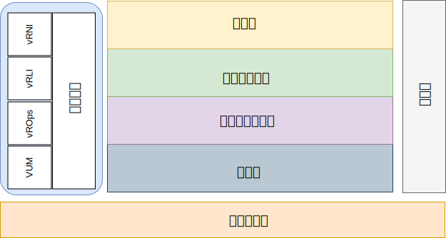

---

copyright:

  years:  2016, 2019

lastupdated: "2019-08-05"

---

# 简介
{: #opsmgmt-intro}

此参考体系结构用于指导和约束 {{site.data.keyword.vmwaresolutions_full}} 体系结构的实例化。

此外，还支持：
* 为各个项目干系人提供通用语言。
* 提供技术实施的一致性以解决问题。
* 支持根据成熟的参考体系结构来验证解决方案。
* 鼓励遵循通用标准、规范和模式。

此参考体系结构的主要目标是记录操作管理功能，以监视为客户机部署的 {{site.data.keyword.vmwaresolutions_short}} 环境并发出警报。工具已使用最佳实践参数和阈值进行配置，可供客户的操作团队使用。

此设计允许客户完成以下任务：
* 根据需要扩展或缩减。
* 根据其操作策略的要求，安装自己的企业监视工具。
* 将工具集成到自己的企业 IT 服务管理 (ITSM) 平台中。

## 操作管理
{: #opsmgmt-intro-opsmgmt}

{{site.data.keyword.vmwaresolutions_short}} 基于以下体系结构层：

* 物理层 - 体系结构的最低层是物理层，包含 {{site.data.keyword.cloud_notm}} 中利用的计算、网络和存储组件：
  * {{site.data.keyword.baremetal_short}}，用于运行管理、Edge 和计算工作负载。
  * {{site.data.keyword.cloud_notm}} 网络，包含 VLAN、子网、前端和后端客户路由器 (FCR/BCR)。
  * vSAN 存储器，这是 {{site.data.keyword.baremetal_short}} 或耐久性存储器内 SSD 中的合并数据存储。

* 虚拟基础架构层 - 虚拟基础架构层基于物理层组件运行。虚拟基础架构层控制对底层物理基础架构的访问，同时控制资源以及将资源分配给管理和计算工作负载。管理工作负载除了包含虚拟基础架构层本身中的元素外，还包含云管理、服务管理、业务连续性和安全层中的元素。

* 业务连续性层 - 此层包含通过提供数据备份、复原和灾难恢复来支持业务连续性的元素。有关更多信息，请参阅 {{site.data.keyword.vmwaresolutions_short}} 备份和复原体系结构以及 Veeam、IBM Spectrum Protect Plus 和 Zerto 灾难恢复参考体系结构。

* 安全层 - 此层包含用于降低风险和提高合规性的元素。有关更多信息，请参阅 Fortinet、F5、NSX、HyTrust 和 Caveonix 参考体系结构。

本文档将以下层添加到 {{site.data.keyword.vmwaresolutions_short}} 体系结构中：

* 操作管理层 - 操作管理层的体系结构包含管理组件，用于实时提供对物理层和虚拟层以及（可选）计算工作负载的支持。操作管理层用于了解 {{site.data.keyword.vmwaresolutions_short}} 拓扑：物理、虚拟、计算、联网和存储资源。操作管理层主要包含监视和日志记录功能。

  信息将按以下格式进行收集：
    * 度量值 - 结构化数据，例如性能和容量
    * 日志 - 非结构化数据，例如系统事件

操作管理层包含以下工具：

* vRealize Operations Manager (vROps) - vROps 使用从系统资源（对象）收集的数据来识别受监视系统组件中的问题，并且对于许多问题，会建议可执行的更正操作以解决问题。对于更具挑战性的问题，vROps 提供了丰富的分析工具，用于揭示隐藏的问题，调查复杂的技术问题，识别趋势或向下钻取以测量单个对象的运行状况。
* vRealize Log Insight (vRLI) - vRLI 为任何环境中的基础架构和应用程序提供智能日志管理。这种高度可缩放的日志管理解决方案提供了直观、可操作的仪表板，支持复杂分析，以及跨物理、虚拟和云环境的广泛第三方可扩展性。
* vRealize Network Insight (vRNI) - vRNI 为软件定义的联网和安全性提供智能操作。它支持掌握虚拟和物理网络的情况，提供操作视图来管理和缩放 NSX 部署，并加快了微分段规划和部署。
* VMware Update Manager (VUM) - VUM 支持对 VMware vSphere 进行集中的自动补丁和版本管理，并提供了以下功能：升级和修补 vSphere 主机，在主机上安装和更新第三方软件，以及升级 VM 硬件、VMware Tools 和虚拟设备。

对于完整的企业体系结构，以下层可能是必需的，但位于 {{site.data.keyword.vmwaresolutions_short}} 体系结构外部：

* 云管理层 - 云管理层是云体系结构的顶层。此层请求资源并通过用户界面或应用程序编程接口 (API) 编排较低的层。vRealize Automation 在 {{site.data.keyword.cloud_notm}} 上启用云自动化。有关更多信息，请参阅 [vRealize Automation (vRA) 参考体系结构](https://www.ibm.com/cloud/garage/files/IBM_Cloud_for_VMware_Solutions_VRA_Architecture_v1.pdf){:new_window}。

有关如何使用 Chef 集成来扩展此体系结构的更多信息，请参阅 [vRA 与 Chef 集成参考体系结构](https://www.ibm.com/cloud/garage/files/IBM_Cloud_for_VMware_Solutions_VRA_Chef_Integration_Architecture.pdf){:new_window}。

* 服务管理层 - 此层关注的是 IT 环境的完整生命周期，通常在企业级别实现，可合并来自 IT 操作和技术的所有纵向结构的输入。此层传统上是基于 IT 服务管理 (ITSM) 框架（例如，IT 基础架构库 (ITIL) 和ISO/IEC 20000）构建的，这是用于在 IT 服务生命周期内各个过程和阶段交付 IT 服务的最佳实践框架。在产品级别，ITSM 的典型特点是采用集中的工作流程管理系统，用于处理连接到配置管理数据库的事件、服务请求、问题、更改和知识。
