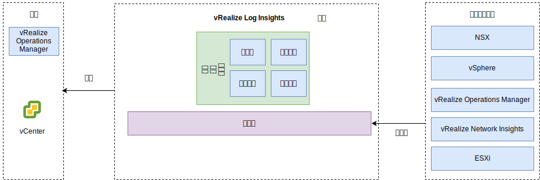

---

copyright:

  years:  2016, 2019

lastupdated: "2019-07-01"

---

# vRealize Log Insights
{: #opsmgmt-vrli}

vRealize Log Insights (vRLI) 环境由四个虚拟机 (VM) 和一个集成负载均衡器构成。

此模式支持：
* 30,000 个 VM
* 75 Gb 日志摄入/天
* 5,000 个事件/秒

vRealize Log Insights (vRLI) 支持对 {{site.data.keyword.vmwaresolutions_full}} 环境中的组件进行实时日志记录。此设计将部署一个 vRLI 集群，其中每个实例中包含四个节点。此配置可提供持续可用性，并提高日志摄入速率。

在此设计中，每个位置都有一个独立的 vRLI 集群，部署在管理集群上。vRLI 集群使用 {{site.data.keyword.cloud_notm}} 可移植 IP 地址部署在工具子网上。这有利于与其地址属于 {{site.data.keyword.cloud_notm}} RFC1918 地址空间的所有组件进行通信。这些组件包括：vSphere 主机、vCenter、Platform Services Controller、NSX Manager 和 NSX Controller。vRLI 集群包含一个主节点、至少两个工作程序节点以及一个集成负载均衡器。

* 主节点 - 集群中必需的初始节点。主节点负责查询和日志摄入。主节点 web UI 是该 vRealize Log Insights 集群的单一虚拟管理平台。针对数据的所有查询都会定向到主节点，然后由主节点将工作负载分发给工作程序。
* 工作程序节点 - 构成一个集群至少需要三个节点，并且集群有能力添加更多工作程序以进行横向扩展。工作程序节点用于摄入日志并本地存储这些日志。
* 集成负载均衡器 - 此组件使用专有负载均衡配置来提供高可用性（无需外部负载均衡器）。
* Log Insight 转发器 - 此组件部署用于从 NSX 覆盖组件接收日志。此外，如果客户机要从计算 VM 发送日志，也可以利用此组件。Log Insight 转发器是单个 vRealize Log Insights 主节点，用作远程 syslog 聚集器，以将警报转发到 vRLI 集群。由于 VXLAN 支持的地址不属于 BYOIP 地址空间，因此必须在 NSX ESG 上实现 NAT 规则。

有以下大小可用，并选择了相应的大小：
* 小型 - 2,000 个事件/秒
* 中型 - 5,000 个事件/秒
* 大型 - 15,000 个事件/秒

vRLI 收集日志，以从中央位置提供有关环境的监视信息。

vRLI 从以下虚拟基础架构和云管理组件（日志记录客户机）收集日志事件：
* vCenter
* ESXi 主机
* NSX
Manager
* NSX
Controller
* NSX Edge 服务网关
* NSX 分布式逻辑路由器实例
* NSX 通用分布式逻辑路由器
* NSX 分布式防火墙 ESXi 内核模块
* vRealize Operations Manager 分析集群节点和远程收集器
* 作为事件转发结果的其他实例中的 vRLI 实例

以下日志记录客户机受支持，但未集成在此设计中：
* vRealize Automation 设备
* vRealize Orchestrator（嵌入在 vRealize Automation 设备中）
* vRealize IaaS Web 服务器
* vRealize IaaS 管理服务器
* vRealize IaaS DEM
* vRealize IaaS 代理
* vRealize Business 服务器
* vRealize Business 数据收集器

## 系统需求
{: #opsmgmt-vrli-requirements}

要容纳来自环境中各日志源的所有日志数据，需要正确调整 vRLI 节点的大小。此设计基于中等大小的设备：

表 1. Log Insight 主节点和副本节点系统设置

|属性|规范|
| ------------------------ | --------------------------------- |
|vCPU|8|
|内存|18 GB|
|磁盘（密集配置）|530 GB（490 GB 用于事件存储）|

每个 vRLI 虚拟设备都有三个缺省虚拟盘，可以将更多虚拟盘用于存储。
* 硬盘 1 - 20 GB（用于根文件系统）
* 硬盘 2 - 510 GB（用于中等大小部署，包含两个分区）：
  * /storage/var - 用于存储系统日志
  * /storage/core storage - 用于存储收集的日志（约 475 GB 可用磁盘空间）

## 联网
{: #opsmgmt-vrli-network}

部署 vRLI 设备需要工具专用可移植子网中的三个 IP 地址。vRLI 需要对以下对象的访问权：
* vCenter 设备
* vRealize Log Insight 设备
* NSX-V/T 设备
* 工具扩展 VXLAN
* 客户网络
* NTP 服务器 (`time.services.softlayer.com`)
* {{site.data.keyword.vmwaresolutions_short}} Active Directory/DNS
* 远程收集器，这些收集器需要在 NSX ESG 上实现 NAT 规则，以支持与主节点、主节点副本和数据节点的连接

## 端口
{: #opsmgmt-vrli-ports}

表 2. Log Insight 端口

|描述|端口|协议|
| ------------------------------------------------------------- | ---------- | -------- |
|配置为转发器目标的出站 syslog 流量|514|TCP 和 UDP|
|基于 SSL 的 syslog 数据|1514 和 6514|TCP|
|Log Insight 摄入 API|9000|TCP|
|通过 SSL 使用的 Log Insight 摄入 API|9543|TCP|
|通过 SSH 访问设备|22|TCP|
|用户接口|80 和 443|TCP|
|NTP|123|UDP|
|SMTP|25 GB |TCP|
|DNS|53|UDP|
|LDAP/LDAPS|389 和 636|TCP|
|LDAP GC|3268/3269|TCP|
|vCenter|443|TCP|
|vRealize Operations Manager 设备|443|TCP|

## 认证
{: #opsmgmt-vrli-auth}

vRLI 的用户管理需要 VMware Identity Manager (vIDM)，此组件与 Active Directory 集成。具有收集度量值和映射拓扑所需的最低许可权集的服务帐户用于从 vRealize Operations Manager 到以下适配器的应用程序到应用程序通信。
* NSX
Manager
* vCenter
* vSAN

## vRealize Log Insights 中的内容包
{: #opsmgmt-vrli-content}

内容包在虚拟基础架构上提供更详细的监视功能，支持检索和抽取日志，并将其解析为人类可读格式。通过这种方式，vRLI 可保存日志查询和警报，并且您可以使用仪表板来进行高效监视。

缺省情况下，会安装以下内容：
* 常规组件
* VMware vSphere
* VMware vSAN
* VMware vROps

此设计还会安装：
* VMware NSX for vSphere
* vRealize Network Insight

其他内容包可以从 [vReize Log Insight 内容包](https://marketplace.vmware.com/vsx/?contentType=2&listingStyle=table){:new_window}中获取。

## 相关链接
{: #opsmgmt-vrli-related}

* [vCenter Server on {{site.data.keyword.cloud_notm}} with Hybridity Bundle 概述](/docs/services/vmwaresolutions/archiref/vcs?topic=vmware-solutions-vcs-hybridity-intro)
* [调整 vRealize Log Insight 虚拟设备的大小](https://docs.vmware.com/en/vRealize-Log-Insight/4.6/com.vmware.log-insight.getting-started.doc/GUID-284FC5F4-B832-47A7-912E-D407A760CAE4.html){:new_window}
* [vRealize Log Insight](https://docs.vmware.com/en/vRealize-Log-Insight/index.html){:new_window}
