---

copyright:

  years:  2016, 2019

lastupdated: "2019-05-17"

---

# vRealize Network Insight
{: #opsmgmt-vrni}

vReize Network Insight (vRNI) 环境由两个虚拟机 (VM)、一个平台 (UI) 和一个控制器节点组成。

vRNI 平台设备提供了分析功能、用户界面和数据管理，可连接到用于从各种数据源（例如，NSX Edge、vCenter 等）收集数据的控制器设备。所有 vRNI 组件都利用 {{site.data.keyword.cloud}} 专用可移植 IP 地址。vRLI 配置为用于 vRNI 的 syslog 服务器。

## 系统需求
{: #opsmgmt-vrni-requirements}

此体系结构支持 3000 个使用中等块大小的 VM。

表 1. Network Insight 平台系统需求

|属性|规范|
|---|---|
|vCPU|8|
|内存|32 GB|
|磁盘（精简配置）|1 TB|

表 2. Network Insight 收集器系统需求

|属性|规范|
|---|---|
|vCPU|4|
|内存|12 GB|
|磁盘（精简配置）|200 GB|

## 联网
{: #opsmgmt-vrni-network}

部署 vRNI 设备需要工具专用可移植子网中的两个 IP 地址。vRNI 的网络连接需要有权访问：
* vCenter 设备
* vRealize Log Insight 设备
* NSX-V/T 设备
* 工具扩展 VXLAN
* 客户网络
* NTP 服务器 (time.services.softlayer.com)
* {{site.data.keyword.vmwaresolutions_short}} Active Directory/DNS

## 端口
{: #opsmgmt-vrni-ports}

表 3. Network Insight 端口

|描述|端口|协议|
|---|---|---|
|vRealize Network Insight 的 VM 之间的通信|443|HTTPS|
|需要因特网访问的服务 svc.ni.vmware.com support2.ni.vmware.com reg.ni.vmware.com|443|HTTPS|Log Insight 摄入 API|9000|TCP|
|通过 SSL 使用的 Log Insight 摄入 API|9543|TCP|
|用户接口|80 和 443|TCP|
|NTP|123|UDP|
|SMTP|25 GB |TCP|
|DNS|53|UDP|
|LDAP/LDAPS|389 和 636|TCP|
|ESXi|2055|TCP|
|VMware vSphere/NSX|443|TCP|

## 认证
{: #opsmgmt-vrni-auth}

vRNI 用户认证直接通过 Active Directory 服务器执行。

## 相关链接
{: #opsmgmt-vrni-links}

* [vCenter Server on {{site.data.keyword.cloud_notm}} with Hybridity Bundle 概述](/docs/services/vmwaresolutions/archiref/vcs?topic=vmware-solutions-vcs-hybridity-intro)
* [vRealize Network Insights](https://docs.vmware.com/en/VMware-vRealize-Network-Insight/index.html){:new_window}
