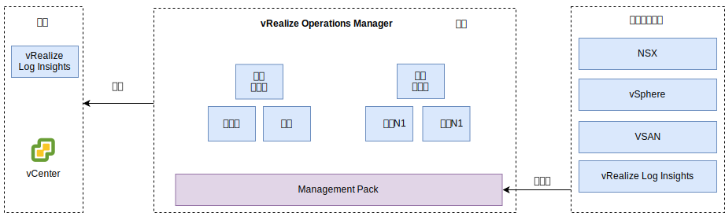

---

copyright:

  years:  2016, 2019

lastupdated: "2019-08-05"

---

# vRealize Operations Manager 设计
{: #opsmgmt-vrops}

vROps 分析集群包含用于分析和存储受监视组件中数据的节点，在此部署中，部署了四个节点和两个 NSX 负载均衡器。此大小允许监视多达 30,000 个 VM，收集 9,000,000 个度量值。

4 节点分析集群包含以下组件：
* 主节点 - 主节点是 vROps 集群中的初始节点。在大型环境中，此节点用于管理所有其他节点。
* 主节点副本 - 此节点支持主节点的高可用性。
* 数据节点 - 数据节点支持在较大的环境中横向扩展 vROps，在此设计中部署了两个数据节点。

此外，此设计使用远程收集器节点，这些节点充当代理/中继服务器，用于仅收集数据并将收集的数据转发到主节点/数据节点。可以添加数据节点和远程收集器，以根据环境大小进行纵向扩展。下图中显示了各 vROps 组件在 VLAN/VXLAN 上的位置。

* 主节点、主节点副本和数据节点使用 {{site.data.keyword.cloud_notm}} 可移植 IP 地址部署在工具子网上，以有利于与其地址属于 {{site.data.keyword.cloud_notm}} RFC1918 地址空间的所有组件进行通信，这些组件包括 vSphere 主机、vCenter、Platform Services Controller、NSX Manager 和 NSX Controller。NSX 负载均衡器与 VIP 一起使用，以实现 HA。
* 由于客户工作负载使用在 BYOIP 地址空间寻址的 IP，因此该设计使用在 VXLAN 中托管的远程收集器。这些远程收集器未配置为 {{site.data.keyword.vmwaresolutions_full}} 自动化的一部分，因此必须由客户机手动实现。

vROps 分析集群可使用管理用户界面或使用 API 进行访问，并与以下组件相集成：
* vCenter
* vRealize Log Insight

客户机可以手动集成到以下产品（如果已部署）中：
* vRealize Automation
* vRealize Business

vROps 从以下各项中收集数据：
* vSphere - vCenter、Platform Services Controller 和 vCenter 主机
* NSX - NSX Manager、NSX Controller 和 NSX Edge
* vRLI

客户机可以手动将 vROps 配置为从 vRealize Automation 和 vRealize Business for Cloud 收集数据。

## 系统需求
{: #opsmgmt-vrops-requirements}

分析集群由一个主节点、一个主节点副本节点和两个数据节点组成，支持横向扩展和高可用性。可添加更多数据节点以进行纵向扩展。分析集群最多可扩展为具有八个中等大小的节点。

表 1. Operations Manager 主节点/副本节点系统设置

|属性|规范|
|---|---|
|vCPU|8|
|内存|32 GB|
|磁盘（密集配置）|254 GB|

表 2. Operations Manager 数据节点系统设置

|属性|规范|
|---|---|
|vCPU|8|
|内存|32 GB|
|磁盘（密集配置）|254 GB|

如果需要监视计算 VM，那么客户机应该在 VXLAN 上安装两个远程收集器节点。标准远程收集器虚拟设备的大小为 2 个 vCPU（带 4 GB RAM），缺省设备 VMDK 大小已足以满足需求。远程收集器节点部署有精简配置磁盘，因为远程收集器不会执行分析操作或存储数据。

表 3. Operations Manager 负载均衡器设置

|设置|负载均衡器 1|负载均衡器 2|
|---|---|---|
|名称|vrops-ui|vrops-data|
|时间间隔|30| 5 |
|超时| 5 |15|
|最大重试次数|3| |
|类型|HTTPS|TCP|
|方法|Get| -- |
|URL|/suite-api/api/deployment/node/status| -- |
|接收|ONLINE| -- |
|算法|循环法|LEASTCONN|
|池| 四个 vROPs 节点 | 四个 vROPs 节点 |

有关更多信息，请参阅 [vRealize Automation Load Balancing (PDF)](https://docs.vmware.com/en/vRealize-Automation/7.5/vrealize-automation-load-balancing.pdf)
{:new_window}.

## 联网
{: #opsmgmt-vrops-network}

部署 vROps 设备需要工具专用可移植子网中的六个 IP 地址。vROps 的网络连接需要有权访问：
* vCenter 设备
* vRealize Log Insight 设备
* NSX-V/T 设备
* 工具扩展 VXLAN
* 客户网络
* NTP 服务器 (`time.services.softlayer.com`)
* {{site.data.keyword.vmwaresolutions_short}} Active Directory/DNS
* 远程收集器，这些收集器需要在 NSX ESG 上实现 NAT 规则，以支持与主节点、主节点副本和数据节点的连接

## 端口
{: #opsmgmt-vrops-ports}

表 4. Operation Manager 端口

|组件|协议|端口|
|---|---|---|
|vCenter|TCP|443|
|DNS|TCP/UDP|53|
|LDAP/LDAPS|TCP|389/636|
|LDAP GC|TCP|3268/3269|
|NTP|UDP|123|
|SMTP|TCP|25 GB |
|SNMP|UDP|161|

### 认证
{: #opsmgmt-vrops-auth}

vROps 的用户管理需要 VMware Identity Manager (vIDM)，此组件与 Active Directory 集成。具有收集度量值和映射拓扑所需的最低许可权集的服务帐户用于从 vRealize Operations Manager 到以下适配器的应用程序到应用程序通信：

* NSX
Manager
* vCenter
* vSAN

## Management Pack
{: #opsmgmt-vrops-management}

vROps 的 Management Pack 用于扩展 vROps 平台的操作管理功能，以提供特定于产品的警报和仪表板。

缺省情况下，vROps 中安装了以下 Management Pack：
* Management Pack for VMware vCenter Server
* Management Pack for vRealize Log Insight
* Management Pack for vSAN
* Management Pack for vRealize Automation
* Management Pack for vRealize Business for Cloud

{{site.data.keyword.vmwaresolutions_short}} 安装了以下组件：
* VMware SDDC Health Management Pack
* Management Pack for NSX for vSphere
* vRealize Operations Federation Management Pack
* Management Pack for Hybrid Cloud Extension (HCX)

客户机可以安装其他 Management Pack。有关更多信息，请参阅 [VMware Exchange 上的 Management Pack](https://marketplace.vmware.com/vsx/?contentType=1&listingStyle=table){:new_window}。

### Management Pack for VMware vCenter Server
{: #opsmgmt-vrops-management-vCenter}

此缺省 Management Pack 用于将 vROps 的功能扩展到 vCenter，以支持收集对象、度量值和警报。

### Management Pack for vRealize Log Insight
{: #opsmgmt-vrops-management-vrli}

此缺省 Management Pack 用于将 vROps 的功能扩展到 vRLI，以支持监视 vRLI 环境，以及将 vRLI 中的事件和警报集成到 vROps 中。

### Management Pack for vSAN
{: #opsmgmt-vrops-management-vsan}

通过 vRealize Operations Management Pack for vSAN，特定于 vSAN 的仪表板可用于评估、管理及优化 vSAN 对象和启用 vSAN 的对象的性能。

### VMware SDDC Health Management Pack
{: #opsmgmt-vrops-management-sddc}

VMware SDDC Health Management Pack for vROps 用于监视 SDDC 管理堆栈，并为作为 SDDC 管理堆栈一部分而提供的不同组件提供运行状况和效率的颜色编码的度量值。通过 VMware SDDC Health Management Pack 中的仪表板，可以监视 vCenter Server 实例和管理工具的以下组件：
* vRealize Operations Manager
* NSX for vSphere/VMware NSX-T
* VMware vSAN
* vRealize Log Insight
* vCenter Server

此外，如果客户机已安装以下各项，那么还可以监视这些项：
* vRealize Automation
* vRealize Orchestrator
* vRealize Business for Cloud
* VMware Site Recovery Manager

VMware SDDC Health Management Pack 提供了以下仪表板：
* SDDC Management Health 概述仪表板 - 可以使用 SDDC Management Health 概述仪表板来查看和分析 SDDC 组件中特定于应用程序的问题。
* SDDC 运行状况历史趋势仪表板 - VMware SDDC Health Management Pack 包含 SDDC 运行状况历史趋势仪表板，可显示 SDDC 堆栈中每个组件的运行状况趋势。
* SDDC vRealize Operations Manager 大小调整仪表板 - SDDC vRealize Operations Manager 大小调整仪表板提供 vRealize Operations Manager 集群用于处理对象和度量值的容量。

VMware SDDC Health Management Pack 中的插件可收集这些插件中包含的对象类型的度量值。Management Pack 可收集以下组件的运行状况度量值：
* vCenter Server
* Management Pack for NSX for vSphere
* vRealize Automation
* vRealize Operations Manager
* vRealize Business
* vRealize Log Insight
* VMware Site Recovery Manager
* vCenter HA
* vMware vSAN Health
* vCenter Server Appliance 中的服务
* vRealize Operations Manager 大小调整
* vRealize Orchestrator

### Management Pack for NSX-T
{: #opsmgmt-vrops-management-nsxt}

NSX-T Management Pack 用于将 vROps 核心分析、相关性、预测容量和可视化功能扩展到虚拟网络。该包中包含以下内容：
* 配置保证
* 运行状况
* 性能
* 容量
* 对 NSX-T 对象进行故障诊断

### Management Pack for NSX for vSphere
{: #opsmgmt-vrops-management-nsxv}

NSX for vSphere Management Pack 提供了用于部署 VMware NSX 虚拟联网技术的操作管理覆盖范围。此 Management Pack 用于将 vROps 核心分析、相关性、预测容量和可视化功能扩展到虚拟网络。覆盖范围包括 NSX 逻辑交换机、逻辑路由器、Edge 服务、分布式防火墙和负载均衡器的配置保证、运行状况、性能、容量和故障诊断。

NSX for vSphere Management Pack 与 vROps 紧密集成，并且 vSphere 主机数据与在这些主机上运行的 NSX 服务相关。利用通过 vRLI 执行的日志集成，可在 Management Pack 对象和问题窗口中发出警报，通知由日志消息触发的错误和中断条件。

### vRealize Operations Federation Management Pack
{: #opsmgmt-vrops-management-federation}

vRealize Operations Federation Management Pack 支持将多站点 vROps 部署到单一虚拟管理平台。此包允许为 vROps 部署从 vROps 部署中接收指定对象的关键度量值的功能。

### Management Pack for Hybrid Cloud Extension (HCX)
{: #opsmgmt-vrops-management-hcx}

vRealize Operations Management Pack for HCX 用于将 vROps 的 Operations Management 功能扩展到 HCX 提供的混合功能。通过此 Management Pack，可以从 HCX 中收集度量值、更改事件和资源拓扑信息。它支持监视、隔离和解决 HCX 互连、迁移或受保护工作负载中的性能瓶颈。

## 相关链接
{: #opsmgmt-vrops-management-links}

* [vRealize Operations Manager 7.0 Sizing Guidelines](https://kb.vmware.com/s/article/57903){:new_window}
* [vRealize Operations Manager 文档](https://docs.vmware.com/en/vRealize-Operations-Manager/index.html){:new_window}
* [Management Pack for vSAN](https://marketplace.vmware.com/resources/vsx/product_files/31742/original/Management-Pack-for-vSAN-Guide6d2a8895b022a5f626a86e8e84b031b5.pdf){:new_window}
* [查看“更新 vSAN 集群”指示信息](/docs/services/vmwaresolutions/archiref/vum?topic=vmware-solutions-vum-updating-vsan)
* [Management-Pack-for-vSAN-Guide](https://marketplace.vmware.com/resources/vsx/product_files/31742/original/Management-Pack-for-vSAN-Guide6d2a8895b022a5f626a86e8e84b031b5.pdf){:new_window}
* [vSAN Health Check Information](https://kb.vmware.com/s/article/2114803){:new_window}
* [Operationalizing VMware NSX](https://www.vmware.com/content/dam/digitalmarketing/vmware/en/pdf/products/nsx/vmware-operationalizing-nsx.pdf){:new_window}
* [NSX Operations Guide](https://communities.vmware.com/servlet/JiveServlet/previewBody/30079-102-2-40474/NSX-Operations-Guide-v6.1.pdf){:new_window}
