---

copyright:

  years:  2016, 2019

lastupdated: "2019-05-16"

---

# VMware Update Manager
{: #opsmgmt-vum}

VMware Update Manager (VUM) 支持对 VMware vSphere 进行集中的自动补丁和版本管理，并允许您在 VMware vCenter Server on {{site.data.keyword.cloud}} 环境中完成以下任务：
* 升级并修补 vSphere ESXi 主机
* 在主机上安装和更新第三方软件
* 升级虚拟机 (VM) 硬件、VMware Tools 和虚拟设备

有关 VMware Update Manager 的详细设计，请参阅 [VMware Update Manager 简介](https://cloud.ibm.com/docs/services/vmwaresolutions/archiref/vum/vum-intro.html#vmware-update-manager-introduction){:new_window}。

## 相关链接
{: #opsmgmt-vum-links}

* [vCenter Server on {{site.data.keyword.cloud_notm}} with Hybridity Bundle 概述](/docs/services/vmwaresolutions/archiref/vcs?topic=vmware-solutions-vcs-hybridity-intro)
* [VMware Update Manager](https://docs.vmware.com/en/VMware-vSphere/6.5/com.vmware.vsphere.update_manager.doc/GUID-F7191592-048B-40C7-A610-CFEE6A790AB0.html){:new_window}
