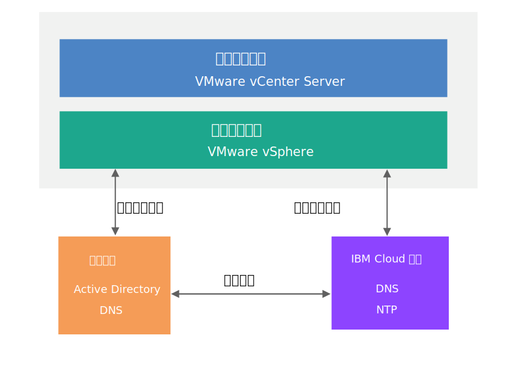

---

copyright:

  years:  2016, 2018

lastupdated: "2018-08-14"

---

# 公共服务设计

公共服务提供由云管理平台中其他服务使用的服务。解决方案的公共服务包括身份和访问权服务、域名服务、NTP 服务、SMTP 服务和认证中心服务。

## 身份和访问权服务

在此设计中，Microsoft Active Directory (AD) 用于身份管理。此设计将一个或两个 Windows Active Directory 虚拟机部署为 Cloud Foundation 和 vCenter Server 部署自动化的一部分。vCenter 将配置为利用 AD 认证。

### Microsoft Active Directory

缺省情况下，会将单个 Active Directory VSI 部署到 {{site.data.keyword.cloud}} 基础架构上。此设计还提供了用于将两个高可用性 Microsoft Active Directory 服务器部署为管理集群中专用 Windows Server VM 的选项。

**注**：如果选择此选项，那么您将负责提供 Microsoft 许可和激活。

Active Directory 用于认证的访问权仅要求管理 VMware 实例，而不是容纳已部署实例中工作负载的最终用户。Active Directory 服务器的林根域名与您指定的 DNS 域名相同。如果链接了多个 Cloud Foundation 和 vCenter Server 实例，将仅为主 Cloud Foundation 和 vCenter Server 实例指定此域名。对于链接的实例，每个实例都包含位于林根副本环中的一个 Active Directory 服务器。此外，还会在 Active Directory 服务器上复制 DNS 区域文件。

### vSphere SSO 域

vSphere Single Sign On (SSO) 域用作单个实例或多个链接实例的初始认证机制。SSO 域还用于将 VMware 实例或多个链接的实例连接到 Microsoft Active Directory 服务器。将应用以下 SSO 配置：  
* 始终使用 SSO 域 `vsphere.local`
* 对于绑定到现有实例的 VMware 实例，会将 PSC 连接到现有实例的 SSO 域
* SSO 站点名称与实例名称相同

## 域名服务 (DNS)

此设计中的 DNS 仅适用于云管理和基础架构组件。

### VMware vCenter Server

vCenter Server 部署将部署的 Active Directory 服务器用作实例的 DNS 服务器。所有部署的组件（vCenter、PSC、NSX 和 ESXi 主机）都配置为指向作为其缺省 DNS 服务器的 Active Directory 服务器。如果 DNS 区域配置不影响已部署组件的配置，那么可以定制 DNS 区域配置。

此设计通过以下配置在 Active Directory 服务器上集成 DNS 服务：
* 可以指定域结构。域名可以有任意级别数（最多为 vCenter Server 组件将处理的最大级别数）。最低级别是实例的子域。
   * 指定的 DNS 域名将用作 Active Directory 林根域名。例如，如果 DNS 域名为 `cloud.ibm.com`，那么 Active Directory 林根域名为 `cloud.ibm.com`。此 DNS 和 Active Directory 域名在所有链接的 vCenter Server 实例中都相同。
   * 可以为实例额外指定子域名。子域名在所有链接的 vCenter Server 实例中必须唯一。
* Active Directory DNS 服务器配置为对于 DNS 域和子域空间都具有权威性。
* Active Directory DNS 服务器配置为指向其他所有区域的 {{site.data.keyword.cloud_notm}} DNS 服务器。
* 要集成到现有目标实例的任何实例必须使用与主实例相同的域名。

### VMware Cloud Foundation

Cloud Foundation 部署使用 VMware Cloud Foundation 自动化，后者使用自己的位于 SDDC Manager VM 组件内的 DNS 服务器。根据设计，由 SDDC Manager 管理的 Cloud Foundation 组件（包括 vCenter、PSC、NSX 和 ESXi 主机）配置为使用 SDDC Manager VM IP 地址作为其缺省 DNS。

由于 SDDC Manager 会为自己管理的组件生成并维护主机名，因此建议不要直接篡改其 DNS 区域文件来添加和除去主机。

此设计通过以下配置将 Active Directory 服务器上的 DNS 服务与 SDDC Manager VM 相集成：
* 可以指定域结构。域名可以有任意级别数（最多为 Cloud Foundation 组件将处理的最大级别数）。
* 最低级别是 SDDC Manager 对其具有权威性的子域。
* 指定的 DNS 域名将用作 Active Directory 林根域名。例如，如果 DNS 域名为 `cloud.ibm.com`，那么 Active Directory 林根域为 `cloud.ibm.com`。此 DNS 域和 Active Directory 域在所有链接的 Cloud Foundation 实例中都相同。
* 可以为实例额外指定子域名。子域名在所有链接的 Cloud Foundation 实例中必须唯一。  
* SDDC Manager DNS 配置变更为指向除了自己所负责区域以外的其他所有区域的 Active Directory 服务器。
* Active Directory DNS 服务器配置为对 SDDC Manager 和 Cloud Foundation 实例子域上级的 DNS 域空间具有权威性。
* Active Directory DNS 服务器配置为指向 SDDC Manager 对其具有权威性的区域的子域授权的 SDDC Manager IP 地址。
* Active Directory DNS 服务器配置为指向其他所有区域的 {{site.data.keyword.cloud_notm}} DNS 服务器。
* 要集成到第一个或目标实例的任何辅助实例都必须在 SDDC Manager 子域上方使用相同的 DNS 名称结构。

## NTP 服务

此设计利用 {{site.data.keyword.cloud_notm}} 基础架构 NTP 服务器。所有部署的组件均配置为利用这些 NTP 服务器。使设计中的所有组件都使用相同的 NTP 服务器对于证书和 Active Directory 认证正确运行至关重要。

图 1. NTP 服务

## 认证中心服务

缺省情况下，VMware vSphere 使用由 VMware Certificate Authority (VMCA) 签署且位于 VMware Platform Services Controller 设备上的 TLS 证书。最终用户设备或浏览器并不信任这些证书。安全最佳实践是将面向用户的证书替换为由第三方或企业认证中心 (CA) 签署的证书。用于机器对机器通信的证书仍然可以是 VMCA 签署的证书，但是建议您遵循组织的最佳实践，这通常涉及使用识别到的企业 CA。

可以在此设计中使用 Windows AD 服务器来创建由本地实例签署的证书。但是，您还可以根据需要选择配置 CA 服务。

### 相关链接

* [物理基础架构设计](design_physicalinfrastructure.html)
* [虚拟基础架构设计](design_virtualinfrastructure.html)
* [基础架构管理设计](design_infrastructuremgmt.html)
