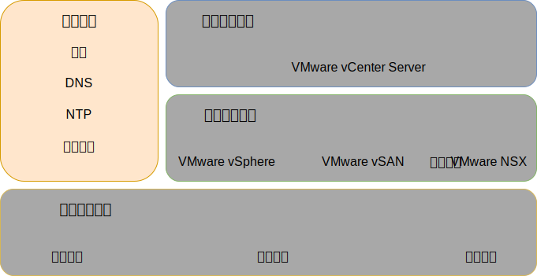
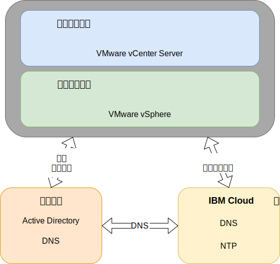

---

copyright:

  years:  2016, 2019

lastupdated: "2019-03-19"

subcollection: vmware-solutions

---

{:tip: .tip}
{:note: .note}
{:important: .important}

# 公共服务设计
{: #design_commonservice}

公共服务提供由云管理平台中其他服务使用的服务。解决方案的公共服务包括身份和访问权服务、域名服务、NTP 服务、SMTP 服务和认证中心服务。

图 1. 公共服务 

## 身份和访问权服务
{: #design_commonservice-identity-access}

在此设计中，Microsoft Active Directory (MSAD) 用于身份管理。此设计将一个或两个 Active Directory 虚拟机部署为 vCenter Server 部署自动化的一部分。vCenter 配置为使用 MSAD 认证。

### Microsoft Active Directory
{: #design_commonservice-msad}

缺省情况下，会将单个 Active Directory VSI 部署到 {{site.data.keyword.cloud}} 基础架构上。

此设计还提供了用于将两个高可用性 MSAD 服务器部署为管理集群中专用 Windows Server VM 的选项。

如果选择具有两个高可用性 MSAD 服务器的选项，那么您负责提供 Microsoft 许可和激活。
{:note}

Active Directory 用于认证的访问权仅要求管理 VMware 实例，而不是容纳已部署实例中工作负载的用户。Active Directory 服务器的林根域名与您指定的 DNS 域名相同。如果链接了多个 vCenter Server 实例，将仅为主实例指定此域名。对于链接的实例，每个实例都包含位于林根副本环中的一个 Active Directory 服务器。此外，还会在 Active Directory 服务器上复制 DNS 区域文件。

### vSphere SSO 域
{: #design_commonservice-vsphere-sso}

vSphere Single Sign On (SSO) 域用作单个实例或多个链接实例的初始认证机制。SSO 域还用于将一个 VMware 实例或多个链接的实例连接到 MSAD 服务器。将应用以下 SSO 配置：  
* 始终使用 SSO 域 `vsphere.local`
* 对于绑定到现有实例的 VMware 实例，会将集成的 PSC 连接到现有实例的 SSO 域
* SSO 站点名称与实例名称相同

## 域名服务
{: #design_commonservice-dns}

此设计中的域名服务 (DNS) 仅适用于云管理和基础架构组件。

### 主 vCenter Server 实例
{: #design_commonservice-primary-vcs}

vCenter Server 部署使用已部署的 AD VSI 作为实例的 DNS 服务器。所有部署的组件（具有嵌入式 PSC 的 vCenter、NSX 和 ESXi 主机）都配置为指向作为其缺省 DNS 的 AD。如果 DNS 区域配置不影响已部署组件的配置，那么可以定制 DNS 区域配置。
- 此设计通过以下配置在 AD VSI 上集成 DNS 服务：
- 域结构由用户指定。域名可以有任意级别数（最多为所有 vCenter Server 组件可以处理的最大级别数），但应确保最低级别是实例的子域。
    - 提供的 DNS 域名将用作 vCenter Server 部署的 AD 林根域名。例如，如果 DNS 域名为 cloud.ibm.com，那么 AD 域林根为 cloud.ibm.com。在 vCenter Server 的所有联合实例中，DNS 域和 AD 域相同。
    - 选择一个额外的名称作为 vCenter Server 实例子域。此子域名在所有链接的 vCenter Server 实例中必须唯一。
- AD DNS 服务器配置为对于 DNS 域和子域空间都具有权威性。
- AD DNS 服务器配置为指向其他所有专区的 {{site.data.keyword.cloud_notm}} DNS 服务器。
- 集成到第一个部署的云区域或目标部署的云区域的任何辅助云区域，在子域之上必须使用相同的 DNS 名称结构。
- （可选）在 vCenter Server 集群中部署冗余 DNS 服务器。两个 AD/DNS 服务器均配置为未许可。用户负责为这些服务器提供 Windows 操作系统的许可证。
- 如果一个站点仅供应有一个 AD/DNS 服务器，那么所有配置的 vCenter Server 组件都只能将该单个 IP 作为 DNS 条目。

### 辅助 vCenter Server 实例
{: #design_commonservice-secondary-vcs}

为了实现跨实例冗余，将第一个辅助 vCenter Server 实例添加到现有主 vCenter Server 实例或当前独立的 vCenter Server 实例时，该主实例 AD DNS 服务器 IP 地址将用于需要 DNS 服务器条目的所有组件的辅助 vCenter Server 实例和任何后续辅助 vCenter Server 实例“辅助 DNS”条目。例如，ESXi、vCenter 和 NSX Manager。这包括附加组件，例如 HCX、Zerto 和 Veeam。然后，主站点辅助 DNS 条目会更改为第一个辅助 vCenter Server 实例 AD/DNS IP 地址。

## NTP 服务
{: #design_commonservice-ntp}

此设计利用 {{site.data.keyword.cloud_notm}} 基础架构 NTP 服务器。所有部署的组件均配置为利用这些 NTP 服务器。使设计中的所有组件都使用相同的 NTP 服务器对于证书和 Active Directory 认证正确运行至关重要。

图 2. NTP 和 DNS 服务 

## 认证中心服务
{: #design_commonservice-cas}

缺省情况下，VMware vSphere 使用由 VMware Certificate Authority (VMCA) 签署且位于 VMware Platform Services Controller 设备上的 TLS 证书。最终用户设备或浏览器并不信任这些证书。安全最佳实践是将面向用户的证书替换为由第三方或企业认证中心 (CA) 签署的证书。用于机器对机器通信的证书仍然可以是 VMCA 签署的证书，但是建议您遵循组织的最佳实践，这通常涉及使用识别到的企业 CA。

可以在此设计中使用 Windows AD 服务器来创建由本地实例签署的证书。但是，您还可以根据需要选择配置 CA 服务。

## 相关链接
{: #design_commonservice-related}

* [物理基础架构设计](/docs/services/vmwaresolutions/archiref/solution?topic=vmware-solutions-design_physicalinfrastructure)
* [虚拟基础架构设计](/docs/services/vmwaresolutions/archiref/solution?topic=vmware-solutions-design_virtualinfrastructure)
* [基础架构管理设计](/docs/services/vmwaresolutions/archiref/solution?topic=vmware-solutions-design_infrastructuremgmt)
