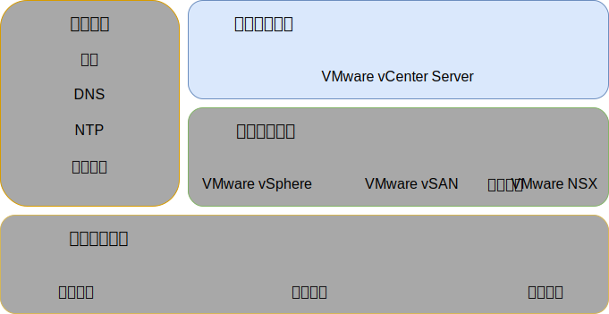

---

copyright:

  years:  2016, 2019

lastupdated: "2019-03-28"

subcollection: vmware-solutions

---

{:tip: .tip}
{:note: .note}
{:important: .important}

# 基础架构管理设计
{: #design_infrastructuremgmt}

基础架构管理是指用于管理 VMware 基础架构的组件。
* 具有嵌入式 Platform Services Controller (PSC) 的 vCenter Server 是用于管理 vSphere 环境的集中式平台，也是此解决方案中的其中一个基本组件。
* 在此解决方案中将使用 PSC 来提供一组基础架构服务，包括 VMware vCenter Single Sign On、许可服务、查找服务和 VMware Certificate Authority。

此设计使用集成到 vCenter Server 实例中的 PSC 功能。PSC 和 vCenter Server 位于同一虚拟机 (VM) 中。

图 1. 基础架构管理 

位于主实例中的 PSC 分配有缺省 SSO 域 `vsphere.local`。

## vCenter Server 设计
{: #design_infrastructuremgmt-vcenter}

此外，具有嵌入式 PSC 的 vCenter Server 将安装在与管理 VM 关联的专用 VLAN 上的可移植子网中。其缺省网关设置为该特定子网的 BCR 上分配的 IP 地址。虚拟设备使用下表中的规范进行配置。

表 1. vCenter Server Appliance 规范

|属性|规范|
|------------------------------|-------------------------------------|
|vCenter Server|虚拟设备|
|设备安装大小|大型（最多 1,000 个主机和 10,000 个 VM）|
|Platform Services Controller|集成|
|vCPU 数量|16|
|内存|32 GB|
|磁盘|本地数据存储上 990 GB（大型磁盘部署）|
|磁盘类型|自动精简配置|

### vCenter Server 数据库
{: #design_infrastructuremgmt-vcenter-db}

vCenter Server 配置使用设备随附的本地嵌入式 PostgreSQL 数据库。嵌入式数据库用于除去对外部数据库和许可的所有依赖关系。

### vCenter Server 集群规范
{: #design_infrastructuremgmt-vcenter-cluster}

通过此设计，您可以对通过解决方案供应的 vSphere ESXi 主机建立集群。但是，会先创建一个数据中心对象（以表示 vSphere ESXi 主机的位置）以及该数据中心内的 pod，然后才能创建集群。创建数据中心对象后，会创建集群。集群部署时会启用 VMware vSphere 高可用性 (HA) 和 VMware vSphere 分布式资源调度程序 (DRS)。

### vSphere 分布式资源调度程序
{: #design_infrastructuremgmt-vsphere-drs}

此设计在初始集群中使用 vSphere 分布式资源安排 (DRS) 来对 VM 定位，并在其他集群中使用 DRS 来动态迁移 VM，以实现集群均衡。自动化级别设置为完全自动化，以便 vSphere 可自动运行初始定位和迁移建议。此外，迁移阈值设置为“中”，以便 vCenter 应用优先级为 1、2 和 3 的建议，从而在集群负载均衡方面至少实现适当改进。

此设计中未使用通过**分布式电源管理**功能进行的电源管理。
{:note}

### vSphere 高可用性
{: #design_infrastructuremgmt-vsphere-ha}

此设计在初始集群和额外集群中使用 vSphere 高可用性 (HA) 来检测计算故障，并恢复在集群内运行的 VM。此设计中的 vSphere HA 功能配置为在集群中同时启用**主机监视**和**许可控制**选项。此外，初始集群会将一个节点的资源保留为用于许可控制策略的备用容量。

日后扩展或收缩集群时，您应负责相应地调整许可控制策略。
{:note}

缺省情况下，**VM 重新启动优先级**选项设置为“中”，**主机隔离响应**选项处于禁用状态。此外，**VM 监视**处于禁用状态，并且**数据存储脉动信号传递**功能已配置为包含任何集群数据存储。此方法使用 NAS 数据存储（如果存在）。

## 增强型 vMotion 兼容性
{: #design_infrastructuremgmt-evc}

为了在具有潜在不同 CPU 功能的各集群节点中简化 vMotion 兼容性，在 Skylake 级别启用了增强型 vMotion 兼容性 (EVC) 方式，以在 {{site.data.keyword.cloud_notm}} 库存中有更新的处理器时确保各集群节点中的 vMotion 兼容性，并且未来支持在库存中没有 Skylake 处理器服务器时进行集群扩展。

### IBM CloudDriver
{: #design_infrastructuremgmt-cloud-driver}

这些解决方案的基石是自动化。自动化可降低部署的复杂性，大大缩短部署时间，并确保以一致的方式部署 VMware 实例。

IBM CloudBuilder 是一种临时 {{site.data.keyword.cloud_notm}} VM 虚拟服务器实例 (VSI)，用于启动新的 VMware 实例并执行生命周期管理功能。它在需要总体 vCenter Server 实例管理时进行部署，在该过程完成后被销毁。

IBM CloudBuilder 是一种临时 {{site.data.keyword.cloud_notm}} VM 虚拟服务器实例 (VSI)，用于根据 Day-2 操作（例如，将主机、集群或附加组件服务添加到 VMware 实例）的需要进行部署。

CloudBuilder 和 CloudDriver 仅部署在通过专用消息队列连接到 IBM 管理平面的专用网络上。它们是 IBM 开发的组件，不可由用户访问，并具有以下属性和功能：

- 在用户帐户中部署和配置 vCenter Server 实例。
- 在 vCenter Server 集群中添加和除去主机。
- 在 vCenter Server 实例中添加和除去集群。
- 在 vCenter Server 实例中添加和除去附加服务或功能。

### 自动化流程
{: #design_infrastructuremgmt-auto-flow}

下面描述了使用 {{site.data.keyword.vmwaresolutions_short}} 控制台订购 VMware 实例时的事件顺序：
1. 订购 VLAN 和子网以通过 {{site.data.keyword.cloud_notm}} 联网。
2. 订购安装了 vSphere Hypervisor 的 {{site.data.keyword.cloud_notm}} {{site.data.keyword.baremetal_short}}。
3. 订购 Microsoft Windows VSI 以充当 Active Directory 域控制器。
4. 部署 Cloud Driver VSI。
5. 验证联网情况和部署的硬件。
6. （如果适用）初始配置单节点 vSAN。
7. 部署并配置 vCenter（具有嵌入式 PSC）和 NSX。
8. 对剩余 ESXi 节点建立集群，扩展 vSAN（如果适用）以及配置 NSX 组件 (VTEP)。
9. 验证环境的安装和配置。
10. 部署可选服务，例如备份服务器和存储器。
11. 除去 Cloud Driver VSI。

## 标识和密码
{: #design_infrastructuremgmt-ids-pwd}

IC4V 管理基础架构将所有 vCenter Server 包含的标识和密码以加密形式存储在 {{site.data.keyword.cloud_notm}} 管理平面中。用户对这些密码进行的任何更改都可能会中断 vCenter Server 中的自动化功能。

可以在 IC4V 解决方案门户网站中提供更改的密码，这样自动化就可以不间断地处理功能。解决方案门户网站（可选）支持验证输入的密码。

## 相关链接
{: #design_infrastructuremgmt-related}

* [物理基础架构设计](/docs/services/vmwaresolutions/archiref/solution?topic=vmware-solutions-design_physicalinfrastructure)
* [虚拟基础架构设计](/docs/services/vmwaresolutions/archiref/solution?topic=vmware-solutions-design_virtualinfrastructure)
* [公共服务设计](/docs/services/vmwaresolutions/archiref/solution?topic=vmware-solutions-design_commonservice)
