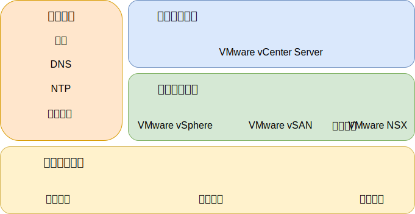

---

copyright:

  years:  2016, 2019

lastupdated: "2019-03-15"

subcollection: vmwaresolutions

---
# IBM Cloud for VMware Solutions 组件
{: #design_overview}

{{site.data.keyword.vmwaresolutions_full}} 提供了自动化功能，可将 VMware 技术组件部署到全球范围的 {{site.data.keyword.CloudDataCents_notm}} 中。

此解决方案产品服务组合中的产品包括自动部署和配置的集群中的 VMware vSphere 产品：VMware vSphere ESXi、具有嵌入式 Platform Services Controller (PSC) 的 VMware vCenter Server Appliance、VMware NSX-V 或 NSX-T 以及（可选）VMware vSAN。

该体系结构包含一个云区域，并支持扩展到其他地理位置中的更多云区域，也支持扩展到同一数据中心内的其他 {{site.data.keyword.cloud_notm}} pod 中。区域定义为唯一的 vCenter Server 实例。此设计还支持在 vCenter Server 实例中自动扩展和收缩虚拟容量。

图 1. {{site.data.keyword.vmwaresolutions_short}} 的解决方案组件

## 相关链接
{: #design_overview-related}

* [物理基础架构设计](/docs/services/vmwaresolutions/archiref/solution?topic=vmware-solutions-design_physicalinfrastructure)
* [虚拟基础架构设计](/docs/services/vmwaresolutions/archiref/solution?topic=vmware-solutions-design_virtualinfrastructure)
* [公共服务设计](/docs/services/vmwaresolutions/archiref/solution?topic=vmware-solutions-design_commonservice)
* [基础架构管理设计](/docs/services/vmwaresolutions/archiref/solution?topic=vmware-solutions-design_infrastructuremgmt)
