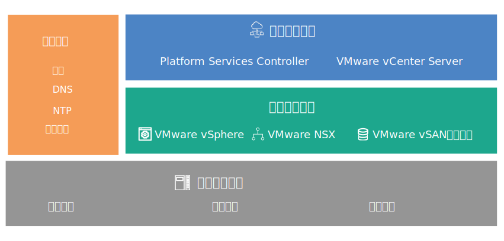

---

copyright:

  years:  2016, 2018

lastupdated: "2018-07-10"

---
# 设计概述

{{site.data.keyword.vmwaresolutions_full}} 提供了自动化功能，可将 VMware 技术组件部署到全球范围的 {{site.data.keyword.CloudDataCents_notm}} 中。

## 解决方案产品

解决方案产品在自动部署并配置的集群中包含以下 VMware vSphere 产品：
* VMware Cloud Foundation：vSphere ESXi、Platform Services Controller (PSC)、VMware vCenter Server Appliance、SDDC Manager、VMware NSX 和 VMware vSAN。
* VMware vCenter Server：vSphere ESXi、Platform Services Controller (PSC)、vCenter Server Appliance、NSX 和（可选）vSAN。

在此设计中，实例部署在初始订购的 {{site.data.keyword.CloudDataCent_notm}} 中的单个 pod 中。初始部署后，可以将虚拟环境扩展到同一数据中心内的其他 pod 中或扩展到其他数据中心内。

该设计还支持在 Cloud Foundation 或 vCenter Server 实例中自动扩展和收缩虚拟容量。

## VMware on IBM Cloud 组件

图 1. VMware on {{site.data.keyword.cloud_notm}} 的组件

### 相关链接

* [物理基础架构设计](design_physicalinfrastructure.html)
* [虚拟基础架构设计](design_virtualinfrastructure.html)
* [公共服务设计](design_commonservice.html)
* [基础架构管理设计](design_infrastructuremgmt.html)
