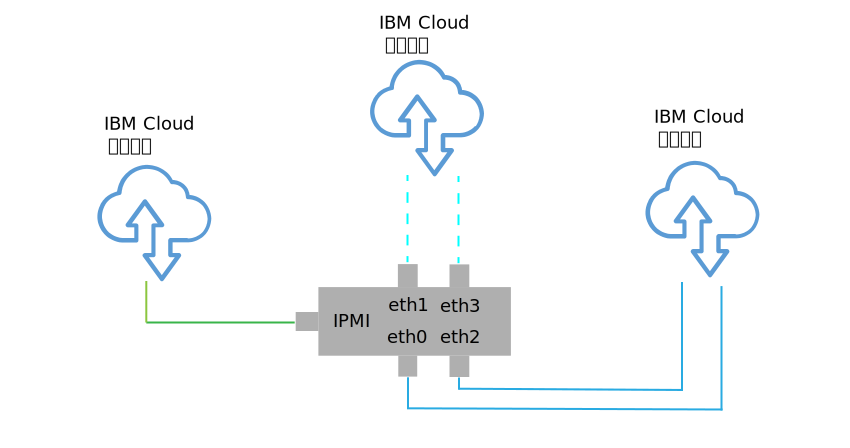

---

copyright:

  years:  2016, 2019

lastupdated: "2019-01-23"

---

{:tip: .tip}
{:note: .note}
{:important: .important}

# 物理基础架构设计

物理基础架构包含以下组件：

<dl class="dl">
  <dt class="dt dlterm">物理计算</dt>
  <dd class="dd">物理计算提供虚拟化基础架构使用的物理处理和内存。对于此设计，计算组件由 {{site.data.keyword.baremetal_long}} 提供，并在 [VMware 硬件兼容性指南 (HCG)](https://www.vmware.com/resources/compatibility/search.php) 中列出。</dd>
  <dt class="dt dlterm">物理存储</dt>
  <dd class="dd">物理存储器提供虚拟化基础架构使用的原始存储容量。存储组件由 {{site.data.keyword.baremetal_short}} 或由使用 NFS V3 的共享网络连接的存储器 (NAS) 阵列提供。</dd>
  <dt class="dt dlterm">物理网络</dt>
  <dd class="dd">物理网络提供环境的网络连接，该连接接着由网络虚拟化使用。网络由 {{site.data.keyword.cloud_notm}} 服务网络提供，并且包含 DNS 和 NTP 等额外服务。</dd>
</dl>

有关物理组件的更多信息，请参阅 [Cloud Foundation 实例](/docs/services/vmwaresolutions/sddc/sd_bom.html)或 [vCenter Server 实例](/docs/services/vmwaresolutions/vcenter/vc_bom.html)的材料清单。

有关存储器的更多信息，请参阅[共享存储器体系结构](https://www.ibm.com/cloud/garage/files/AttachedStorageSolutionArchitecture_v1.0.pdf)。

## 物理主机设计

物理主机是指环境中提供计算资源的 {{site.data.keyword.baremetal_short}}。在此解决方案中应用的 {{site.data.keyword.baremetal_short}} 由 VMware 进行认证，并在 [VMware HCG](http://www.vmware.com/resources/compatibility/search.php) 中列出。

解决方案中可用的服务器配置满足或超过安装、配置和管理 vSphere ESXi 的最低需求。有各种配置可用于满足不同需求。有关用于 VMware on {{site.data.keyword.cloud_notm}} 解决方案的确切规范的详细列表，请参阅 [Cloud Foundation 实例](/docs/services/vmwaresolutions/sddc/sd_bom.html)或 [vCenter Server 实例](/docs/services/vmwaresolutions/vcenter/vc_bom.html)的材料清单。

{{site.data.keyword.baremetal_short}} 位于 {{site.data.keyword.cloud_notm}} 中。
{:note}

每个 Cloud Foundation 实例都以 4 主机部署开始，每个 vCenter Server 实例以 3 主机或 4 主机部署开始，具体取决于存储解决方案的选择。

物理主机采用要分配给 vSphere ESXi 系统管理程序的两个本地连接的磁盘。您可以使用 vSAN（如_物理存储器设计_部分中所述）或使用 NetApp ONTAP（如 [NetApp ONTAP Select 体系结构](https://www.ibm.com/cloud/garage/files/IBM_Cloud_for_VMware_Solutions_NetApp_Architecture.pdf)中所述）来分配更多磁盘。每个物理主机都具有冗余的 10 Gbps 网络连接，支持公用和专用网络访问。

裸机服务器具有以下规范：
* CPU：双 Intel Xeon，不同核心和速度配置
* 内存：不同配置，128 GB 或更大
* 网络：4 个 10 Gbps
* 驱动器数：2 个或更多

## 物理网络设计

此部分描述 {{site.data.keyword.cloud_notm}} 提供的物理网络以及与物理主机关联的物理主机连接（VLAN 和 MTU）。

{{site.data.keyword.cloud_notm}} 的物理网络分为三种不同的网络：公用网络、专用网络和管理网络。有关三种网络及其工作方式的插图，请参阅 [{{site.data.keyword.cloud_notm}} 网络](https://www.ibm.com/cloud-computing/bluemix/our-network)。

### 公用网络

{{site.data.keyword.CloudDataCents_notm}} 和网络存在点 (PoP) 具有多个 1 Gbps 或 10 Gbps 连接，用于连接到顶层传输和对等网络运营商。

来自世界任何地方的外部网络流量都会连接到离得最近的网络 PoP，并通过该网络直接传输到其数据中心，从而最大程度地减少提供者之间的网络中继段数和切换次数。

在数据中心内部，{{site.data.keyword.cloud_notm}} 通过一对单独的同级聚集的前端客户交换机 (FCS)，为各个服务器提供 1 Gbps 或 10 Gbps 的网络带宽。这些聚集的交换机连接到一对单独的前端客户路由器 (FCR) 以用于 L3 联网。

通过此多层设计，网络可以在 {{site.data.keyword.CloudDataCent_notm}} 内跨机架、机柜行和 pod 进行扩展。

### 专用网络

所有 {{site.data.keyword.CloudDataCents_notm}} 和 PoP 均通过专用网络主干进行连接。专用网络独立于公用网络，支持连接到全球的 {{site.data.keyword.CloudDataCents_notm}} 中的服务。在 {{site.data.keyword.CloudDataCents_notm}} 之间移动数据是通过与专用网络的多个 10 Gbps 或 40 Gbps 连接完成的。

与公用网络类似，专用网络也是多层的，其中服务器和其他基础架构组件连接到聚集的后端客户交换机 (BCS)。这些聚集的交换机连接到一对单独的后端客户路由器 (BCR) 以用于 L3 联网。专用网络还支持使用巨型帧 (MTU 9000) 进行物理主机连接的功能。

### 管理网络

除了公用和专用网络之外，每个 {{site.data.keyword.cloud_notm}} 服务器还会连接到一个频带外管理网络。此管理网络可通过 VPN 进行访问，支持经由智能平台管理接口 (IPMI) 来对服务器（与其 CPU、固件和操作系统无关）进行访问，以进行维护和管理。

### 主 IP 块和可移植 IP 块

{{site.data.keyword.cloud_notm}} 会分配要在 {{site.data.keyword.cloud_notm}} 基础架构中使用的两种类型的 IP 地址：
* 主 IP 地址，分配给由 {{site.data.keyword.cloud_notm}} 供应的设备、裸机服务器和虚拟服务器。不要分配这些块中的任何 IP 地址。
* 可移植 IP 地址，供您根据需要进行分配和管理。

在 {{site.data.keyword.slportal}} 中启用了 **VLAN 生成**，或者帐户配置为**虚拟路由和转发 (VRF)** 帐户时，主 IP 地址或可移植 IP 地址可以设置为可路由到客户帐户内的任何 VLAN。

### VLAN 生成

**VLAN 生成**是一个 {{site.data.keyword.slportal}} 帐户设置，允许帐户中所有 VLAN 的主子网 IP 块和可移植子网 IP 块相互路由。禁用了 **VLAN 生成**设置时，IP 块仍可以路由到 {{site.data.keyword.cloud_notm}} 服务，但不能相互路由。

要允许跨解决方案组件所在的各种不同子网建立透明连接，需要在部署了 Cloud Foundation 和 vCenter Server 实例的 {{site.data.keyword.slportal}} 帐户中启用 **VLAN 生成**。

### 虚拟路由和转发 (VRF)

您还可以将 {{site.data.keyword.slportal}} 帐户配置为 VRF 帐户，以提供与 VLAN 生成类似的功能，从而使子网 IP 块之间能够自动路由。具有“直接链路”连接的所有帐户都必须转换为或创建为 VRF 帐户。

{{site.data.keyword.vmwaresolutions_short}} 控制台无法检测是否在 {{site.data.keyword.slportal}} 中启用了 VRF。您将收到一条警告，提醒您确保在 {{site.data.keyword.slportal}} 帐户中启用了 **VLAN 生成**或 VRF。

### 物理主机连接

此设计中的每个物理主机都有两对冗余的 10 Gbps 以太网连接，用于连接到每个 {{site.data.keyword.cloud_notm}} 机顶接入 (ToR) 交换机（公用和专用）。适配器设置为独立连接（未绑定），共有 4 个 10 Gbps 连接。这允许网络接口卡 (NIC) 连接彼此独立工作。

图 1. 物理主机 NIC 连接

### VLAN

{{site.data.keyword.vmwaresolutions_short}} 产品设计有 3 个 VLAN：一个公用 VLAN 和两个专用 VLAN；这些 VLAN 在部署时进行分配。如图 2 中所示，公用 VLAN 分配给 eth1 和 eth3，专用 VLAN 分配给 eth0 和 eth2。

缺省情况下，在 {{site.data.keyword.cloud_notm}} 中未标记此设计中创建和分配的公用 VLAN 和第一个专用 VLAN。另一个专用 VLAN 在物理交换机端口上中继，并在使用这些子网的 VMware 端口组中进行标记。

在此设计中，专用网络由两个 VLAN 组成。有三个子网分配给其中的第一个 VLAN（在此指定为“专用 VLAN A”）：
* 第一个子网是 {{site.data.keyword.cloud_notm}} 分配给物理主机的主专用 IP 子网范围。
* 第二个子网用于管理虚拟机，例如 vCenter Server Appliance 和 Platform Services Controller
* 第三个子网用于通过 VMware NSX Manager 分配给每个主机的 VXLAN 隧道端点 (VTEP)。

除了“专用 VLAN A”外，还存在另一个专用 VLAN（在此指定为“专用 VLAN B”），用于支持 vSAN 和 vMotion 等 VMware 功能，以及用于连接到网络连接的存储器 (NAS)。因此，该 VLAN 分成两个或三个可移植子网。

* 第一个子网分配给用于 vMotion 流量的内核端口组。
* 其余子网用于存储流量：
   * 使用 vSAN 时，子网将分配给用于 vSAN 流量的内核端口组。
   * 使用 NAS 时，子网将分配给专用于 NFS 流量的端口组。

在 vCenter Server 或 Cloud Foundation 自动部署过程中配置的所有子网都使用 {{site.data.keyword.cloud_notm}} 管理的范围。这是为了确保您现在或未来需要连接时，任何 IP 地址都可以路由到 {{site.data.keyword.cloud_notm}} 帐户中的任何数据中心。

表 1 中对此进行了全面概述。

表 1. VLAN 和子网摘要

|VLAN|类型|描述|
|:---- |:---- |:----------- |
|公用|主|分配给物理主机以用于公用网络访问。在初始部署时未使用。|
|专用 A|主|分配给 {{site.data.keyword.cloud_notm}} 所分配物理主机的单个子网。通过管理接口用于 vSphere 管理流量。|
|专用 A|可移植|分配给用作管理组件的虚拟机的单个子网|
|专用 A|可移植|分配给 NSX VTEP 的单个子网|
|专用 B|可移植|分配用于 vSAN（如果在使用）的单个子网|
|专用 B|可移植|分配用于 NAS（如果在使用）的单个子网|
|专用 B|可移植|分配用于 vMotion 的单个子网|

在此设计中，所有支持 VLAN 的主机和虚拟机都配置为指向作为缺省路径的 {{site.data.keyword.cloud_notm}} 后端“专用网络”客户路由器。虽然 vCenter Server 和 Cloud Foundation 实例支持使用软件定义的联网 (SDN)，但在 VMware 实例中创建的包含到内部子网的路由的网络覆盖并不为 {{site.data.keyword.cloud_notm}} 管理的路由器所知。因此，您可能需要在 VMware 实例中的一些或所有管理组件上创建静态路由。

专用网络连接配置为使用大小为 9000 的巨型帧 MTU，这将提高存储和 vMotion 等大型数据传输的性能。这是 VMware 和 {{site.data.keyword.cloud_notm}} 中允许的最大 MTU。公用网络连接使用标准以太网 MTU，即 1500。必须保留此设置不变，因为对此设置的任何更改都可能导致因特网上发生包分段。

## 物理存储器设计

物理存储器设计由物理主机中安装的物理磁盘的配置以及共享文件级别存储器的配置组成。这包括 vSphere ESXi 系统管理程序的操作系统磁盘以及用于存储虚拟机 (VM) 的磁盘。VM 的存储器可以由 VMware vSAN 虚拟化的本地磁盘或共享文件级别的存储器组成。

### 操作系统磁盘

vSphere ESXi 系统管理程序设计为安装在持久位置。因此，物理主机在 RAID-1 配置中包含两个 1 TB SATA 磁盘，以支持 vSphere ESXi 系统管理程序冗余。

### 虚拟机存储器

此设计支持将 VMware vSAN 或共享文件级别的存储器用作 VM 的主数据存储的选项。

### vSAN 磁盘

使用 VMware vSAN 时，将使用全闪存配置来配置 VMware vSAN。此设计支持多个配置选项，包括 2U 和 4U 机箱、不同磁盘数以及各种磁盘大小。所有配置都使用两个 vSAN 磁盘组，其中一个固态磁盘 (SSD) 用于高速缓存，一个或多个 SSD 用于容量。分配供 vSAN 使用的所有驱动器均在单磁盘 RAID-0 中配置。

有关支持的配置的更多信息，请参阅 [Cloud Foundation 实例](/docs/services/vmwaresolutions/sddc/sd_bom.html)或 [vCenter Server 实例](/docs/services/vmwaresolutions/vcenter/vc_bom.html)的材料清单。

### 跨主机共享文件级别的存储器

使用共享文件级别的存储器时，2-TB TB NFS 共享会连接到组成初始 VMware 集群的主机。此共享（称为管理共享）用于管理组件，例如 VMware vCenter Server、Platform Services Controller 和 VMware NSX。存储器使用 NFSv3 协议进行连接，并且最多可以支持 4000 IOPS。

图 2. 连接到 VMware 部署的 NFS 共享

您可以在购买时或日后在控制台中为工作负载分配和安装更多文件共享。可以从相应的 {{site.data.keyword.CloudDataCent_notm}} 中可用的 {{site.data.keyword.cloud_notm}} 耐久性文件存储器容量选项和性能层中进行选择。所有共享均使用 NFSv3 协议进行连接。此外，还可通过应用 NetApp ONTAP Select 产品来连接 NFSv3 文件共享。

提供 10 IOPS/ GB 性能层的 {{site.data.keyword.CloudDataCents_notm}} 还包含提供者管理的静态数据加密（AES-256 加密），并且这些数据中心通过全闪存存储器支持。10 IOPS/GB 性能层限制为最大容量 4 TB。有关此解决方案中使用的共享 NAS 的更多信息，请参阅[共享存储器体系结构](https://www.ibm.com/cloud/garage/files/AttachedStorageSolutionArchitecture_v1.0.pdf)。

### 相关链接

* [Cloud Foundation 材料清单](/docs/services/vmwaresolutions/sddc/sd_bom.html)
* [vCenter Server 材料清单](/docs/services/vmwaresolutions/vcenter/vc_bom.html)
* [共享存储器体系结构](https://www.ibm.com/cloud/garage/files/AttachedStorageSolutionArchitecture_v1.0.pdf)
* [NetApp ONTAP Select 体系结构](https://www.ibm.com/cloud/garage/files/IBM_Cloud_for_VMware_Solutions_NetApp_Architecture.pdf)
