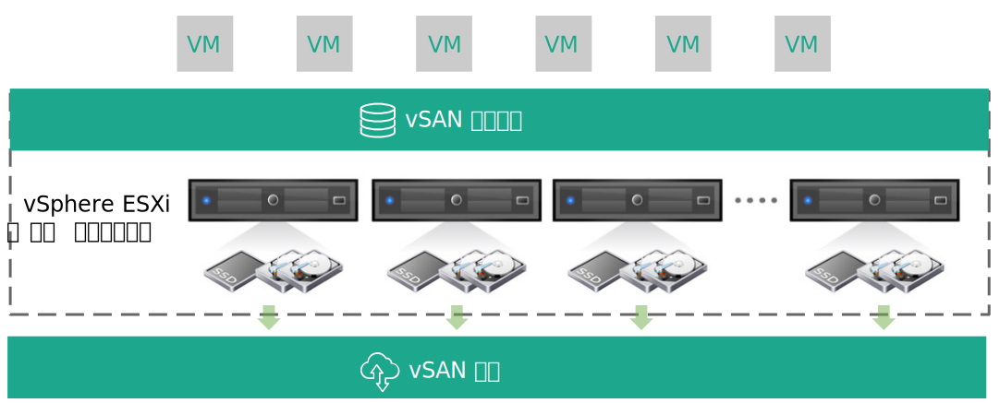
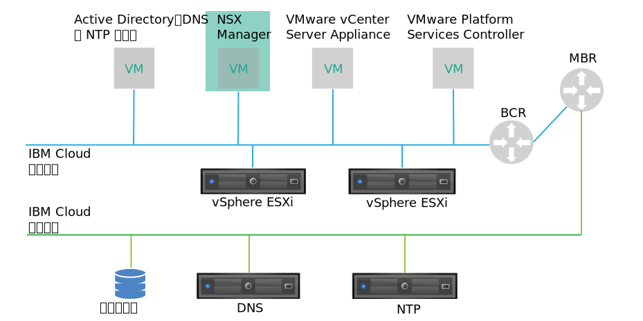
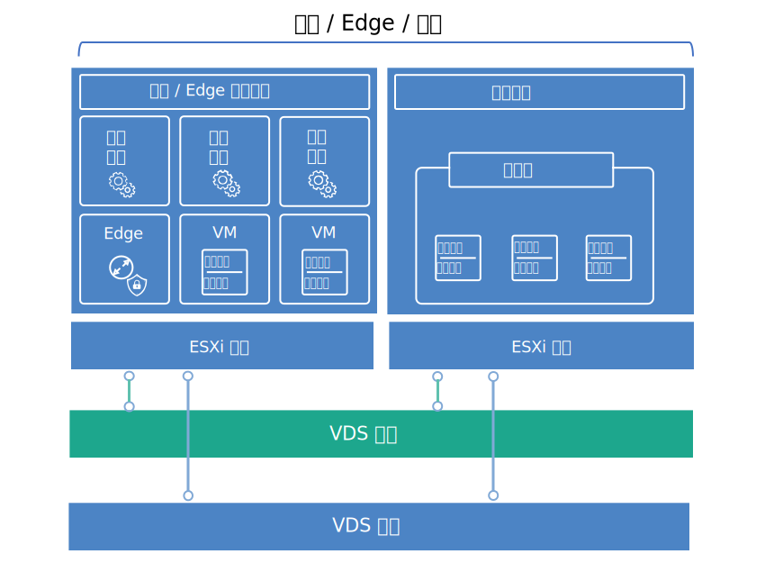

---

copyright:

  years:  2016, 2018

lastupdated: "2018-09-28"

---

# 虚拟基础架构设计

虚拟基础架构层包含多个 VMware 软件组件，用于虚拟化物理基础架构层中提供的计算、存储和网络资源：VMware vSphere ESXi、VMware NSX 和（可选）VMware vSAN。

## VMware vSphere 设计

vSphere ESXi 配置由以下方面构成：
* 引导配置
* 时间同步
* 主机访问
* 用户访问
* DNS 配置

表 1 概述了各个方面的规范。在配置和安装 ESXi 之后，该主机会添加到 VMware vCenter Server，并在其中对该主机进行管理。

该设计允许您通过直接控制台用户界面 (DCUI)、ESXi Shell 和安全 Shell (SSH) 来访问虚拟主机。

缺省情况下，唯一可以直接登录的用户是主机物理机器的 _root_ 和 _ibmvmadmin_ 用户。管理员可以添加 Microsoft Active Directory (MSAD) 域中的最终用户，以允许用户访问主机。vCenter Server 解决方案设计中的所有主机都配置为与中央 NTP 服务器同步。

表 1. vSphere ESXi 配置

|属性|配置参数|
|:---------------------- |:----------------------- |
|ESXi 引导位置|使用在 RAID-1 中配置的本地磁盘|
|时间同步| 使用 {{site.data.keyword.cloud}} NTP 服务器 |
|主机访问|支持 DCUI、ESXi Shell 或 SSH|
|用户访问| 本地认证和 MSAD |
| 域名解析 |使用 DNS，如[公共服务设计](design_commonservice.html)中所述。|

vSphere 集群包含用于管理针对用户工作负载的中央云和计算资源的虚拟机 (VM)。

对于 Cloud Foundation 实例：
* 初始部署时，实例包含 4 个 ESXi 主机。
* 部署后最多可扩展到 32 个 ESXi 主机。

对于 vCenter Server 实例：
* 实例仅使用 NFS 时，初始部署时的最小 ESXi 主机数为 2，但建议使用 3 个 ESXi 主机以实现 HA。在初始部署期间或初始部署后，可以向上扩展到最多 59 个 ESXi 主机。
* 实例使用 vSAN 时，初始部署时的最小 ESXi 主机数为 4。在初始部署期间或初始部署后，可以向上扩展到最多 59 个 ESXi 主机。

要支持更多用户工作负载，可以通过以下方式扩展环境：  
* 为现有集群部署更多计算主机
* 部署由同一 vCenter Server Appliance 管理的其他集群
* 使用自己的 vCenter Server Appliance 部署新的 vCenter Server 或 Cloud Foundation 实例

有关集群的更多信息，请参阅 [{{site.data.keyword.cloud_notm}} 运行 VMware 集群解决方案体系结构文档](https://www.ibm.com/cloud/garage/files/IBM-Cloud-for-VMware-Solutions-Multicluster-Architecture.pdf)。

## VMware vSAN 设计

在此设计中，Cloud Foundation 实例中采用了 VMware vSAN 存储器，在 vCenter Server 实例中可选择采用 VMware vSAN 存储器，从而为 vSphere 主机提供共享存储器。

如图 1 中所示，vSAN 跨 vSphere 集群内的多个 ESXi 主机聚集本地存储器，并将聚集的存储器作为一个 VM 数据存储进行管理。在此设计中，计算节点包含用于 ESXi 操作系统和 vSAN 数据存储的本地磁盘驱动器。无论节点属于哪个集群，每个节点中都包含两个 1-TB SATA 驱动器来容纳 ESXi 安装。

图 1. vSAN 概念

vSAN 采用以下组件：
* 双磁盘组 vSAN 设计，每个磁盘组包含两个或更多磁盘。组中最小大小的一个 SSD 充当高速缓存层，其余 SSD 充当容量层。
* 在 RAID-0 级别，为每个驱动器（两个操作系统驱动器除外）配置板载 RAID 控制器。
* 基于所有存储器创建一个 vSAN 数据存储。

可用的 vSAN 功能部件取决于订购实例时选择的许可证版本。有关更多信息，请参阅 [VMware vSAN 版本比较](appendix.html#vmware-vsan-edition-comparison)。

### vSAN 的虚拟网络设置

对于此设计，vSAN 流量会在专用私有、VLAN 上的 ESXi 主机之间遍历。连接到专用网络交换机的两个网络适配器在 vSphere 中配置为 vSphere 分布式交换机 (vDS)，两个网络适配器均作为上行链路。为 vSAN VLAN 配置的专用 vSAN 内核端口组位于 vDS 中。对专用 vDS 启用了巨型帧 (MTU 9000)。

vSAN 不会跨上行链路对流量进行负载均衡。因此，一个适配器处于活动状态，而另一个适配器处于备用状态以支持高可用性 (HA)。vSAN 的网络故障转移策略在物理网络端口之间配置为**显式故障转移**。

有关物理 NIC 连接的更多信息，请参阅[物理基础架构设计](design_physicalinfrastructure.html)中的“图 2. 物理主机 NIC 连接”。

### 存储策略设计

启用并配置 vSAN 后，存储策略会配置为定义 VM 存储器特征。存储器特征为不同 VM 指定不同级别的服务。

此设计中的缺省存储策略容许单个故障。缺省策略配置为使用 RAID 5 擦除编码，其中**容错方法**设置为 **RAID-5/6（擦除编码）- 容量**，**主要故障级别**设置为 1。

RAID 5 配置至少需要 4 个主机。或者，可以选择 RAID 6 配置，其中**容错方法**设置为 **RAID-5/6（擦除编码）-容量**，**主要故障级别**设置为 2。

RAID 6 配置至少需要 6 个主机。在缺省存储策略中，**复制**和**压缩**也处于启用状态。

除非在 vSphere 控制台中另外指定，否则实例会使用缺省策略。配置定制策略后，vSAN 将尽可能保证使用该策略。但是，如果无法保证使用此策略，那么无法供应使用该策略的 VM，除非已启用强制供应。

添加新的 ESXi 主机或对 ESXi 主机安装补丁后，必须重新应用存储策略。

### vSAN 设置

vSAN 设置是根据在 {{site.data.keyword.cloud_notm}} 中部署 VMware 解决方案的最佳实践设置的。vSAN 设置包含 SIOC 设置、显式故障转移设置端口组和磁盘高速缓存设置。
* SSD 高速缓存策略设置：**非预读**、**直写**、**直接** (NRWTD)
* 网络 I/O 控制设置
   * 管理：20 个共享
   * 虚拟机：30 个共享
   * vMotion：50 个共享
   * vSAN：100 个共享
* vSAN 内核端口：**显式故障转移**

## VMware NSX 设计

网络虚拟化提供了存在于虚拟层中的网络覆盖。网络虚拟化为体系结构提供了快速供应、部署、重新配置和销毁随需应变虚拟网络等功能。此设计使用 vDS 和 VMware NSX for vSphere 来实现虚拟联网。

在此设计中，初始集群中将部署 NSX Manager。将从专用可移植地址块中为 NSX Manager 分配支持 VLAN 的 IP 地址，该地址块指定用于管理组件，并配置为使用[公共服务设计](design_commonservice.html)中讨论的 DNS 和 NTP 服务器。将使用表 2 中所列的规范安装 NSX Manager。

表 2. NSX Manager 属性

|属性|规范|
|:--------------- |:------------- |
|NSX Manager|虚拟设备|
|vCPU 数量|4|
|内存|16 GB|
|磁盘|管理 NFS 共享上 60 GB|
|磁盘类型|自动精简配置|
|网络|指定用于管理组件的专用 A 可移植|

下图显示了 NSX Manager 相对于体系结构中其他组件的位置。

图 2. NSX Manager 网络概述

初始部署后，{{site.data.keyword.cloud_notm}} 自动化会在初始集群中部署三个 NSX 控制器。 将从指定用于管理组件的专用 A 可移植子网中为每个控制器分配一个支持 VLAN 的 IP 地址。此外，此设计还会创建 VM 到 VM 反亲缘关系规则，以在集群中的各主机之间分隔控制器。初始集群必须至少包含 3 个节点，以确保控制器的高可用性。

除了控制器之外，{{site.data.keyword.cloud_notm}} 自动化还会为部署的 vSphere 主机准备 NSX VIBS，以支持通过 VXLAN 隧道端点（VTEP）使用虚拟化网络。将从为 VTEP 指定的专用 A 可移植 IP 地址范围中为 VTEP 分配支持 VLAN 的 IP 地址，如[物理基础架构设计](design_physicalinfrastructure.html)的*表 1. VLAN 和子网摘要*中所列示。VXLAN 流量驻留在未标记的 VLAN 上，并且分配给专用 vDS。

随后，将分配分段标识池，并且将集群中的主机添加到传输区域。由于在 {{site.data.keyword.cloud_notm}} 中未配置因特网组管理协议 (IGMP) 监听，因此在传输区域中仅使用单点广播。

在此之后，将部署 NSX Edge 服务网关对。在所有情况下，都会使用一个网关对来处理位于专用网络中的自动化组件的出站流量。对于 vCenter Server，将部署另一个称为客户管理的 Edge 的网关，并将其配置为使用上行链路连接公用网络，还会为专用网络分配一个接口。有关作为解决方案的一部分部署的 NSX Edge 服务网关的更多信息，请参阅 [NSX Edge on {{site.data.keyword.cloud_notm}} 解决方案体系结构](https://www.ibm.com/cloud/garage/files/IBM_Cloud_for_VMware_Solutions_NSX_Edge_Services_Gateway.pdf)。

云管理员可以配置任何必需的 NSX 组件，例如分布式逻辑路由器 (DLR)、逻辑交换机和防火墙。可用的 NSX 功能部件取决于在订购实例时选择的 NSX 许可证版本。有关更多信息，请参阅 [VMware NSX 版本比较](appendix.html#vmware-nsx-edition-comparison)。对于 vCenter Server 实例，{{site.data.keyword.cloud_notm}} 自动化会将 vCenter Server Appliance 和 Platform Services Controller (PSC) 添加到 NSX Manager 分布式防火墙排除列表中。

### 分布式交换机设计

该设计使用最小数量的 vDS 交换机。集群中的主机会连接到公用和专用网络。这些主机均配置有两个分布式虚拟交换机。两个交换机的使用遵循的是用于将公用和专用网络分隔开的 {{site.data.keyword.cloud_notm}} 网络实践。下图显示了 vDS 设计。

图 3. 分布式交换机设计

如图所示，一个 vDS 配置用于公用网络连接 (SDDC-Dswitch-Public)，另一个 vDS 配置用于专用网络连接 (SDDC-Dswitch-Private)。

不同类型的流量需要进行分隔，以减少争用和等待时间并提高安全性。VLAN 用于对物理网络功能进行分段。

此设计使用三个 VLAN：两个用于专用网络流量，一个用于公用网络流量。下表显示了流量分隔。

表 3. VLAN 与流量类型的对应关系

|VLAN|名称| 流量类型 |
|:----- |:----------- |:------------ |
|VLAN1|公用|可用于因特网访问|
|VLAN2|专用 A| ESXi 管理、管理、VXLAN (VTEP) |
|VLAN3|专用 B|vSAN、NFS 和 vMotion|

来自工作负载的流量将在支持 VXLAN 的逻辑交换机上传输。

vSphere 集群使用两个 vSphere 分布式交换机，配置如以下各表中所示。

表 4. 融合集群分布式交换机

|vSphere 分布式 交换机名称 |功能|网络 I/O 控制|负载均衡 模式 |物理 NIC 端口 |MTU|
|:------------- |:------------- |:------------- |:------------- |:------------- |:------------- |
|SDDC-Dswitch-Private| ESXi 管理、vSAN、vSphere vMotion、VXLAN 隧道端点、NFS (VTEP) |已启用| 基于显式故障转移（vSAN、vMotion）发起虚拟端口进行路由（其他所有）|2|9,000 （巨型帧）|
|SDDC-Dswitch-Public| 外部管理流量（南北） |已启用| 基于发起虚拟端口进行路由|2|1,500 （缺省值）|

**注**：根据 {{site.data.keyword.CloudDataCent_notm}} 和主机硬件选择，主机 NIC 的名称、数量和顺序可能有所不同。

表 5. 融合集群分布式交换机端口组配置设置

|参数|设置|
|:------------------ |:------------- |
|负载均衡|基于发起虚拟端口进行路由 \*|
|故障转移检测|仅链接状态|
|通知交换机|已启用|
|故障恢复|否|
|故障转移顺序|活动上行链路：Uplink1 或 Uplink2 \* |

\* **注**：vSAN 端口组使用采用活动/备用方式的显式故障转移，因为它不支持对 vSAN 存储器流量进行负载均衡。

表 6. 融合集群虚拟交换机端口组和 VLAN

| vSphere 分布式交换机 | 端口组名称 |组队|上行链路|VLAN 标识|
|:------------- |:------------- |:------------- |:------------- |:---------- |
|SDDC-Dswitch-Private|SDDC-DPortGroup-Mgmt|发起虚拟端口|活动：0、1|VLAN1|
|SDDC-Dswitch-Private|SDDC-DPortGroup-vMotion|发起虚拟端口|活动：0、1|VLAN2|
|SDDC-Dswitch-Private|SDDC-DPortGroup-VSAN|显式故障转移|活动：0 备用：1|VLAN2|
|SDDC-Dswitch-Private|SDDC-DPortGroup-NFS|发起虚拟端口|活动：0、1|VLAN2|
|SDDC-Dswitch-Private|由 NSX 自动生成|发起虚拟端口|活动：0、1|VLAN1|
|SDDC-Dswitch-Public|SDDC-DPortGroup-External|发起虚拟端口|活动：0、1|VLAN3|

表 7. 融合集群 VM 内核适配器

| vSphere 分布式交换机 |用途| 连接的端口组 | 启用的服务 |MTU|
|:-------------------------- |:------- |:-------------------- |:---------------- |:--- |
|SDDC-Dswitch-Private|管理|SDDC-DPortGroup-Mgmt| 管理流量 |1,500 （缺省值）|
|SDDC-Dswitch-Private|vMotion|SDDC-DPortGroup-vMotion| vMotion 流量 |9,000|
|SDDC-Dswitch-Private|VTEP|*由 NSX 自动生成*| \- |9,000|
|SDDC-Dswitch-Private|VSAN|SDDC-DPortGroup-VSAN|vSAN|9,000|
|SDDC-Dswitch-Private|NAS|SDDC-DPortGroup-NFS| \-  |9,000|

### NSX 配置

此设计指定 NSX 组件的配置，但不会应用任何网络覆盖组件配置。您可以根据需要设计网络覆盖。将预配置以下方面：

* 安装管理服务器和控制器，并将其集成到 vCenter Web UI 中
* 安装 ESXi 代理程序，并且为每个 ESXi 主机配置 VTEP IP 地址
* VTEP 配置、控制器配置和 VXLAN 配置（传输区域）
* NSX Edge 服务网关设备，供管理组件使用
* 仅限 vCenter Server 实例：供客户使用的 NSX Edge 服务网关设备

未配置以下方面：
* 虚拟分布式路由器
* 微分段
* VXLAN
* 将 NSX Management 链接到其他 VMware 实例

### 相关链接

* [{{site.data.keyword.cloud_notm}} 运行 VMware 集群解决方案体系结构](https://www.ibm.com/cloud/garage/files/IBM-Cloud-for-VMware-Solutions-Multicluster-Architecture.pdf)
* [NSX Edge on {{site.data.keyword.cloud_notm}} 解决方案体系结构](https://www.ibm.com/cloud/garage/files/IBM_Cloud_for_VMware_Solutions_NSX_Edge_Services_Gateway.pdf)
