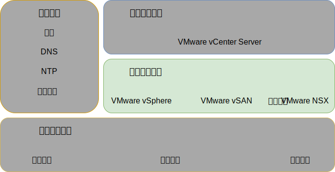
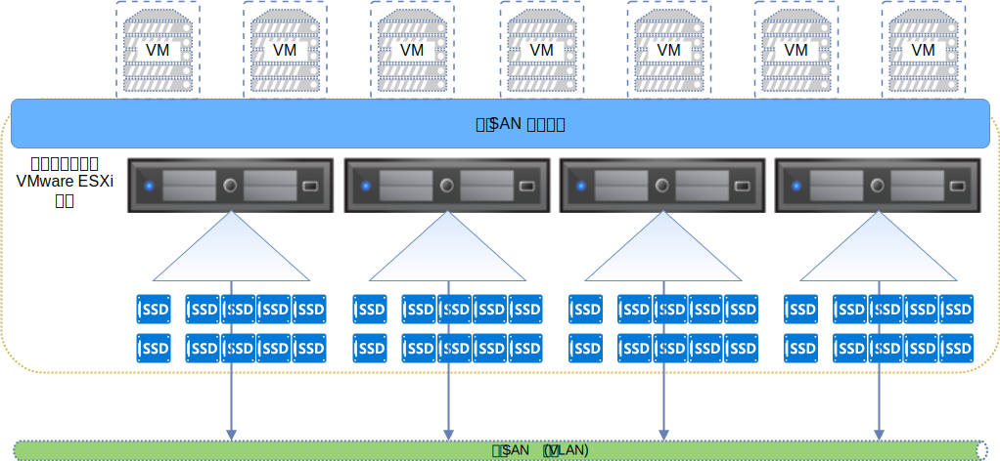
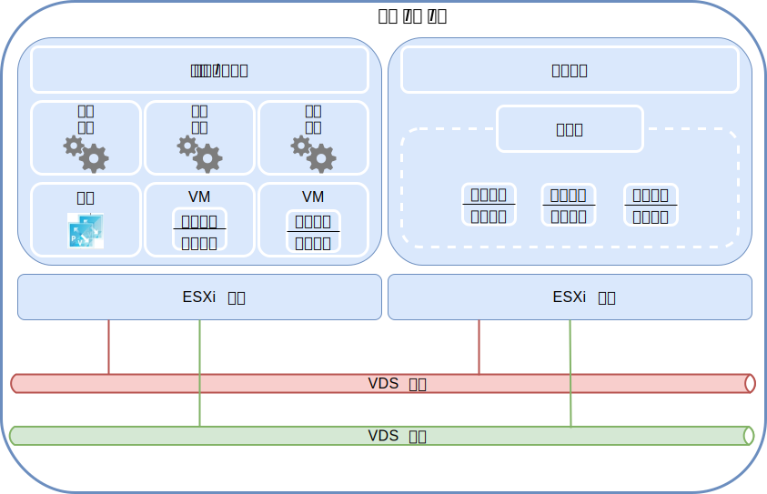

---

copyright:

  years:  2016, 2019

lastupdated: "2019-06-21"

subcollection: vmware-solutions

---

{:tip: .tip}
{:note: .note}
{:important: .important}

# 虚拟基础架构设计
{: #design_virtualinfrastructure}

虚拟基础架构层包含多个 VMware 软件组件，用于虚拟化物理基础架构层中提供的计算、存储和网络资源：VMware vSphere ESXi、VMware NSX-V 或 NSX-T 以及（可选）VMware vSAN。

## VMware vSphere 设计
{: #design_virtualinfrastructure-vsphere-design}

vSphere ESXi 配置由以下方面构成：
* 引导配置
* 时间同步
* 主机访问
* 用户访问
* DNS 配置

下表概述了各个方面的规范。在配置和安装 ESXi 之后，该主机会添加到 VMware vCenter Server，并在其中对该主机进行管理。

借助此设计，您可以通过直接控制台用户界面 (DCUI) 和 vSphere Web Client 来访问虚拟主机。作为最佳实践，安全 Shell (SSH) 和 ESXi Shell 在供应后均已禁用。

缺省情况下，唯一可以直接登录的用户是主机物理机器的 _root_ 和 _ibmvmadmin_ 用户。管理员可以添加 Microsoft Active Directory (MSAD) 域中的用户，以允许用户访问主机。vCenter Server 解决方案设计中的所有主机都配置为与中央 NTP 服务器同步。

表 1. vSphere ESXi 配置

|属性|配置参数|
|:---------------------- |:----------------------- |
|ESXi 引导位置|使用以 RAID-1 方式配置的本地磁盘|
|时间同步| 使用 {{site.data.keyword.cloud}} NTP 服务器 |
|主机访问|支持 DCUI。SSH 和 ESXi Shell 受支持，但缺省情况下未启用|
|用户访问| 本地认证和 MSAD |
| 域名解析 |使用 DNS，如[公共服务设计](/docs/services/vmwaresolutions/archiref/solution?topic=vmware-solutions-design_commonservice)中所述。|
|EVC 方式|Skylake（仅限“绿地”vSphere 6.7 部署）|

vSphere 集群包含用于管理 vCenter Server 实例的虚拟机 (VM) 以及针对用户工作负载的计算资源。

* vCenter Server 实例使用 vSAN 时，初始部署时的最小 ESXi 主机数为 4。
* vCenter Server 实例使用共享文件级别或块级别存储器时，初始部署时的最小 ESXi 主机数为 3。

在初始部署期间或初始部署后，可以扩展到最多 59 个 ESXi 主机。

要支持更多用户工作负载，可以通过以下方式扩展环境：  
* 在现有集群中部署更多计算主机
* 部署由同一 vCenter Server Appliance 管理的更多集群
* 使用自己的 vCenter Server Appliance 部署新的 vCenter Server 实例

有关集群的更多信息，请参阅 [{{site.data.keyword.cloud_notm}} running VMware clusters solution architecture](https://www.ibm.com/cloud/garage/files/IBM-Cloud-for-VMware-Solutions-Multicluster-Architecture.pdf)。

## VMware vSAN 设计
{: #design_virtualinfrastructure-vsan-design}

在此设计中，vCenter Server 实例中采用了 VMware vSAN 存储器，为 vSphere 主机提供共享存储器。

如下图中所示，vSAN 跨 vSphere 集群内的多个 ESXi 主机聚集本地存储器，并将聚集的存储器作为一个 VM 数据存储进行管理。在此设计中，计算节点包含用于 ESXi 操作系统 (OS) 和 vSAN 数据存储的本地磁盘驱动器。无论节点属于哪个集群，每个节点中都包含两个操作系统驱动器来容纳 ESXi 安装。

vSAN 采用以下组件：
* 双磁盘组 vSAN 设计，每个磁盘组包含两个或更多磁盘。组中最小大小的一个 SSD 或 NVMe 驱动器充当高速缓存层，其余 SSD 充当容量层。
* 为每个驱动器配置了采用 RAID-0 阵列的板载 RAID 控制器，但两个操作系统驱动器除外。
* 基于所有存储器创建一个 vSAN 数据存储。

可用的 vSAN 功能部件取决于订购实例时选择的许可证版本。有关更多信息，请参阅 [VMware vSAN 版本比较](/docs/services/vmwaresolutions/archiref/solution?topic=vmware-solutions-solution-appendix#vmware-vsan-edition-comparison)。

### vSAN 的虚拟网络设置
{: #design_virtualinfrastructure-net-setup}

对于此设计，vSAN 流量会在专用私有、VLAN 上的 ESXi 主机之间遍历。连接到专用网络交换机的两个网络适配器在 vSphere 中配置为 vSphere 分布式交换机 (vDS)，两个网络适配器均作为上行链路。为 vSAN VLAN 配置的专用 vSAN 内核端口组位于 vDS 中。对专用 vDS 启用了巨型帧 (MTU 9000)。

vSAN 不会跨上行链路对流量进行负载均衡。因此，一个适配器处于活动状态，而另一个适配器处于备用状态以支持高可用性 (HA)。vSAN 的网络故障转移策略在物理网络端口之间配置为**显式故障转移**。

有关物理 NIC 连接的更多信息，请参阅[物理主机 NIC 连接](/docs/services/vmwaresolutions/services?topic=vmware-solutions-design_physicalinfrastructure#design_physicalinfrastructure-host-connect)。

### vSAN 策略设计
{: #design_virtualinfrastructure-storage-policy}

启用并配置 vSAN 后，存储策略会配置为定义 VM 存储器特征。存储器特征为不同 VM 指定不同级别的服务。

此设计中的缺省存储策略容许单个故障。缺省策略配置为使用擦除编码，其中**容错方法**设置为 **RAID-5/6（擦除编码）- 容量**，**主要故障级别**设置为 1。RAID 5 配置至少需要 4 个主机。

或者，可以选择 RAID 6 配置，其中**容错方法**设置为 **RAID-5/6（擦除编码）- 容量**，**主要故障级别**设置为 2。RAID 6 配置至少需要 6 个主机。在缺省存储策略中，**复制**和**压缩**也处于启用状态。

除非在 vSphere 控制台中另外指定，否则实例会使用缺省策略。配置定制策略后，vSAN 将尽可能保证使用该策略。但是，如果无法保证使用此策略，那么无法供应使用该策略的 VM，除非已启用强制供应。

添加新的 ESXi 主机或对 ESXi 主机安装补丁后，必须重新应用存储策略。

### vSAN 设置
{: #design_virtualinfrastructure-vsan-sett}

vSAN 设置是根据在 {{site.data.keyword.cloud_notm}} 中部署 VMware 解决方案的最佳实践配置的。vSAN 设置包含 SIOC 设置、显式故障转移设置端口组和磁盘高速缓存设置。
* SSD 高速缓存策略设置：**非预读**、**直写**、**直接** (NRWTD)
* 网络 I/O 控制设置
   * 管理 - 20 个共享
   * 虚拟机 - 30 个共享
   * vMotion - 50 个共享
   * vSAN - 100 个共享
* vSAN 内核端口：**显式故障转移**

## NFS 连接的存储器
{: #design_virtualinfrastructure-nfs-storage}

使用 NFS 网络连接的存储器时，此体系结构规定使用 NFS v3 而不是 NFS v4.1，因为使用后者时 NFS 服务器 LIF 迁移可能会导致等待时间过长。每个 vSphere 主机使用其主机名连接到 NFS 存储器。

一个 2 TB NFS 数据存储器连接到集群，以供管理组件将其与性能层 4 IOPS/GB 配合使用。可以将更多数据存储器连接到集群以供工作负载使用，实现各种大小和性能层。

此外，此体系结构要求所有主机都为 NFS 存储器所在的子网创建了子网路由。此子网路由的目的是指示所有 NFS 流量使用此设计指定用于 NFS 流量的端口组、子网和 VLAN。如果连接了多个 NFS 数据存储器，可能需要配置多个路由，因为这些数据存储器可能位于不同的远程子网中。

管理虚拟机可能位于 NFS 数据存储器上。这会产生引导问题，因为某些管理机器可能负责用于解析 NFS 主机名的 DNS 服务。因此，此体系结构指定管理数据存储器的至少一个 IP 地址在每个主机上的 `/etc/hosts` 中进行硬编码。

## VMware NSX-V 设计
{: #design_virtualinfrastructure-nsx-design}

网络虚拟化提供了存在于虚拟层中的网络覆盖。网络虚拟化为体系结构提供了快速供应、部署、重新配置和销毁随需应变虚拟网络等功能。此设计使用 vDS 和 VMware NSX for vSphere 来实现虚拟联网。

在此设计中，初始集群中将部署 NSX Manager。将从专用可移植地址块中为 NSX Manager 分配支持 VLAN 的 IP 地址，该地址块指定用于管理组件，并配置为使用[公共服务设计](/docs/services/vmwaresolutions/archiref/solution?topic=vmware-solutions-design_commonservice)中提供的 DNS 和 NTP 服务器。

下图显示了 NSX Manager 相对于体系结构中其他组件的位置。

初始部署后，{{site.data.keyword.cloud_notm}} 自动化会在初始集群中部署三个 NSX 控制器。 将从指定用于管理组件的**专用 A** 可移植子网中为每个控制器分配一个支持 VLAN 的 IP 地址。此外，此设计还会创建 VM 到 VM 反亲缘关系规则，以在集群中的各主机之间分隔控制器。初始集群必须至少包含 3 个节点，以确保控制器的高可用性。

除了控制器之外，{{site.data.keyword.cloud_notm}} 自动化还会为部署的 vSphere 主机准备 NSX VIBS，以支持通过 VXLAN 隧道端点（VTEP）使用虚拟化网络。从为 VTEP 指定的**专用 A** 可移植 IP 地址范围中为 VTEP 分配支持 VLAN 的 IP 地址，如 [VLAN](/docs/services/vmwaresolutions/services?topic=vmware-solutions-design_physicalinfrastructure#design_physicalinfrastructure-vlans) 中所列示。VXLAN 流量驻留在未标记的 VLAN 上，并且分配给专用 vDS。

然后，将分配分段标识池，并且将集群中的主机添加到传输区域。由于在 {{site.data.keyword.cloud_notm}} 中未配置因特网组管理协议 (IGMP) 监听，因此在传输区域中仅使用单点广播。根据 VMW 最佳实践，会在同一 VTEP 专用子网上为每个主机配置两个 VTEP 内核端口。

在此之后，如果实例具有公用网络接口，那么将部署两个 NSX Edge 服务网关对。一个网关对用于处理位于专用网络中的自动化组件的出站流量。将部署另一个称为客户管理的 Edge 的网关，并将其配置为使用上行链路连接公用网络，还会配置一个分配给专用网络的接口。有关作为解决方案一部分部署的 NSX Edge 服务网关的更多信息，请参阅 [NSX Edge 服务网关解决方案体系结构](/docs/services/vmwaresolutions/services?topic=vmware-solutions-nsx_overview#nsx_overview)。

云管理员可以配置任何必需的 NSX 组件，例如分布式逻辑路由器 (DLR)、逻辑交换机和防火墙。可用的 NSX 功能部件取决于在订购实例时选择的 NSX 许可证版本。有关更多信息，请参阅 [VMware NSX 版本比较](/docs/services/vmwaresolutions/archiref/solution?topic=vmware-solutions-solution-appendix#vmware-nsx-edition-comparison)。

将使用下表中所列的规范安装 NSX Manager。

表 3. NSX Manager 需求

|属性|规范|
|:--------------- |:------------- |
|NSX
Manager|虚拟设备|
|vCPU 数量|4|
|内存|16 GB|
|磁盘|管理 NFS 共享上 60 GB|
|磁盘类型|自动精简配置|
|网络|指定用于管理组件的**专用 A** 可移植子网|

### 分布式交换机设计
{: #design_virtualinfrastructure-distr-switch}

该设计使用最小数量的 vDS 交换机。集群中的主机会连接到公用和专用网络。这些主机均配置有两个分布式虚拟交换机。两个交换机的使用遵循的是用于将公用和专用网络分隔开的 {{site.data.keyword.cloud_notm}} 网络实践。下图显示了 vDS 设计。

如上图所示，一个 vDS 配置用于公用网络连接 (SDDC-Dswitch-Public)，另一个 vDS 配置用于专用网络连接 (SDDC-Dswitch-Private)。不同类型的流量需要进行分隔，以减少争用和等待时间并提高安全性。

VLAN 用于对物理网络功能进行分段。此设计使用三个 VLAN：两个用于专用网络流量，一个用于公用网络流量。下表显示了流量分隔。

表 4. VLAN 与流量类型的对应关系

|VLAN|名称| 流量类型 |
|:----- |:----------- |:------------ |
|VLAN 1|专用 A| ESXi 管理、管理、VXLAN (VTEP) |
|VLAN 2|专用 B|vSAN、NFS 和 vMotion|
|VLAN 3|公用|可用于因特网访问|

来自工作负载的流量将在支持 VXLAN 的逻辑交换机上传输。

vSphere 集群使用两个 vSphere 分布式交换机，配置如以下各表中所示。

表 5. 融合集群分布式交换机

|vSphere 分布式 交换机名称|功能|网络 I/O 控制|负载均衡 方式|物理 NIC 端口|MTU|
|:------------- |:------------- |:------------- |:------------- |:------------- |:------------- |
|SDDC-Dswitch-Private| ESXi 管理、vSAN、vSphere vMotion、VXLAN 隧道端点、NFS (VTEP) |已启用| 基于显式故障转移（vSAN、vMotion）发起虚拟端口进行路由（其他所有）|2|9,000 （巨型帧）|
|SDDC-Dswitch-Public| 外部管理流量（南北） |已启用| 基于发起虚拟端口进行路由|2|1,500 （缺省值）|

根据 {{site.data.keyword.CloudDataCent_notm}} 和主机硬件选择，主机 NIC 的名称、数量和顺序可能有所不同。
{:note}

表 6. 融合集群分布式交换机端口组配置设置

|参数|设置|
|:------------------ |:------------- |
|负载均衡|基于发起虚拟端口进行路由 \*|
|故障转移检测|仅链接状态|
|通知交换机|已启用|
|故障恢复|否|
|故障转移顺序|活动上行链路：Uplink1 或 Uplink2 \* |

\* vSAN 端口组使用采用活动或备用方式的显式故障转移，因为它不支持对 vSAN 存储器流量进行负载均衡。
{:note}

表 7. 融合集群虚拟交换机端口组和 VLAN，分布式交换机 **SDDC-Dswitch-Private**

端口组|组队|上行链路|VLAN 标识
---|---|---|--
SDDC-DPortGroup-Mgmt|发起虚拟端口|活动：0、1|VLAN 1
SDDC-DPortGroup-vMotion|发起虚拟端口|活动：0、1|VLAN 2
SDDC-DPortGroup-VSAN|显式故障转移|活动：0，备用：1|VLAN 2
SDDC-DPortGroup-NFS|发起虚拟端口|活动：0、1|VLAN 2
NSX 生成|发起虚拟端口|活动：0、1|VLAN 1
SDDC-DPortGroup-External|发起虚拟端口|活动：0、1|VLAN 3

表 8. 融合集群 VMkernel 适配器，分布式交换机 **SDDC-Dswitch-Private**

用途| 连接的端口组 | 启用的服务 |MTU
--|---|---|---|--
管理|SDDC-DPortGroup-Mgmt|管理流量|1500（缺省值）
vMotion|SDDC-DPortGroup-vMotion|vMotion 流量|9000
VTEP|NSX 生成|-|9000
vSAN|SDDC-DPortGroup-VSAN|vSAN|9000
NAS|SDDC-DPortGroup-NFS|NAS|9000

### NSX 配置
{: #design_virtualinfrastructure-nsx-config}

此设计指定 NSX 组件的配置，但不会应用任何网络覆盖组件配置。您可以根据需要设计网络覆盖。

将预配置以下方面：
* 安装管理服务器和控制器，并将其集成到 vCenter Web UI 中
* 安装 ESXi 代理程序，并且为每个 ESXi 主机配置 VTEP IP 地址
* VTEP 配置、控制器配置和 VXLAN 配置（传输区域）
* NSX Edge 服务网关设备，供管理组件使用
* NSX Edge 服务网关设备，供客户使用
* NSX VXLAN 工作客户工作负载，通过 DLR 与客户 ESG 之间的传输 VXLAN 连接到分布式本地路由器 (DLR)。
* RFC 1918 地址空间，用于 VXLAN 以及 IBM Cloud 专用和公共可移植 IP 空间，可用作客户 ESG 上的流出网络。

未配置以下方面：
* 微分段
* 将 NSX Management 链接到其他 VMware 实例

## 公用网络连接

有多种原因可能需要将公用网络连接用于实例。这可能包括访问公共更新服务或其他公共服务以处理工作负载，例如地理位置数据库或天气数据。此外，虚拟化管理和附加组件服务也可能需要或受益于公共连接。例如，vCenter 可以通过公用网络更新其 HCL 数据库并获取 [VMware Update Manager (VUM)](/docs/services/vmwaresolutions/archiref/vum?topic=vmware-solutions-vum-intro) 更新。Zerto、Veeam、VMware HCX、F5 BIG-IP 和 FortiGate-VM 在其产品许可、激活或使用情况报告的某些部分，都会使用公用网络连接。在此基础上，您还可以通过公用网络使用隧道来连接到内部部署数据中心以进行复制。

通常，这些通信通过管理或客户 Edge 服务网关 (ESG) 来选择性路由并通过 NAT 传输到公用网络。但是，您可能有更多安全需求，或者可能更愿意使用代理来简化通信路径。此外，如果您在禁用公共接口的情况下部署了实例，那么无法使用 ESG 来路由到公用网络。

此体系结构支持用于将流量路由到或通过代理连接到公用网络的以下选项：

方法|描述|限制
--|--|--
虚拟化网关|跨专用和公用网络部署虚拟化网关（例如，NSX ESG、F5 BIG-IP、FortiGate-VM 或您选择的虚拟设备）。配置源系统（例如，vCenter、Zerto 和工作负载）上的路由，以仅将公用网络流量定向到网关，并根据需要配置网关。|仅适用于启用了公共接口的实例。此配置同时支持出站和入站流量模式。
使用代理的虚拟化网关|如上所述部署虚拟化网关。在此网关后面，[部署代理服务器](/docs/services/vmwaresolutions/archiref/vum?topic=vmware-solutions-vum-init-config#vum-init-config)，然后将服务和应用程序配置为通过此代理连接到公用网络。|仅适用于启用了公共接口的实例。出站流量模式可以使用代理，但入站流量模式必须在网关处进行管理。
硬件网关|将[硬件网关设备](https://cloud.ibm.com/catalog/infrastructure/gateway-appliance)部署到管理 VLAN。根据需要，将网关配置为以 NAT 方式传输面向公用网络的出站流量。|适用于所有实例，不管是否启用了公共接口。此配置同时支持出站和入站流量模式。
使用代理的硬件网关|如上所述部署网关设备。在此网关后面，[部署代理服务器](/docs/services/vmwaresolutions/archiref/vum?topic=vmware-solutions-vum-init-config#vum-init-config)，然后将服务和应用程序配置为通过此代理连接到公用网络。|适用于所有实例，不管是否启用了公共接口。出站流量模式可以使用代理，但入站流量模式必须由网关进行管理。
负载均衡器|IBM Cloud 提供了多个 [LoadBalancer 服务](https://cloud.ibm.com/catalog/infrastructure/load-balancer-group)，可用于提供对应用程序的入站网络访问权。|适用于所有实例，但仅限于入站流量模式。

## 相关链接
{: #design_virtualinfrastructure-related}

* [{{site.data.keyword.cloud_notm}} 运行 VMware 集群解决方案体系结构](https://www.ibm.com/cloud/garage/files/IBM-Cloud-for-VMware-Solutions-Multicluster-Architecture.pdf)
* [NSX Edge 服务网关解决方案体系结构](/docs/services/vmwaresolutions/services?topic=vmware-solutions-nsx_overview#nsx_overview)
