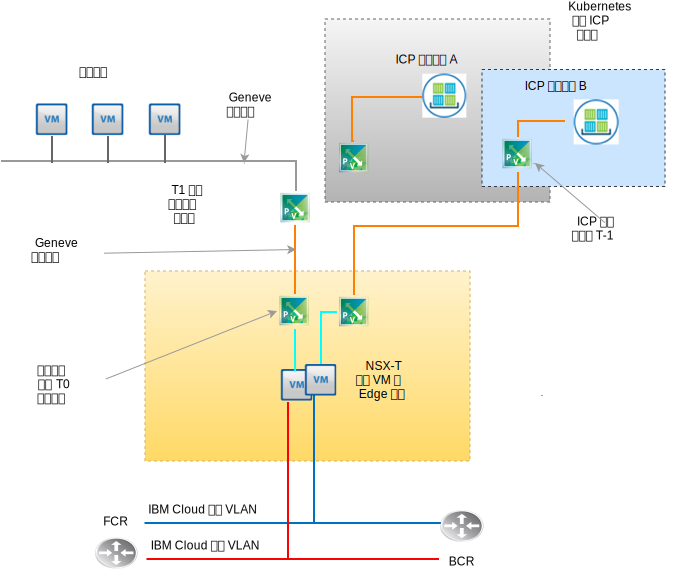

---

copyright:

  years:  2016, 2019

lastupdated: "2019-03-19"

subcollection: vmware-solutions

---

# VMware NSX-T 设计
{: #nsx-t-design}

与 NSX-V (NSX on vSphere) 不同，VMware NSX-T 旨在解决具有异构端点和技术堆栈的应用程序框架和体系结构。除了 vSphere 外，这些环境还可以包含其他系统管理程序、KVM、容器和裸机。NSX 旨在跨不同平台上的软件定义的网络和安全基础架构，而不仅仅用于 vSphere。虽然可以在不需要 vSphere 的情况下部署 NSX-T 组件，但此设计主要关注的是 NSX-T 及其在 vCenter Server vSphere 自动部署中的集成。

NSX-T 中有许多高级功能，例如防火墙策略、防火墙策略中包含的访客自省功能以及高级网络流跟踪。对这些功能的描述超出了本文档的范围。请参阅 VMware 文档来了解 NSX-T。在此设计中，NSX-T 管理基础架构在初始 vCenter Server 集群部署期间进行部署，以取代 NSX-V。

## NSX-T 与 NSX-V
{: #nsx-t-design-nsx-t-nsx-v}

对于 vSphere 本机 NSX (NSX-V)，请查看以下更广为人知的 NSX-T 对象，其功能类似于其 NSX-V 对等项。此外，还将讨论 vSphere 环境中的限制和差异。下表列出了 NSX-T 和 NSX-V 的对应的常用功能。

表 1. NSX-V 与 NSX-T 术语

NSX-V 或 vSphere 本机|NSX-T
--|:---|:--
**虚拟分布式交换机**|网络虚拟分布式交换机 (N-VDS)
**NSX 传输专区**|传输专区（覆盖或支持 VLAN）
**端口组 (vDS)**|逻辑交换机
**VXLAN（L2 封装）**|GENEVE（L2 封装）
**边缘网关**|T0 网关（自 V2.4 开始已更改）
**分布式逻辑路由器**|T1 网关（自 V2.4 开始已更改）
**ESXi 服务器 (vTEP)**|传输节点（ESXi、KVM、裸机 T0 网关）

针对此设计的 NSX-T 实现，有一些关键 NSX-T 概念不与 NSX-V 功能相对应，因此需要了解。

如下所示：
- 边缘集群是参与 NSX-T 虚拟光纤网的一个或多个 VM 或物理机器。它们是用于覆盖网络传输专区和支持 VLAN 的传输专区的端点。边缘集群可以支持多个 T-0 网关实例。
- T-0 网关是虚拟路由器实例，而不是 VM。多个 T-0 网关实例可以在一个边缘集群中运行，每个实例具有自己的路由表和功能。这意味着边缘集群必须存在后，才能创建 T-0 路由器实例。
- 传输专区可以跨不同平台上的端点以及多个 vSphere vCenter 实例。无需交叉 vCenter 链接的 NSX。可以排除特定端点中的传输专区。N-VDS 直接关联到传输专区，并在创建该传输专区时创建。
- 上行链路故障转移顺序独立于特定逻辑交换机创建，因为它们是以概要文件形式创建为“上行链路概要文件”，并且应用于基于 VLAN 的特定逻辑交换机。由于可能需要对同一 VLAN 的物理上行链路使用不同的故障转移顺序或进行负载均衡，因此特定 VLAN 的上行链路概要文件可以包含多个条目，用于对不同的故障转移顺序和负载均衡进行“组队”。将上行链路概要文件分配给逻辑交换机时，将选择特定的组队概要文件。

- 自 NSX-T 2.4 开始，合并了 Manager VM 和 Controller VM 功能。这将导致部署三个 Controller/Manager VM。如果这三个 VM 位于同一子网上，那么它们会使用内部网络负载均衡器。如果位于不同子网上，那么需要外部负载均衡器。

## 资源需求
{: #nsx-t-design-resource-req}

在此设计中，NSX-T Manager/Controller VM 会部署在初始集群上。此外，将从专用可移植地址块中为每个 Controller/Manager 分配支持 VLAN 的 IP 地址，该地址块指定用于管理组件，并配置为使用第 0 部分中讨论的 DNS 和 NTP 服务器。下表中显示了 NSX Manager 安装的摘要。

表 2. NSX-T Manager/Controller 规范

属性|规范
--|--
**NSX Manager/Controller** |3 个虚拟设备
**vCPU 数**|4
**内存**|16 GB
**磁盘**|60 GB
**磁盘类型**|自动精简配置
**网络**|专用 A

下图显示了 NSX Manager/Controller 相对于此体系结构中其他组件的位置。

图 1. NSX-T Manager 网络概览图

## 部署注意事项
{: #nsx-t-design-deployment}

使用 NSX-T on vSphere 时，必须在主机中为 N-VDS 分配物理适配器。由于 N-VDS 只能在 NSX-T Manager 中进行配置，因此这意味着如果要保持冗余，那么对于容纳 NSX-T 组件和关联的覆盖网络组件的集群，没有物理适配器可用于该集群中的本机本地交换机或 vDS 分配。

因此，在 NSX-T 安装及其配置期间，一个适配器上的一个物理 NIC 端口必须保持分配给本地 vSphere vSwitch 或虚拟分布式交换机 (vDS)。NSX-T 部署后，所有 ESX 内核端口都需要迁移到 N-VDS，并禁用所有本地 vSwitch 或 VDS。除去内核端口后，其余的物理 NIC 端口可以分配为 N-VDS 上行链路，以实现 N-VDS 的冗余。

初始部署后，{{site.data.keyword.cloud_notm}} 自动化会在初始集群中部署三个 NSX-T Manager/Controller 虚拟设备。将从指定用于管理组件的专用 A 可移植子网中为 Controller 分配支持 VLAN 的 IP 地址。此外，会创建 VM-VM 反亲缘关系规则，以在集群中的各主机之间分隔 Controller。

初始集群必须至少部署有三个节点，以确保 Manager/Controller 的高可用性。除了 Manager/Controller 外，{{site.data.keyword.cloud_notm}} 自动化还会准备部署的 vSphere 主机以作为 NSX-T 传输节点。从 NSX IP 池（其范围派生自 VLAN 和子网摘要）指定的专用 A 可移植 IP 地址范围中，为 ESXi 传输节点分配支持 VLAN 的 IP 地址。传输节点流量位于未标记的 VLAN 上，并且分配给专用 NSX-T 虚拟分布式交换机 (N-VDS)。

根据要部署的由客户选择的 NSX-T 拓扑，NSX-T Edge 集群可以部署为一对 VM，也可以作为软件部署在裸机集群节点上。不管集群对是虚拟还是物理的，上行链路都会配置为连接 {{site.data.keyword.cloud_notm}} 公用和专用网络的 N-VDS 交换机。

下表总结了中等大小的环境的需求。

表 3. NSX-T 组件规范

资源|3 个 Manager/Controller|2 个边缘集群|裸机边缘
-----------|:---------|:-------|:---------
**中等大小**|虚拟设备|虚拟设备|物理服务器
**vCPU 数**|4|4|8
**内存**|16 GB|8 GB|32 GB
**磁盘**|120 GB VSAN/管理 NFS|120 GB VSAN/管理 NFS|200 GB
**磁盘类型**|自动精简配置|自动精简配置|物理
**网络**|专用 A|专用 A|专用 A

## 传输专区和 N-VDS
{: #nsx-t-design-transport-zones}

传输专区指示哪些主机和哪些 VM 可以参与使用特定网络。为此，传输专区限制可以“看到”逻辑交换机的主机，因此也限制了哪些 VM 可以连接到逻辑交换机。传输专区可以跨一个或多个主机集群。此设计要求如下所示创建传输专区：

表 4. NSX-T 传输专区和 N-VDS

传输专区名称|VLAN/VXLAN|N-VDS 名称|上行链路组队策略
--|:-------|:------|:-----
**Private-Overlay**|VXLAN|SDDC-Overlay|Default
**Public-VLAN**|VLAN|SDDC-Public|Default
**Private-VLAN**|VLAN|SDDC-Private|NFS、vSAN、iSCSI-A 和 B、Default

## 传输节点
{: #nsx-t-design-transport-nodes}

传输节点定义参与虚拟网络光纤网的物理服务器对象或 VM。查看下表可了解该设计。

表 5. NSX-T 传输节点

传输节点类型|N-VDS|上行链路概要文件|IP 分配|物理 NIC
--|:--------|:--------|:---
**ESXi**|SDDC-Private|SDDC-Private-uplink|IP 池|vmnic0、vmnic2
**边缘集群**|SDDC-Overlay|SDDC-Overlay-uplink|IP 池|不适用
**物理边缘**|SDDC-Private|SDDC-Private-uplink|IP 池|eth0、eth2

## 上行链路概要文件
{: #nsx-t-design-uplink-profiles}

上行链路概要文件针对从系统管理程序主机到 NSX-T 逻辑交换机的链路，或针对从 NSX Edge 节点到机顶接入交换机的链路定义了策略。

表 6. NSX-T 上行链路概要文件

上行链路概要文件名称|VLAN|包含的组队|MTU
--|:-----|:---|:---
**SDDC-Private-Uplink**|缺省|Default、Management|9000
**SDDC-Public-Uplink**|缺省|Default|1500
**SDDC-Storage-Uplink**|存储器 VLAN|vSAN、iSCSI-A 和 B、NFS|9000

## 组队
{: #nsx-t-design-teaming}

表 7. NSX-T NIC 端口组队规范

组队名称|故障转移或负载均衡|活动 NIC|备用 NIC
--|:----|:---|:---
**Default**|对源进行负载均衡|上行链路 1、2|不适用
**Management**|故障转移|上行链路 1|上行链路 2
**TEP**|故障转移|上行链路 1|上行链路 1
**vSAN**|故障转移|上行链路 2|上行链路 1
**iSCSI-A**|故障转移|上行链路 1|不适用
**iSCSI-B**|故障转移|上行链路 2|不适用
**NFS**|对源进行负载均衡|上行链路 1、2|上行链路 1
**vMotion**|故障转移|上行链路 2|上行链路 1

## VNI 池
{: #nsx-t-design-vni-pools}

虚拟网络标识 (VNI) 类似于物理网络的 VLAN。通过池或标识范围创建逻辑交换机时，会自动创建 VNI。此设计使用通过 NSX-T 部署的缺省 VNI 池。

## 逻辑交换机
{: #nsx-t-design-logical-switches}

NSX-T 逻辑交换机在与底层硬件完全分离的虚拟环境中，重现交换功能、广播、未知单点广播和多点广播 (BUM) 流量。

表 8. NSX-T 逻辑交换机

逻辑交换机名称|VLAN|传输区域|上行链路组队策略
--|:---|:----|:---
**SDDC-LS-Mgmt**|缺省|Private-VLAN|管理
**SDDC-LS-NFS**|缺省|Private-VLAN|NFS
**SDDC-LS-vMotion**|缺省|Private-VLAN|vMotion
**SDDC-LS-VSAN**|标记的存储器 VLAN|Private-VLAN|vSAN
**SDDC-LS-iSCSI-A**|标记的存储器 VLAN|Private-VLAN|iSCSI-A
**SDDC-LS-iSCSi-B**|标记的存储器 VLAN|Private-VLAN|iSCSi-B
**SDDC-LS-TEP**|缺省|Private-VLAN|TEP
**SDDC-LS-External**|缺省|Public-VLAN|Default

### 边缘集群
{: #nsx-t-design-edge-cluster}

在此设计中，将供应单个虚拟边缘集群以供管理和客户工作负载使用。虚拟边缘集群可以容纳 T0 网关的多个实例。如前所述，可以在单个边缘集群上实例化多个 T0 边缘网关实例，每个实例都有自己的路由表。请参阅下图，以了解 NSX-T Edge 集群的功能组件。

图 2. 从 T0 扩展到 T1 的 NSX-T Edge 集群示例 

图 3. 管理 T0 网关 

#### 第 0 层逻辑网关
{: #nsx-t-design-tier-0}

通过 NSX-T 第 0 层逻辑路由器，可启用和禁用逻辑和物理网络之间的网关服务。对于此设计，将部署多个 T-0 网关，以满足管理、附加产品和（可选）客户所选拓扑的需求。

#### 第 1 层逻辑网关
{: #nsx-t-design-tier-1}

NSX-T 第 1 层逻辑网关具有下行端口（连接到 NSX-T Data Center 逻辑交换机）和上行端口（仅连接到 NSX-T Data Center 第 0 层逻辑路由器）。它们在配置用于的系统管理程序的内核级别运行，而不是作为虚拟机或物理机器运行。对于此设计，将创建一个或多个 T-1 逻辑网关，以满足客户所选拓扑的需求。

#### 第 1 层到第 0 层的路径公布
{: #nsx-t-design-tier-1-tier-0}

对于连接到不同第 1 层逻辑网关的逻辑交换机，要在这些逻辑交换机所连接的 VM 之间提供第 3 层连接，需要启用第 1 层到第 0 层的路径公布。无需配置第 1 层和第 0 层逻辑路由器之间的路由协议或静态路由。启用路径公布时，NSX-T 会自动创建静态路由。对于此设计，针对任何 IC4V 自动创建的 T-1 网关，始终会启用路径公布。

### 预配置的拓扑
{: #nsx-t-design-preconfig-topo}

工作负载到 T1 到 T0 网关 - 虚拟边缘集群

图 4. 使用虚拟 T0 边缘网关的 NSX-T 部署拓扑

IC4V 部署的拓扑 1 基本上与使用 NSX-V DLR 和边缘网关部署的拓扑相同。使用 NSX-T 时，T1 和 T0 之间没有动态路由协议配置。RFC-1891 IP 地址空间用于工作负载覆盖网络和传输覆盖网络。将分配客户专用和公共可移植 IP 空间，以供客户使用。客户指定的 {{site.data.keyword.cloud_notm}} 专用和公共可移植 IP 空间会分配给 T0，以供客户使用。 

对于此设计，如果 vCenter Server 实例已停用并删除，那么可以选择不删除这些 IP 范围。

工作负载到 T1 到 T0 网关 - 物理边缘集群：

图 5. 使用物理 T0 边缘网关的 NSX-T 部署拓扑

部署的拓扑 2 类似，但不同之处在于将基于 VM 的边缘集群替换为运行 Red Hat 服务器的一对裸机服务器。客户指定的 {{site.data.keyword.cloud_notm}} 专用和公共可移植 IP 空间会分配给 T0，以供客户使用。 对于此设计，如果 vCenter Server 实例已停用并删除，那么可以选择不删除这些 IP 范围。

有关硬件和操作系统规范的材料清单，请参阅单独的文档或链接。

使用 ICP 的工作负载到 T0 网关 - 物理边缘集群：

图 6. 使用 ICP NSX-T 集成和虚拟 T0 边缘网关的 NSX-T 部署拓扑

部署的拓扑 3 包含拓扑 1，并添加了一个 ICP 部署，其中采用 NSX-T 集成而不是 ICP 部署中的缺省联网堆栈 Calico。客户可以在 ICP 中供应其他容器名称空间，这将自动为每个名称空间创建逻辑交换机、IP 子网和 T1 网关实例。

要全面了解 ICP 在 vCenter Server 上的运行方式，请参阅 ICP on vCenter Server 体系结构文档。客户指定的 {{site.data.keyword.cloud_notm}} 专用和公共可移植 IP 空间会分配给每个 T0，以供客户使用。 

对于此设计，如果 vCenter Server 实例已停用并删除，那么可以选择不删除这些 IP 范围。

## 相关链接
{: #nsx-t-design-related}

* [vCenter Server on {{site.data.keyword.cloud_notm}} with Hybridity Bundle 概述](/docs/services/vmwaresolutions/archiref/vcs?topic=vmware-solutions-vcs-hybridity-intro)
