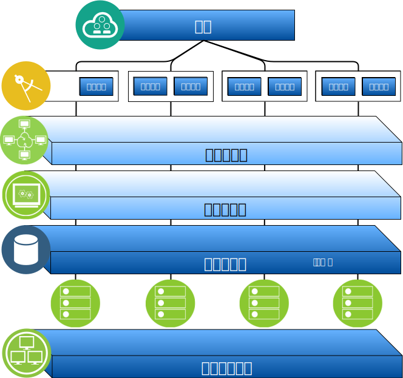

---

copyright:

  years:  2016, 2019

lastupdated: "2019-03-15"

subcollection: vmware-solutions

---

# IBM Cloud for VMware Solutions 概述
{: #solution_overview}

通过 {{site.data.keyword.vmwaresolutions_full}} 产品，您可以将现有 VMware 虚拟化数据中心扩展到 {{site.data.keyword.cloud_notm}} 中或容纳云本机应用程序。

该解决方案支持多种用例，例如将容量扩展到云（在不需要时进行收缩）、迁移到云、灾难恢复到云和备份到云。借助此解决方案，可以创建用于开发、测试、训练、实验或生产的专用云环境。

查看这些信息以了解 {{site.data.keyword.vmwaresolutions_short}} vCenter Server 的设计，该产品的目标工作负载需要高级别的可用性和可伸缩性。

此设计充当基线体系结构，为针对特定用例添加其他内部组件或特定于供应商的组件提供了基础。

图 1. VMware on {{site.data.keyword.cloud_notm}} 概述

## IBM Cloud for VMware Solutions 的主要优点
{: #solution_overview-benefits}

VMware vCenter Server on {{site.data.keyword.cloud_notm}} 提供了基本构建块（包括 VMware vSphere、vCenter Server 和 NSX）和共享存储选项（如 vSAN）。要灵活地设计最符合您工作负载的由 VMware 软件定义的数据中心解决方案，就需要这些组件。

通过应用高级自动化和单租户裸机基础架构，只需要几个小时，就可以快速将整个 VMware 环境部署到 {{site.data.keyword.cloud_notm}} 中。然后，您可以通过本机 VMware 客户机、命令行界面 (CLI)、现有脚本或其他熟悉的 vSphere API 兼容工具来访问和管理 IBM 托管的环境。

部署后，可以向实例添加（从实例中除去）ESXi 服务器，添加和除去集群，将其他 vCenter Server 实例连接到现有实例，以及使用 {{site.data.keyword.vmwaresolutions_short}} 控制台来添加产品和服务。您负责监视和管理 vCenter Server 实例。

您的责任包括备份、修补、配置和监视 VMware 软件及底层系统管理程序硬件。{{site.data.keyword.vmwaresolutions_short}} 提供了自动化解决方案，可帮助持续管理和监视 vCenter Server 实例。

此外，还有 {{site.data.keyword.cloud_notm}} 专业服务和受管服务可通过迁移、实施和上线服务等产品，帮助您加速迁移到云。

与受管服务产品不同，vCenter Server 为您提供对所有组件的完全和完整访问权，灵活性比受管服务更高。但是，在 vCenter Server 部署后，会应用一些约束以允许 IBM Cloud for VMware Solutions 自动化正常运行。

VMware on {{site.data.keyword.cloud_notm}} 产品提供了以下优点：

* **加速交付** - 通过将采购、体系结构构建、实施和部署资源的时间从数周甚至数月缩短到数小时，加速开发者和业务线交付 IT 项目。
* **增强安全性** - 在托管的私有云中提供专用裸机服务器，包括静态数据加密。对于 vSAN 存储器，使用 vSAN 或 vSphere 加密进行静态数据加密是可选的。对于共享文件级别的存储器或块存储器，缺省情况下，在精选数据中心可以使用服务提供者管理的静态加密，或者可以选择使用 vSphere 加密。您必须管理必要的加密密钥。
* **支持一致的管理和监管** - 通过提供对虚拟化管理的全面管理访问权，支持对部署的混合云进行一致管理和监管，从而保护现有 VMware 工具、脚本和训练投资。
* **使用全球范围的 VMware 专业知识** - 通过遍布全球 30 多家 {{site.data.keyword.CloudDataCents_notm}} 的 IBM 专业和受管服务来使用全球范围的 VMware 专业知识。

## 相关链接
{: #solution_overview-related}

* [设计概述](/docs/services/vmwaresolutions/archiref/solution?topic=vmware-solutions-design_overview)
* [缩放容量](/docs/services/vmwaresolutions/archiref/solution?topic=vmware-solutions-solution_scaling)
* [备份组件](/docs/services/vmwaresolutions/archiref/solution?topic=vmware-solutions-solution_backingup)
