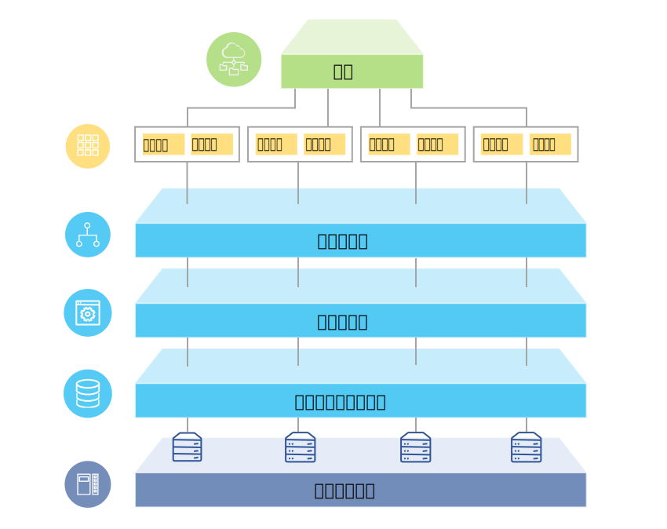

---

copyright:

  years:  2016, 2018

lastupdated: "2018-07-10"

---

# 解决方案概述

通过 {{site.data.keyword.vmwaresolutions_full}} 产品，您可以将现有 VMware 虚拟化数据中心扩展到 {{site.data.keyword.cloud_notm}} 中或容纳云本机应用程序。

该解决方案支持多种用例，例如将容量扩展到云（在不需要时进行收缩）、迁移到云、灾难恢复到云和备份到云。借助此解决方案，可以创建用于开发、测试、培训、实验或生产的专用云环境。

查看这些信息以了解 {{site.data.keyword.vmwaresolutions_short}} 产品（包括 VMware Cloud Foundation 和 VMware vCenter Server）的设计，这些产品的目标工作负载需要高级别的可用性和可扩展性。

此设计充当基线体系结构，为针对特定用例添加其他内部组件或特定于供应商的组件提供了基础。

## VMware on IBM Cloud 概述

图 1. VMware on {{site.data.keyword.cloud_notm}} 概述

## 主要优点

VMware Cloud Foundation 和 vCenter Server on {{site.data.keyword.cloud_notm}} 提供了基础构建块，包括 VMware vSphere、vCenter Server、NSX 和共享存储选项（包括 vSAN），需要这些构建块来灵活构建 VMware 软件定义的数据中心解决方案，以最适合您的工作负载。通过应用高级自动化和单租户裸机基础架构，可以将整个 VMware 环境快速部署到 {{site.data.keyword.cloud_notm}}，并在几小时内就使用您喜欢的工具来访问虚拟环境。此时，您可以通过本机 VMware 客户机、命令行界面 (CLI)、现有脚本或其他熟悉的 vSphere API 兼容工具来访问和管理 IBM 托管的环境。

部署后，可以添加 ESXi 主机节点，并管理某些管理组件的备份和补丁安装。另外还有 {{site.data.keyword.cloud_notm}} 专业服务和受管服务可通过迁移、实施和上线服务等产品，帮助您加速迁移到云。

VMware on {{site.data.keyword.cloud_notm}} 产品提供了以下优点：

* **加速交付** - 通过将采购、体系结构构建、实施和部署资源的时间从数周甚至数月缩短到数小时，加速开发人员和业务线交付 IT 项目。
* **增强安全性** - 在托管的私有云中提供专用裸机服务器，包括静态数据加密。
* **支持一致的管理和监管** - 通过提供对虚拟化管理的全面管理访问权，支持对部署的混合云进行一致管理和监管，从而保护现有 VMware 工具、脚本和培训投资。
* **利用全球范围的 VMware 专业知识** - 通过遍布全球 30 多家 {{site.data.keyword.CloudDataCents_notm}} 的 IBM 专业和受管服务来利用全球范围的 VMware 专业知识。

### 相关链接

* [设计概述](design_overview.html)
* [扩展容量](solution_scaling.html)
* [备份组件](solution_backingup.html)
