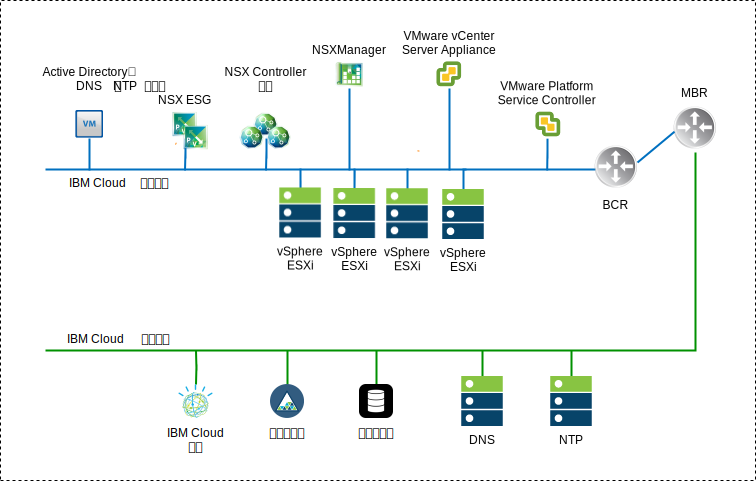
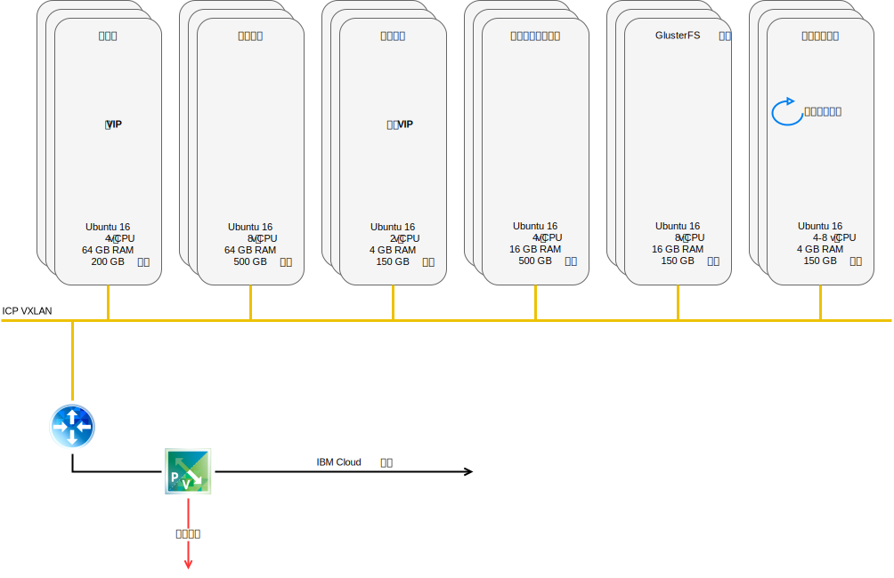
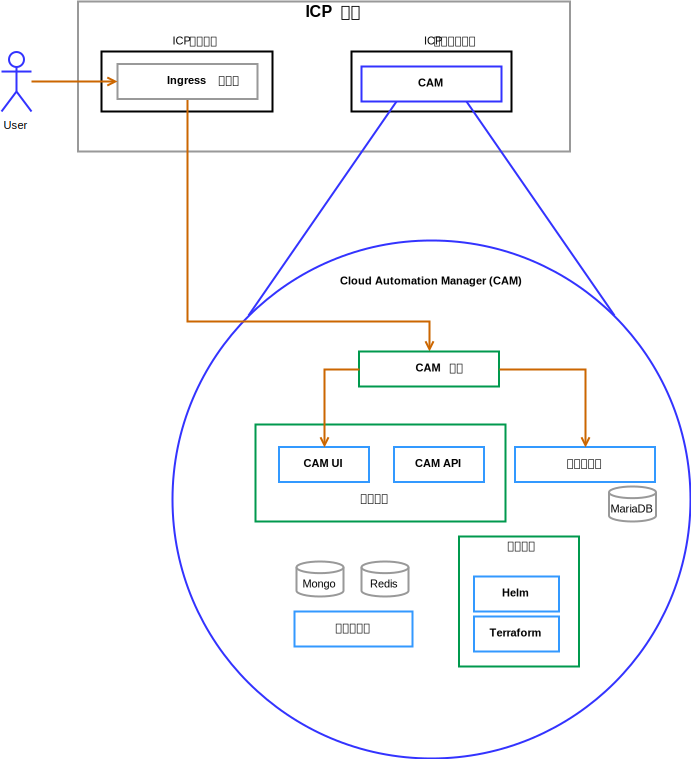

---

copyright:

  years:  2016, 2018

lastupdated: "2018-11-13"

---

# 解决方案组件

## VMware vCenter Server on IBM Cloud 组件

图 1. vCenter Server 环境图

### Platform Service Controller

vCenter Server 部署使用单个外部 Platform Services Controller，后者安装在与管理虚拟机 (VM) 关联的专用 VLAN 中的可移植子网上。其缺省网关设置为后端客户路由器 (BCR)。

### vCenter Server

与 Platform Services Controller 类似，vCenter Server 也会部署为设备。此外，vCenter Server 还将安装在与管理虚拟机关联的专用 VLAN 上的可移植子网中。其缺省网关设置为该特定子网的 BCR 上分配的 IP 地址。

### NSX
Manager

NSX Manager 部署在初始集群上。此外，将从专用可移植地址块中为 NSX Manager 分配支持 VLAN 的 IP 地址，该地址块指定用于管理组件，并配置为使用 DNS 和 NTP 服务器。

### NSX
Controller

{{site.data.keyword.cloud}} 自动化会在初始集群中部署三个 NSX Controller。将从指定用于管理组件的专用可移植子网中为控制器分配支持 VLAN 的 IP 地址。

### NSX Edge 和分布式逻辑路由器

将部署 NSX Edge 服务网关 (ESG) 对。在所有情况下，都会使用一个网关对来处理位于专用网络中的自动化组件的出站流量。对于 vCenter Server 和 {{site.data.keyword.cloud_notm}} Private (ICP)，将部署另一个网关（称为 ICP 管理的 Edge），并将其配置为使用上行链路连接到公用网络，还会配置一个分配给专用网络的接口。管理员可以配置任何必需的 NSX 组件，例如分布式逻辑路由器 (DLR)、逻辑交换机和防火墙。

有关网络设计的更多信息，请参阅 [vCenter Server 联网参考体系结构](../vcsnsxt/vcsnsxt-intro.html)。

下表总结了 ICP ESG 和 DLR 规范。

表 1. ICP ESG 规范

属性|规范
--|--
Edge 服务网关|虚拟设备
Edge 大小    大|2 个 vCPU
内存|1 GB
磁盘|本地数据存储上 1000 GB

表 2. ICP DLR 规范

属性|规范
--|--|
分布式逻辑路由器|虚拟设备
Edge 大小    精简|1 个 vCPU
内存|512 MB
磁盘|本地数据存储上 1000 GB

## ICP 组件

ICP 是一种用于开发和管理内部部署容器化应用程序的应用程序平台。ICP 是用于管理容器的集成环境，包括容器编排器 Kubernetes、专用映像存储库、管理控制台和监视框架。

图 2. 使用 vCenter Server 的虚拟 ICP 部署

### 引导节点

引导节点或引导程序节点（可选）用于运行安装、配置、节点扩展和集群更新。任何集群都只需要一个引导节点。请将一个节点同时用作主节点和引导节点。

### 主节点

主节点提供管理服务，并控制集群中的工作程序节点。主节点托管负责资源分配、状态维护、安排和监视的进程。由于高可用性 (HA) 环境中包含多个主节点，因此主导主节点发生故障时，故障转移逻辑会自动将另一个节点提升为主角色。可以用作主节点的主机称为主节点候选者。

### 工作程序节点

工作程序节点是提供容器化环境以运行任务的节点。随着需求的增长，可以轻松地将更多工作程序节点添加到集群以提高性能和效率。一个集群可以包含任意数量的工作程序节点，但必须至少包含一个工作程序节点。

### 代理节点

代理节点是将外部请求传输到集群内部创建的服务的节点。由于高可用性 (HA) 环境中包含多个代理节点，因此主导代理节点发生故障时，故障转移逻辑会自动将另一个节点提升为代理角色。尽管可以将一个节点同时用作主节点和代理节点，但最好使用专用的代理节点，这样可减少主节点上的负载。如果集群内需要进行负载均衡，那么集群必须至少包含一个代理节点。

### 管理节点

管理节点是可选节点，用于托管管理服务，例如监视、测量和日志记录。通过配置专用的管理节点，可以避免主节点超负荷。只能在 ICP 安装期间启用管理节点。

### 漏洞顾问程序节点

漏洞顾问程序 (VA) 节点是可选节点，用于运行漏洞顾问程序服务。漏洞顾问程序服务属于资源密集型服务。使用漏洞顾问程序服务时，请指定专用的 VA 节点。

下表提供了高可用性 ICP 实例需要的 VM 规范。

表 3. ICP VM 规范

节点|实例数|IP 数|CPU|RAM (GB)|磁盘 (GB)
:-----|------------:|:----|----:|----------:|----------:|
主节点|3|IP（3 个），VIP（1 个）|4| 64 |200
管理|3|IP（3 个）|8| 64 |500
代理|3|IP（3 个），VIP（1 个）|2|4|150
漏洞顾问程序|3|IP（3 个）|4|16|500
GlusterFS|3|IP（3 个）|8|16|150
工作程序|3-6|IP（3 个）|4-8|4|150

CAM 需要工作程序节点具有更高的 vCPU 和内存配置。

表 4. ICP VM 规范

节点|实例数|IP 数|CPU|RAM (GB)|磁盘 (GB)
:-----|------------:|:----|----:|----------:|----------:|
工作程序|3|IP（3 个）|4-8|16-20|150

## IBM Cloud Automation Manager 组件

{{site.data.keyword.cloud_notm}} Automation Manager (CAM) 是在 ICP 上运行的多云自助服务管理平台，帮助开发者和管理员满足其业务需求。

图 3. CAM 组件参考

### CAM 代理

通过 Nginx 代理访问 CAM。

### CAM 用户界面

CAM 用户界面组件分布在多个容器上：“云连接”用户界面、“模板库”用户界面和“已部署的实例”用户界面。

### CAM API

CAM API 分布在多个容器上。

### Helm

一个具有所需二进制文件的容器，用于将 Helm 图表部署到 Kubernetes 集群中。

### Terraform

一个具有所需二进制文件的容器，用于跨多个云部署 Terrform 资源。

### 日志

容器日志的位置。

### Mongo 数据库

CAM 应用程序的核心数据库。

### Redis

Redis 数据库用于存储 CAM 中的会话高速缓存和锁定。

### 模板设计器

一个图形用户界面，用于创建 Terraform 模板，具有拖动 Terraform 模块的功能。

### Maria 数据库

模板设计器应用程序的数据库。

## 相关链接

* [vCenter Server on {{site.data.keyword.cloud_notm}} with Hybridity Bundle 概述](../vcs/vcs-hybridity-intro.html)
