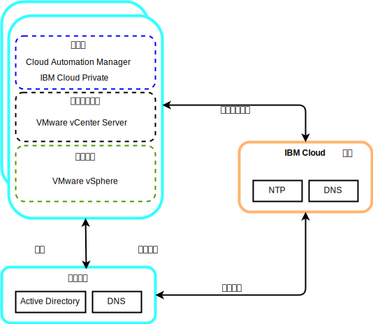

---

copyright:

  years:  2016, 2018

lastupdated: "2018-11-13"

---

# 公共服务组件

公共服务提供由云管理平台中其他服务使用的服务。公共服务包括身份和访问权服务、域名服务和 NTP 服务。

图 1. {{site.data.keyword.cloud}} Private (ICP) 公共服务

## 身份和访问权服务

作为 VMware vCenter Server on {{site.data.keyword.cloud_notm}} 自动化的一部分，Microsoft Active Directory (AD) 用于身份管理。部署了单个 AD 虚拟服务器实例 (VSI)。vCenter 配置为使用 AD 认证，并且还可以将 ICP 配置为进行 LDAP 认证。

## 域名服务

部署使用已部署的 AD VSI 作为实例的域名系统 (DNS) 服务器。所有部署的组件都配置为指向作为其缺省 DNS 的 AD。部署的组件示例包括 vCenter、PSC、NSX 和 ESXi 主机。

## 网络时间协议服务

vCenter Server 部署使用 {{site.data.keyword.cloud_notm}} 基础架构网络时间协议 (NTP) 服务器。所有部署的组件均配置为使用这些 NTP 服务器。使所有组件都使用相同的 NTP 服务器对于证书和 AD 认证正常运行至关重要。

### 相关链接

* [vCenter Server on {{site.data.keyword.cloud_notm}} with Hybridity Bundle 概述](../vcs/vcs-hybridity-intro.html)
