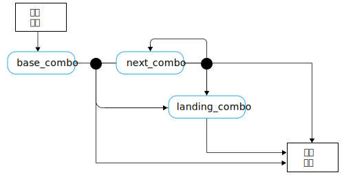

---

copyright:

  years:  2016, 2019

lastupdated: "2019-02-15"

subcollection: vmwaresolutions


---

# 滑板语言概念
{: #vcscar-concepts}

## 滑板手语言
{: #vcscar-concepts-skater}

Skate Advisor 的一个关键方面是可与 Watson 驱动的聊天机器人进行对话。以下部分详细描述了用于定义与 Skate Advisor 聊天机器人进行人机交互的对话规则。

滑板手语言是系统的核心，可通过以下方式使用：
* 技巧识别：由 Watson Discovery 用于从在线来源中摄入资料，以识别现有技巧并映射到源资料。
* 滑板对话：由聊天机器人用于与系统用户进行有意义的对话。
* 技巧分类：根据技巧的文本描述对该技巧进行存储和分类。通过此方式分类的技巧可以附加元数据，例如位置和视频参考。

## 语言元素
{: #vcscar-concepts-lang-elem}

### 核心元素
{: #vcscar-concepts-core-elem}

下面是用于构造技巧的核心语言元素。

表 1. 核心语言元素

元素类型|语言文本
---|---|---
方向|倒滑<br>反脚倒滑<br>反脚
转体|倒滑内转 180 度<br>倒滑内转 360 度<br>180<br>360<br>540
基本|尖翻<br>跟翻<br>难翻<br>大转<br>正向倒板<br>绕板
着地|滑后轮（后两轮）<br>滑前轮（前两轮）<br>5-0（碾磨）<br>碾磨前桥<br>滑板尾<br>滑板鼻<br>歪磨<br>斯密磨<br>骑肋<br>反向骑肋<br>

### 元素修饰符
{: #vcscar-concepts-elem-modifiers}

元素修饰符是特殊的语言元素，用于将上下文提供给语言的特定方面。

表 2. 语言修饰符

元素类型|语言文本|备注
---|---|---
转向前辍|外转<br>内转|“转体前辍”与转体方向相关
小乱|内转<br>外转|

## 语言规则
{: #vcscar-concepts-lang-rules}

以下规则集用于构造语言。技巧分为一个或多个元素组合，称为“组合”。除非另有说明，否则第一个组合和随后的组合之间的区别在于，假定第一个组合的方向与基本组合中的方向相同。

有关以下规则的信息，请参阅“核心元素”和“元素修饰符”作为参考，因为会将它们用于构造语言。

### 技巧规则集
{: #vcscar-concepts-trick-ruleset}

```
base_combo = 'direction \+ \[varial | turn_prefix\] \+ \[rotation\] \+ \[base_trick\]'
next_combo = ''\[varial | turn_prefix\] \+ \[rotation\] \+ \[base_trick\]'
landing_combo = ''\[varial | turn_prefix\] \+ landing'
trick = 'combo \+ \[“to” + combo\] \+ \[“to” \+ landing_combo\]'
```

### 技巧规则引擎
{: #vcscar-concepts-trick-rule-engine}

下图是规则引擎的可视摘要。

图 1. 滑板语言概览图


## 样本技巧语言
{: #vcscar-concepts-sample-trick}

以下示例是样本技巧的列表：

```
fakie-kickflip
fakie-kickflip to fakie-5-0 to fronside-halfcab (out)
fakie-heeflip
fakie-heeflip to fakie-maual to fakie-hardflip
fakie-inward (varial) heeflip to fakie-backside tailslide to fakie
switch-heeflip to fakie-maual to fakie-hardflip
switch-hardflip to fakie-manual
fakie-hardflp to fakie-nosegrind
nollie-hardflip-to-tailslide
nollie-inward-heelflip to frontside noseslide
kickflip-frontside to crooked grind
halfcab-heelflip to crooked grind
frontside-shuvit to nosegrind to nollie-flip (out)
kickflip to nosegrind to nollie-impossilbe (out)
nollie-kickflip to noseslide to nollieflip
nollie-kickflip to frontside-lipslide
nollie-impossible to manual
nollie-impossible to 5-0
nollie-kickflip to crooked grind
nollie-kickflip to crooked grind to nollie-halfcab-kickflip (out)
frontside-nollie-halfcab-heelflip to fakie-nosegrind
backside-nollie-halfcab-kickflip to backside-tailslide to backside-180-out
frontside-nollie-cab-kicflip halfcab to backside-smithgrind
halfcab to backside-smithgrind to backside-180-bigspin (out)
kickflip-backside-tailslide to backside-180-kickflip
kickflip-backside-tailslide to backside-backside-bigspin
360-kicflip to nosemanual to nollie-360-kickflip
360-kicflip to frontside-lipslide
harflip to backside-lipslide
kicflip to frontside-boardslidev
nollie-heelflip to frontside-boardslide
```

## 相关性
{: #vcscar-concepts-relevance}

技巧语言是一个关键的构造，用于训练 Watson 来识别和摄入滑板文档和媒体，同时形成与用户对话的基础。

## 相关链接
{: #vcscar-concepts-related}

* [vCenter Server on {{site.data.keyword.cloud}} with Hybridity Bundle 概述](/docs/services/vmwaresolutions/archiref/vcs?topic=vmware-solutions-vcs-hybridity-intro)  
