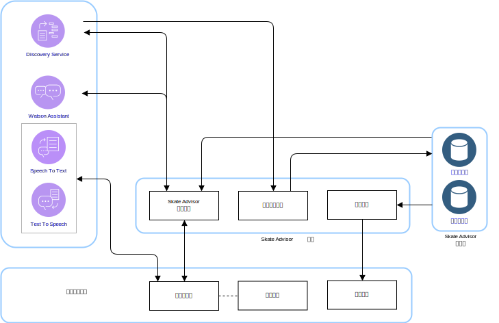

---

copyright:

  years:  2016, 2019

lastupdated: "2019-05-07"

subcollection: vmware-solutions

---

# Skate Advisor 逻辑设计
{: #vcscar-logical}

以下信息详细说明了构成系统逻辑设计的应用程序元素。

## 系统组件
{: #vcscar-logical-sys-comp}

Skate Advisor 主要包含一个聊天机器人，它可接受文本或语音识别，以结构化的方式与系统进行交互。

## 技巧
{: #vcscar-logical-tricks}

Skate Advisor 的核心数据元素是技巧。技巧语言唯一地定义了技巧。此语言可用于完成以下任务：
- 与聊天机器人就技巧进行交谈。
- 通过 Watson Discovery 搜索技巧。
- 通过源文章训练 Watson Discovery 时对技巧进行识别和分类。
- 识别适用于位置和媒体播放的技巧。

### 技巧定义
{: #vcscar-logical-trick-def}

技巧通过描述该技巧的语言构造唯一地定义。请参阅“技巧规则引擎”以获取完整定义。

### 技巧列表
{: #vcscar-logical-list-tricks}

通过查询语言元素中定义的“基本”技巧或“着地”，可返回技巧列表。

### 技巧数据
{: #vcscar-logical-trick-data}

返回的技巧可能包含以下信息：
- 技巧描述
- 一个或多个媒体工件
- 位置信息

## 对话流
{: #vcscar-logical-conv-streams}

聊天机器人有数量有限的预定义的可能对话。对话由以下信息进行定义：
- 技巧查找：查找基于查询参数（表示“基本”技巧或“着地”）的一组有效技巧。
- 位置查找：查找附近适合练习某个技巧的位置。
- 媒体显示：显示媒体项，例如，已在其中找到技巧并对技巧分类的在线视频。

表 1. 对话

对话|结构|结果
---|---|---
技巧查找|描述技巧|技巧列表
位置查找|我该到哪儿去练习这个技巧？|适合练习特定技巧的位置的列表
媒体显示|显示技巧视频|媒体结果列表

## 用户界面组件
{: #vcscar-logical-ui-comp}

### 聊天机器人
{: #vcscar-logical-chatbot}

聊天机器人是用于与用户对话的 Web 组件。聊天机器人可以接受文本或语音。结果（如列表）以文本形式呈现，并可能附带语音用于陈述结果。

聊天机器人通过以下方式与系统交互：

表 2. 聊天机器人交互

步骤|描述
---|---
1|启动有效对话；请参阅有关“对话流”的部分。
2|聊天机器人将语音发送给 Speech to Text 服务。
3|Speech to Text 服务将文本发送给聊天机器人。
4|聊天机器人向 Skate Advisor 发送文本查询。
 5 |Skate Advisor 评估请求并发送给 Watson Assistant。
6|Watson Assistant 对请求分类，并向 Skate Advisor 回复要执行的操作。
7|Skate Advisor 从 Discovery 服务请求数据集。
8|Discovery 服务评估查询并发送响应。
9|Skate Advisor 构成响应，并以文本形式发送给聊天机器人。
10|聊天机器人向 Text To Speech 服务发送文本回复。
11|结果通过聊天机器人发送给用户。

### 视频呈现
{: #vcscar-logical-video-render}

视频呈现组件会播放视频或显示文档。这些工件代表了从中发现技巧的源工件。

视频呈现组件是 Web 界面中用于显示视频的嵌入式窗口小部件。视频在聊天机器人中会显示为系统用户查询的结果。选择生成的视频链接会触发视频呈现。

### 位置界面
{: #vcscar-logical-location-interface}

Skate Advisor 包含一个界面，供系统用户记录练习特定技巧的位置。该 Web 界面组件有两个主要元素：
1. 接受来自系统用户的位置，作为练习特定技巧的最佳位置。
2. 显示建议用于练习特定技巧的一个或多个位置。

## Watson 组件
{: #vcscar-logical-watson-comp}

此体系结构中包含以下 Watson 组件。
* Knowledge Studio - Watson Studio 是一个工具，我们可将其用于为系统设计滑板语言，并使用这种语言识别 Web 中实现滑板语言的文档。Knowledge Studio 提供了模型以供 Watson Discovery 使用。
* Speech to Text - 将语音转录为文本。此组件接受来自运行聊天机器人的设备的音频，并将其转换为文本以供 Watson 处理。
* Text to Speech - 将文本合成为语音。此组件接受来自 Skate Advisor 应用程序的文本，并将其转换为语音供运行聊天机器人的设备播放。
* Discovery 服务 - 系统使用 Watson Discovery 服务来检索与所请求参数匹配的滑板相关内容。例如，“列出卡斯坡技巧的所有记录”。Watson Discovery 使用高级机器学习方法，呈现所摄入内容中最相关的片段。
* Watson Assistant - Watson Assistant 是一个工具，用于设计用户与机器（聊天机器人）之间的交互。此工具必须使用特定于领域的语言（例如，滑板运动）进行训练，并采用 Assistant 可识别并构建相应响应的一系列语法。

## Skate Advisor 服务
{: #vcscar-logical-skate-advisor-services}

Skate Advisor 服务是一个应用程序组件，提供用于呈现请求的一组 API 服务。公开的服务与先前描述的对话流有直接的关联。公开的 API 具有以下常规类别：
* get_tricks - 基于采用自然语言的 <query\> 返回技巧列表，此列表会提供给 Discovery 服务。
* show_tricks - 针对特定技巧，返回相关媒体的列表。
* find_trick - 返回特定技巧。
* accept_command - 接受来自聊天机器人的文本命令，并为请求提供服务。

## Discovery 服务训练
{: #vcscar-logical-disc-service-training}

Watson Discovery 必须通过机器学习模型进行训练，该模型是由主题专家使用 Watson Knowledge Studio 以迭代方式创建的。

对于 Skate Advisor，模型包含实体类型之间的关系，并组合使用基于规则的训练和基于字典的训练来创建模型。此模型支持 Discovery 服务识别从用作训练集的文章和视频描述中摄入的技巧并对其分类。

经过训练后，Discovery 服务可以响应如下查询：
- 显示包含跟翻基本技巧的所有技巧。
- 显示所有技巧。
- 显示包含多个组合的所有技巧。

## 相关链接
{: #vcscar-logical-related}

* [vCenter Server on {{site.data.keyword.cloud}} with Hybridity Bundle 概述](/docs/services/vmwaresolutions/archiref/vcs?topic=vmware-solutions-vcs-hybridity-intro)
