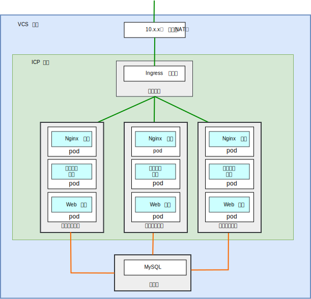
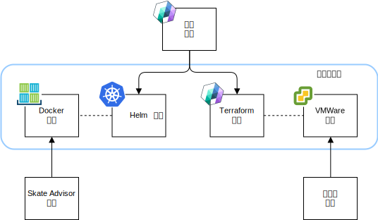
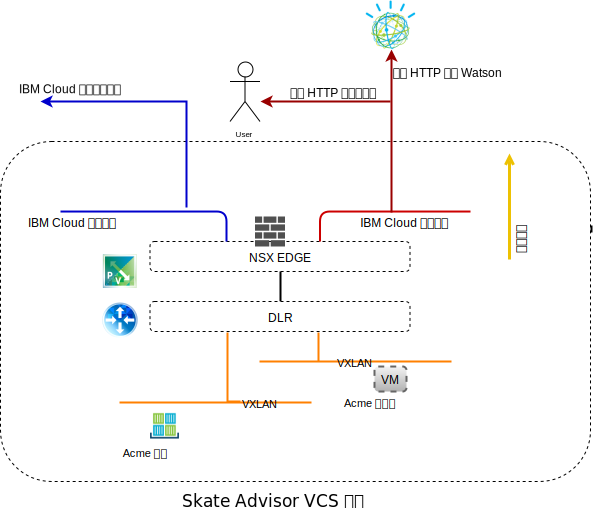
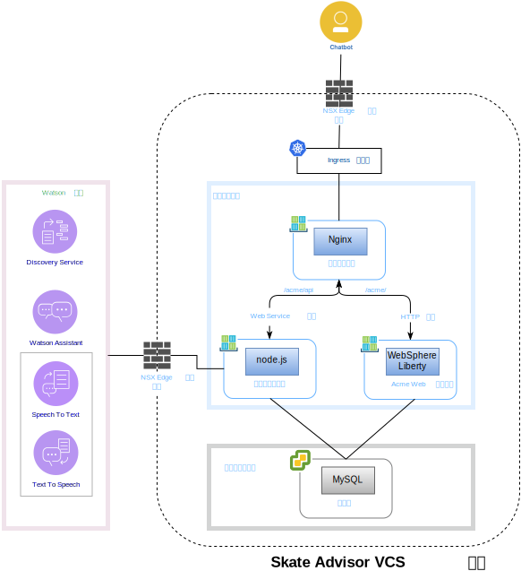

---

copyright:

  years:  2016, 2018

lastupdated: "2018-11-14"

---

# Skate Advisor 组件

{{site.data.keyword.vmwaresolutions_full}} 提供了自动化功能，可将 VMware 技术组件部署到全球范围的 {{site.data.keyword.CloudDataCents_notm}} 中。该体系结构包含一个云区域，并支持扩展到位于下列其中一个选项中的更多云区域：

1. 其他地理位置。
2. 同一数据中心内的其他 {{site.data.keyword.cloud_notm}} pod。
3. 其他地理位置和同一数据中心内的其他 {{site.data.keyword.cloud_notm}} pod。

{{site.data.keyword.cloud_notm}} Private (ICP) 和 Cloud Automation Manager (CAM) 产品可以手动部署到内部部署虚拟化平台中，从而支持通过内部部署位置进行云管理。或者，ICP 和 CAM 可借助自动化功能，作为服务扩展提供给现有或新的 VMware vCenter Server on {{site.data.keyword.cloud_notm}} 部署，从而支持通过 {{site.data.keyword.cloud_notm}} 进行云管理。

ICP 是一种用于开发和管理内部部署容器化应用程序的应用程序平台。ICP 是用于管理容器的集成环境，包括容器编排器 Kubernetes、专用映像存储库、管理控制台和监视框架。

IBM Multi-Cluster Manager 在各种云和集群中提供用户可视性、以应用程序为中心的管理（策略、部署、运行状况和操作）以及基于策略的合规性。通过 IBM Multi-Cluster Manager，您可以控制 Kubernetes 集群。您可以确保集群是安全的、在高效运行，并提供应用程序所需的服务级别。

{{site.data.keyword.cloud_notm}} Automation Manager 是在 {{site.data.keyword.cloud_notm}} Private 上运行的多云自助服务管理平台，支持开发者和管理员满足其业务需求。Cloud Automation Manager Service Composer 支持您在 ICP 目录中公开混合云服务。

## Skate Advisor 组件

下图描述了应用程序现代化基础架构实现中 Acme Skate Advisor 应用程序的参考实现。

图 1. Skate Advisor 物理组件

Skate Advisor 应用程序通过基于微服务的组件（与 Watson 交互）和 Nginx 容器（用于代理发给 Web 和微服务容器的请求）扩展现有 Acme Web 应用程序。

Skate Advisor 应用程序利用应用程序现代化平台，该平台提供了必要的托管基础架构。

### 应用程序打包和部署

应用程序将部署为 CAM 编排，其中包含以下元素：

图 2. CAM 编排

这些元素的描述如下：
* 服务编排 - CAM 服务编排是一种工作流程资源，用于描述要部署为服务构面的 Terraform 模板和 Helm 图表。可以发布服务，服务是用于编排整个部署的控制工件。
* Helm 图表 - Helm 图表位于本地 ICP 存储库中，用于将容器和其他资源部署到 ICP。Helm 图表是对 Kubernetes 资源的描述，包括：
 - 容器部署
 - 服务
 - Ingress
 - 规则
 - 端点

* Docker 映像 - Docker 映像包含操作系统 (Ubuntu)、中间件（WebSphere Liberty 和 Nginx）以及 Skate Advisor 和 Skate Store 代码。Docker 映像是部署到运行中容器中的静态对象。
* Terraform 模板 - Terraform 模板是用于描述要部署的云资源的文件。对于 Skate Advisor，这是随 mysql 一起预安装的 Ubuntu 模板，并且描述了数据库模式。
* VMWare 模板 - VMWare 模板是预安装了 mysql 和数据库模式的 Ubuntu 模板。

### 负载均衡和代理

负载均衡和代理通过 ICP Ingress 控制器组件实现。此组件以无缝方式处理容器扩展和故障转移。

应用程序代理由 Nginx 容器提供，该容器通过以下方式进行负载均衡。

表 1. Skate Advisor 逆向代理规则

URL|端点
---|---
/acme|Acme Web Container Service
/acme/api|Skate Advisor 服务
/acme/api/explorer|Skate Advisor 服务

容器具有不可预测的 IP 地址，可能会根据系统需求向内和向外扩展。为了克服此问题，ICP 服务用于在系统内执行实时 IP 地址解析。

### Acme Skate Web 应用程序
Acme Skate Web 应用程序是一个基于 Spring 框架的 Java 平台企业修订版应用程序。该应用程序部署在 WebSphere Liberty 容器上。

### Acme Skate Advisor 应用程序
Acme Skate Advisor 应用程序是一个基于微服务的应用程序，部署在 WebSphere Liberty 容器上。Nginx Web 服务器提供了微服务的前端。

### Acme Skate 数据库
Acme Skate 数据库是一个部署在 vSphere 受管虚拟机上的 MySQL 数据库。

### 通信概述
Skate Advisor 需要以下通信：
-	从 Web 容器到系统用户的通信。
-	从 Advisor 和 Web 容器到 Watson 服务的通信。
-	容器与实现的虚拟机各方面之间的通信。

应用程序现代化平台设计为使用以下组件，以实现此目标。

图 3. 公用网络访问

{{site.data.keyword.cloud_notm}} 有两个网络。公用网络支持通过因特网访问服务器，而专用网络支持所有 {{site.data.keyword.CloudDataCents_notm}} 中的服务器通过高速主干相互通信。

虚拟路由设备 (VRA) 支持客户通过将 VLAN 与设备相关联来路由专用和公用网络流量。vCenter Server NSX Edge 和 IKS 基础架构都配置为使用到公用网络的缺省路径，以及到专用网络的标准 10.0.0.0/8 路径。

在 IKS 基础架构上需要静态路由来连接到 VRA 设备，以用于定义的任何 NSX VXLAN。通过 NSX Edge，我们配置了通过专用网络建立的 BGP 与 VRA 的对等连接，从而支持 NSX VXLAN 的路线公布和插入。此对等连接支持 NSX VXLAN 覆盖网络与 {{site.data.keyword.cloud_notm}} 主干之间的相互通信。

### 软件组件映射

Skate Advisor 应用程序使用以下软件组件。

图 4. Skate Advisor 软件映射

使用了以下软件组件：

* Nginx - 用于向应用程序提供逆向代理服务。微服务和应用程序请求会分发给正确的容器端点。
* WebSphere Liberty - 用于托管 Acme 应用程序，这是基于 Spring 的 Java 平台企业修订版应用程序。
* Node.js -  用于向聊天机器人提供微服务框架。此应用程序使用 Watson 提供的服务。
* mysql - 应用程序数据库由 Oracle Mysql 提供。
* JavaScript - 聊天机器人是在客户机浏览器中托管的基于 JavaScript 的应用程序。聊天机器人通过基于 Node.js 的微服务与 Watson 进行通信。

## 管理概述

Acme Skate Advisor 位于 {{site.data.keyword.cloud_notm}} 上，因此是体系结构的关键一环。{{site.data.keyword.cloud_notm}} 具有以下体系结构。

图 5. 云管理

此图表示 vCenter Server 实例上部署的 ICP 和 CAM，其中连接了内部部署 vCenter 和 IKS 服务。通过使用 CAM，系统管理员和开发者可以在内部部署虚拟机，或将虚拟机部置到 vCenter Server 实例和容器中，并将容器部署到 ICP 和 IKS 集群。

在该图中，CAM 在逻辑上创建与 vCenter、云提供者、ICP 和 IKS 环境的云连接。ICP 集群部署到每个数据中心/云环境，其中 MCM 提供将 ICP 集群连接到单个管理视图的机制。

### 相关链接

* [vCenter Server on {{site.data.keyword.cloud_notm}} with Hybridity Bundle 概述](../vcs/vcs-hybridity-intro.html)
