---

copyright:

  years:  2016, 2019

lastupdated: "2019-02-15"

subcollection: vmware-solutions

---

# 前言
{: #vcscar-preface}

图 1. 我们自己设计的语言

## 滑板语言简介
{: #vcscar-preface-intro}

滑板手把动作和分解动作组合成技巧的方式构成了一种语法，这些动作基于将发生的物理运动，出于类似的原因，采用了化学命名法。如今，地球一端的滑板手可以将一个技巧的名称用文本发送给地球另一端的其他滑板手，从而使其理解该技巧的复杂动作。

滑板语言的丰富性主要源于滑板运动本身的复杂性。滑板的运动精细复杂，由此催生了数十种基本技巧，这些技巧可以通过多种方式来完成，通过多个变量进行迭代，从而产生数量庞大的组合。每个组件的“前缀-根-后缀”结构决定了每个元素或动作如何衔接，并与滑板和滑板手的真实动量集相对应。力的物理方向和力学决定了哪些适合放在一起，哪些不适合，这就是构成该语法的内容。

*豚跳*或*反脚倒滑*技巧可以从板尾或板头起跳来完成，并与滑板手的前脚或后脚相对应。滑板将翻转、滑行和下降运动综合于一体，并且这三种动作会沿任一方向（顺时针或逆时针）在三个轴上迭代。随后滑板手的动作会配合滑板的运动，这将基于方向、转体、“站位”以及与滑板翻转是同向还是逆向，为迭代添加多个维度。

最后两个变量应该进一步加以说明。首先，*站位*很容易与线性方向性混淆。滑板手有自己的天生站位，即左脚在前或右脚在前；因此*反脚*（开弓站位）技巧等于是自身在镜中的影像，这与左右开弓的棒球手类似。反向属于偶然行为；主要区别在于左右手习惯，或者说是“左右脚习惯”。因此，*反脚*来完成的任何技巧都值得大力称赞，这并不是因为它是反向的，而是因为所有运动机能都逆转到您的弱项，即“不习惯”的脚。如果只是向后做某个技巧（即“倒滑”），这仅仅在方向上是相反的，但涉及所有相同的运动机能，因此难度只是略高一点。

对于更高水平的滑板手来说，另一个非常重要的微妙差异在于*内转*或*外转*翻跳，具体取决于滑板相对于身体本身的翻转和旋转方式（2 根轴）。练习翻跳技巧时，可从滑板的任一侧向脚内侧或外侧翻转：*尖翻*是脚尖向外侧踢出使板顺时针翻转，*跟翻*则刚好相反，翻转的方向与自然运动轨迹同向或逆向。因此，内转翻跳太不自然了，人们便用另外一个单独的术语*难翻*来表达这种技巧，这一名称可谓名副其实。所以，*反脚倒滑内转尖翻*与*反脚倒滑难翻*完全相同，都需要更精确的技巧，因为这些动作是与自然动作相反的。

因此，采用这种“前缀-根-后缀”结构的每个组件可以再细分成包括转体、方向和站位在内的三个二元元素；一些技巧需要必须指定翻转是内转还是外转。要不是能够把各种技巧组合在一起而滚雪球般地增大迭代次数，滑板也不过是小孩子的游戏而已。对于顶级职业选手来说，可以将多个基本技巧串联成单个聚类，这些聚类由二元组、三元组甚至多至五元组或六元组构成。

到目前为止，实用的迭代次数已经达到数百个，但这只是为我们奠定了基础；在*街头滑板*中可以看到真正的复杂性，其中的组合数激增为数千个。

早在 90 年代初，滑板手就已经发展出早期的平地技巧，随后这些技巧被运用到滑板手身边的“有机”环境中：楼梯、台子、扶手、坡岸、坡道连接处、扁板、野餐桌、花盆；所有这一切为定义滑板运动开辟了新的维度。滑板手有无穷无尽的方式把技巧和地形结合在一起，实现阴阳配合，数十年来，滑板手一直在潜心磨炼这些技巧。在 U 池和泳池中进行的*高台花式滑板*的发展也与此类似，代表人物是滑板冠军 Tony Hawk。

虽然多年来大多数基本技巧已经趋于成熟，但将这些技巧组合起来并调整使用，往往迸发出的光芒会压过职业选手天生的能力。这也是为什么与其说滑板是一种运动，不如说滑板是一种艺术的另一个原因。个性化表现总是比原始能力更重要。这也是点燃艺术家创造动力的支撑引擎，催生了 Activision 大获成功的视频游戏系列 *Tony Hawk Pro Skater*，这款游戏风靡了近十年，进而引发了 *Electronic Arts* 推出与其竞争的游戏。

通过训练 Watson Assistant 来模拟高水平职业选手的思维过程，我们可以提供强大的工具，推动任何滑板手进行创造性思考，尤其是精英级滑板手。虽然其他板类运动的复杂程度要低得多，但这也证明了滑板运动的超凡影响力，因为其他板类运动也采用了我们的惯例。因此，Watson Assistant 不仅有潜力帮助（即使不能变革）这项新纳入奥运会的运动项目的创造性表现，还可能影响到其他艺术工作。

## 语言编码
{: #vcscar-preface-codification}

与任何语言一样，我们的语言也随着时间不断发展，不断选用新的词语和用法，并且在此过程中会偶尔出现冗余和例外。即便如此，这一命名法仍然高度一致、持久而明确。正是这种外延的严格性和一致性，解决了通过机器学习将连续镜头转化为文字这个看似不可克服的问题。对于滑板手来说，复杂动作的每个细节都会构建到命名法本身中。事实上，这是一种非常稳健的语言，不仅已被雪板手采用，也被冲浪手采用。

不过，尽管如此复杂而功能强大，语言编码仍然直截了当、简明扼要。每个*基本*技巧都有一个*方向性*和*转体*组件以及一个*着地*组件，这些组件用于确定它是否以及如何与下一个基本技巧衔接以构成组合技巧，这些就是四个*核心元素*。另外还会附加两个*修饰符*：一个是*转体前缀*，指示滑板手转体方向（顺时针或逆时针）；另一个是*小乱*组件，用于指定滑板相对于身体的旋转方式（内转还是外转）。通过使用这种编码，能以递归方式应用简明规则集，以支持任意长度的组合。

## 其他环境变量
{: #vcscar-preface-env-var}

如今的职业选手经常花费与练习技巧同等的精力来寻找玩滑板的地形。事实上，能使任何滑板手脱颖而出的部分原因是创造性地调整技巧，从而以全新的、富有想像力的方式表现技巧的能力，这往往会引领滑板手走向世界。虽然已经有一些滑板应用程序可以对社区提供的滑板地形进行编目，但是从来没有构想也没有技术能创建一个能够帮助任何滑板手（尤其是职业选手）在实现这一创造性过程的应用程序。

此参考体系结构演示了 Watson 和云如何利用 YouTube、Google Images、线上杂志（《Thrasher》和《Transworld》）、滑板手和视频游戏论坛上的庞大在线滑板手资源，而最重要的是，如何利用社交媒体上（尤其是在 Instagram 上）每天来自世界各地的最新技巧的无穷无尽的技巧信息流。此外，不存在任何翻译问题；这是一种国际性语言，与计算机语言或数学类似，在全球无缝地使用相同的名称和惯例。

Watson Knowledge Studio 根据特定滑板手的查询，使用技巧描述、媒体工件、位置（滑板地形）信息等更新 Discovery 服务。聊天机器人的对话数量有限，这些对话源于经验丰富的职业滑板手有创意且实用的推论。因此，Assistant 可以回复适合练习特定技巧的离得最近或最佳的滑板地形（位置），或者回复更广泛的地形范围，这些范围不仅适合练习该技巧，也适合练习以相同根完成的其他技巧（即衍生动作）。

例如，滑板手可以要求 Watson Assistantor 列出*难翻接内转 5-0* 的所有可能的衍生动作。此请求将从 Speech to Text 转换为 Discovery 服务，不仅会回复*难翻接碾磨*衍生动作，还会回复这些衍生动作适合的各种地形的列表，从而有助于了解更多内容，其中可能包括按当地邮政编码、按大小甚至按可用性聚类的扶手列表，例如在校园或商业场所。系统会使用现有的应用程序数据，对有可能因非法入侵而被抓的风险进行评级。此类帮助对上述变量的级联后果会产生巨大影响，可帮助所有职业滑板手实现创造性的生活。

## 云平台
{: #vcscar-preface-cloud-platform}

IT 系统的创造性分层可生成新组合，代表了滑板的核心。不管我们去哪儿，它都有能力影响到创新生活，在全球范围内激发创新。没有 {{site.data.keyword.cloud}}，这一切都不可能实现。

## 相关链接
{: #vcscar-preface-related}

* [vCenter Server on {{site.data.keyword.cloud_notm}} with Hybridity Bundle 概述](/docs/services/vmwaresolutions/archiref/vcs?topic=vmware-solutions-vcs-hybridity-intro)
