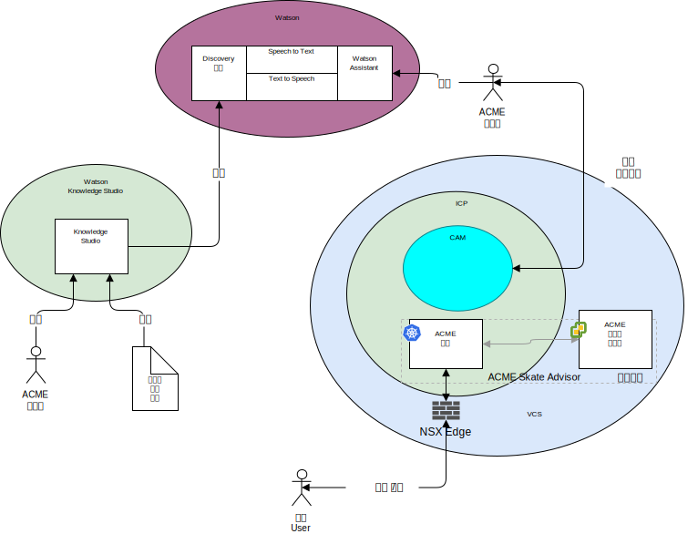

---

copyright:

  years:  2016, 2019

lastupdated: "2019-02-15"

---

## 系统上下文
{: #vcscar-syscontext}

下图显示了此参考体系结构的系统上下文。系统上下文图定义了系统的关键元素、系统的边界、与系统交互的实体以及交互。这是一个高级别图，为读取者提供了系统的初始视图。

图 1. 系统上下文

下面是系统上下文的核心组件：
-	vCenter Server - VMware vCenter Server on {{site.data.keyword.cloud_notm}} 是一个 {{site.data.keyword.cloud_notm}} for VMware Services 实例，作为内部部署环境中已迁移虚拟机 (VM) 的目标。它与内部部署虚拟化一起构成混合环境，支持 VM 从一个环境移至另一个环境。
-	{{site.data.keyword.icpfull_notm}} - {{site.data.keyword.icpfull_notm}} 是一种用于开发和管理容器化应用程序的应用程序平台。{{site.data.keyword.icpfull_notm}} 环境是一个集成环境，包含容器编排器 Kubernetes、专用映像存储库、管理控制台、监视框架和图形用户界面，该界面提供了一个集中位置来部署、管理、监视和扩展应用程序。
-	{{site.data.keyword.cloud_notm}} Automation Manager - CAM 是一种企业就绪型基础架构即代码平台，它提供了一个窗格来供应基于 VM 的工作负载以及基于 Kubernetes 的工作负载，支持自动供应工作负载，不管是 VM 还是容器及其基础架构必备软件。
-	Watson - Watson 是 IBM 的人工智能和认知解决方案平台。
-	Watson Knowledge Studio - Watson Knowledge Studio 提供了模型以供 Watson Discovery 使用。

### 参与者
{: #vcscar-syscontext-actors}

系统上下文图确定了以下参与者：

* Acme 管理员 - 管理员负责应用程序的持续部署和维护，包括以下持续进行的任务：
 - 训练聊天机器人。
 - 训练 Discovery 服务。
* 系统用户 - 系统用户是系统的用户。这种用户通过支持浏览器的设备中的浏览器与系统进行通信。

### 系统
系统上下文图确定了以下系统：
* Knowledge Studio - Watson Studio 是一个工具，用于为系统设计滑板语言，并使用此语言识别 Web 中实现滑板语言的文档。
* Speech to Text - 将语音转录为文本。此组件接受来自运行聊天机器人的设备的音频，并将其转换为文本以供 Watson 处理。
* Text to Speech - 将文本合成为语音。此组件接受来自 Skate Advisor 应用程序的文本，并将其转换为语音供运行聊天机器人的设备播放。
* Discovery 服务 - 系统使用 Watson Discovery 服务来检索与所请求参数匹配的滑板记录。例如，“列出卡斯坡技巧的所有记录”。\ Watson
Assistant - 系统使用 Watson Discovery 服务来检索与所请求参数匹配的滑板相关内容。例如，“列出卡斯坡技巧的所有记录”。Watson Discovery 使用高级机器学习方法，呈现所摄入内容中最相关的片段。  
* 数据库 - Acme Skate Advisor 数据库在 vCenter Server 管理的虚拟机上进行托管。
* 应用程序容器 - 完成了应用程序现代化之旅并且现在作为容器运行的应用程序。对于此参考体系结构以及此 Acme Skateboards 示例，其中一个容器化应用程序是 Web 服务器，这是联机在线工作负载的一部分。ACME 容器托管 Acme Web 应用程序和 Acme Skate Advisor 应用程序。
* NSX Edge - NSX Edge 是用于管理进出 vCenter Server 实例的南北流量的虚拟设备。

## 相关链接
{: #vcscar-syscontext-related}

* [vCenter Server on {{site.data.keyword.cloud_notm}} with Hybridity Bundle 概述](/docs/services/vmwaresolutions/archiref/vcs?topic=vmware-solutions-vcs-hybridity-intro)
