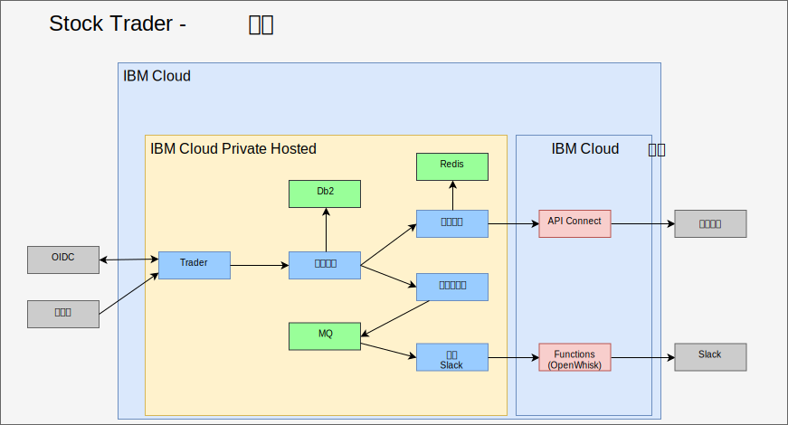
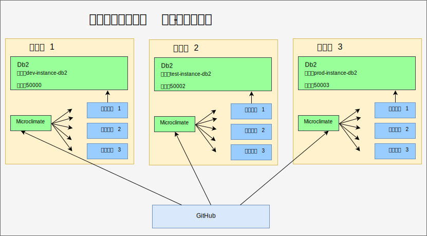
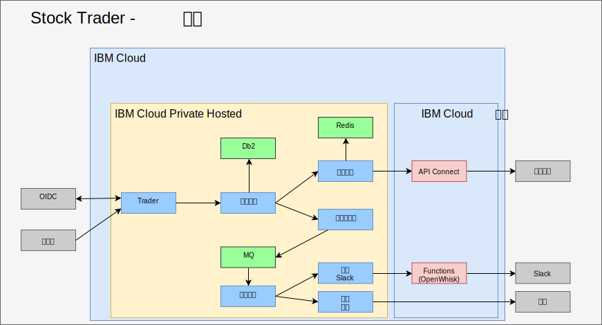

---

copyright:

  years:  2016, 2019

lastupdated: "2019-06-27"

subcollection: vmware-solutions

---

# 重构中间件并将中间件添加到 IBM Cloud Private 中
{: #vcscontent-addmidware}

既然 Stock Trader 已在一个容器中运行，并且 Jane 对目前的微服务感到满意，因此她和 Todd 继续研究如何利用额外的功能来提高应用程序的性能。通过重构 Stock Trader 微服务来处理增加的活动和可扩展性，他们两人都认为需要将中间件添加到 {{site.data.keyword.cloud}} Private 中。其中一些中间件存在于其数据中心内，因此这更像是在添加一些新中间件的情况下重新构建平台的做法。

此解决方案重构将提供一个公共平台来运行应用程序和必需的服务，从而引入更简单的管理平面。

## 内容选项
{: #vcscontent-addmidware-content-choices}

{{site.data.keyword.cloud_notm}} Private 拥有广泛的内容可供选择，Todd 和 Jane 都需要决定最适合自己需求的内容。如 Todd 在 {{site.data.keyword.cloud_notm}} Private 目录中所见，大多数内容可供试用，但某些内容需要购买并从 Passport Advantage 下载。

* 工具链和运行时
  - UrbanCode Deploy
  - Microclimate
  - Jenkins（开放式源代码）
  - IBM WebSphere Liberty（MicroProfile、Web Profile、Java 平台企业修订版概要文件）
  - Open Liberty（开放式源代码）
  - Node.js 运行时（开放式源代码）
  - Swift 运行时（开放式源代码）
  - Nginx（开放式源代码）
  - IBM WebSphere Application Server for {{site.data.keyword.cloud_notm}} Private VM Quickstarter Community Edition

* 集成
  -	IBM Integration Bus
  -	IBM Integration Bus for Developers
  -	IBM DataPower Gateway Virtual Edition
  -	IBM DataPower Gateway for Developers
  -	IBM API Connect Professional
  -	IBM API Connect Enterprise
  -	IBM App Connect Enterprise Developer Edition
  -	IBM App Connect Enterprise 11.0.0

* 数据科学和业务分析
  -	IBM Data Science Experience Local
  -	IBM Data Science Experience Developer Edition
  -	IBM Watson Explorer Deep Analytics Edition
  -	IBM PowerAI（ILAN 许可，提供支持产品）
  - IBM PowerAI Vision

* 数据监管和集成
  -	IBM InfoSphere Information Server for Evaluation
  移动
  -	IBM Mobile Foundation

* 连接
  -	IBM Voice Gateway Developer Trial

* 应用程序现代化工具
  -	IBM Transformation Advisor

* 消息传递
  -	IBM MQ Advanced
  -	IBM MQ Advanced for Developers
  -	Rabbit MQ（开放式源代码）
  -	IBM Event Streams 技术预览（基于 Apache Kafka）

* 数字业务自动化
  -	IBM Operational Decision Manager
  -	IBM Operational Decision Manager for Developers
  -	IBM FileNet Content Manager 5.5
  -	IBM Content Foundation 5.5

* 数据服务
  -	IBM Db2 Direct Advanced Edition / AESE with Data Server Manager
  -	IBM Db2 Dev-C
  -	IBM Data Server Manager（用于 Db2 Dev-C）
  -	IBM Db2 Warehouse Enterprise
  - IBM Db2 Warehouse Dev-C
  -	IBM Cloudant Developer Edition
  -	MongoDB（开放式源代码）
  -	PostgreSQL（开放式源代码）
  -	MariaDB（开放式源代码）
  -	使用 MariaDB 建立 Galera 集群（开放式源代码）
  -	Redis（开放式源代码）

* HPC / HPDA
  -	IBM Spectrum LSF Community Edition
  -	IBM Spectrum Symphony Community Edition
  -	IBM Spectrum Conductor 技术预览

* 多云管理
  -	{{site.data.keyword.cloud_notm}} Automation Manager

* Watson
  -	IBM Watson Compare & Comply: Element Classification
  -	Compliance Assist

* 管理
  -	IBM Netcool - 集成（用于 {{site.data.keyword.icpfull_notm}} 服务的探测器 - 对事件进行日志记录和监视警报）
  - {{site.data.keyword.cloud_notm}} App Management 2018.2.0
  -	IBM Netcool - 集成（用于管理 {{site.data.keyword.icpfull_notm}} 事件的探测器。与 IBM Netcool Insights 产品一起销售）
  - {{site.data.keyword.cloud_notm}} Event Management for IBM Cloud Private（ILAN 许可，支持在目录中发现和试用）
  - IBM Operations Analytics Predictive Insights Mediation Pack（管理 {{site.data.keyword.icpfull_notm}} 监视度量值。ILAN 许可，支持在目录中发现和试用）
  -	IBM Operations Analytics Predictive Insights Mediation Pack（随 Predictive Insights 产品一起销售）

* 联网
  -	F5 BIGIP Controller（开放式源代码）
  -	Calico BGP-Peer（开放式源代码）
  -	strongSwan IPSec VPN（开放式源代码）

* 存储
  -	IBM PowerVC FlexVolume Driver（开放式源代码，受 PowerVC 产品支持）
  - 带有 Heketi 生命周期管理功能的 GlusterFS 存储集群（开放式源代码）
  -	容器存储接口 (CSI) 样本 NFS
  -	Driver（开放式源代码）
  -	Rook Ceph 集群（开放式源代码）

* 工具
  -	Web Terminal（开放式源代码）
  -	Skydive – 网络分析器（开放式源代码）

对于 Stock Trader，根据 Jane 的解决方案体系结构，Todd 将从 [Db2](https://cloud.ibm.com/catalog/services/db2-hosted)、[MQ](https://cloud.ibm.com/catalog/services/mq) 和 [Redis](https://cloud.ibm.com/catalog/services/databases-for-redis) 着手。

## 添加中间件
{: #vcscontent-addmidware-add-middleware}

要将中间件添加到 {{site.data.keyword.cloud_notm}} Private，请在目录中找到 [Helm Chart](https://github.com/IBM/charts/blob/master/stable/ibm-microclimate/README.md)，阅读自述文件，然后继续安装。

对于 Stock Trader，Todd 决定添加所有中间件。以下信息总结了 Todd 必须对他希望 Jane 使用的每个中间件执行的操作。

### Db2
{: #vcscontent-addmidware-db2}

Todd 从 Db2 着手，因为他们已经在使用 Db2，并可以为每个解决方案提供一个基于容器的专用 Db2。

Todd 已准备好 {{site.data.keyword.icpfull_notm}}，因此已经定义了自己的 pod 安全策略。Todd 可以将重点放在创建 Docker 映像拉取私钥上：

`kubectl create secret docker-registry db2dockerregistry
--docker-username=dockeruser
--docker-password=XXXXXXXX-XXXX-XXXX-XXXX-XXXXXXXXX
--docker-email=dockeruser@email.com --namespace=default`

最后，因为 Todd 决定使用 NFS，所以他根据自述文件需求创建了 NFS 卷：

转至 {{site.data.keyword.icpfull_notm}} 仪表板并创建持久性卷。要创建多大的卷呢？请查看自述文件以了解卷大小：

`capacity=20Gi
RWO
type=NFS
server = nfs.server.ip.address
path = /shared/db2trader1`

在目录用户界面中，搜索“Db2”，然后单击 ibm-db2oldp-dev。查看该自述文件，然后单击“配置”。

在“配置”部分中，有“快速入门”部分和“所有参数”部分。打开“所有参数”，因为 Todd 需要输入更多配置：

*	发布名称 = db2trader1
*	名称空间 = default
*	同意许可
*	数据库名称 = trader
*	私钥名称 = db2dockerregistry
*	服务名称 = db2trader1-ibm-db2oltp-dev
*	服务类型 = NodePort
*	端口 = 50000
*	Db2 实例名称 = db2inst1
*	Db2 实例名称的密码 = xxxxxx
*	是（选中）对此部署启用持久性

Db2 运行后，Todd 或 Jane 需要创建 Stock Trader 解决方案使用的表。

### MQ
{: #vcscontent-addmidware-mq}

Todd 和 Jane 需要消息传递软件，他们已经使用了 MQ，这个选择很不错。此外，MQ 运行占用的空间很小，并且可以为每个开发者启动开发版本，从而节省宝贵的生产流量。安装 MQ 相当简单。Todd 如同使用 Db2 一样创建了存储器，然后安装了 Helm Chart：

{{site.data.keyword.icpfull_notm}} 仪表板 > 目录 > 开始在 MQ 中进行输入 > 选择 ibm-mqadvanced-server-dev。
查看该自述文件，然后单击“配置”。
提供或验证以下输入值：

`release name = mqtrader1
target namespace = stock-trader
accept license
enable persistence
data PVC size = 2Gi
Service type = NodePort
Queue manager name = stocktrader
Admin pw = mq1pw
App password = LEAVE BLANK`

最初，Todd 选择了 NodePort 以用于在用户界面中访问中间件。最后，Todd 可以使用 ClusterIP，以便只有集群内的 pod 才能访问中间件。

为了将 MQ 配置为使用 Stock Trader，Todd 打开了“MQ 管理”用户界面，该界面与 VM 版本完全相同。

### Redis
{: #vcscontent-addmidware-redis}

虽然 Stock Trader 是在 {{site.data.keyword.cloud_notm}} Private Hosted 上运行，但他们仍担心股票报价服务延迟，而对于他们的大部分工作，他们真正关心的是前一天收盘股价。为了帮助提高性能，他们添加了 Redis 高速缓存。

此部署使用 ibm-charts 中的 ibm-redis-ha-dev 图表。

缺省情况下，此图表安装六个 pod：一个主节点、两个从属节点和三个哨兵节点。此示例很好地说明了 Kubernetes 的弹性，其中多个 pod 跨许多工作程序节点一起工作，即使工作程序节点位于多个子网中。

该配置很简单，因此 Todd 进入了要在其中进行安装的名称空间，并开始安装。

## 重构 Stock Trader
{: #vcscontent-addmidware-refactor-stock-trader}

重构 Stock Trader 对 Jane 来说是非常重要的一步。Todd 忙着将中间件添加到 {{site.data.keyword.cloud_notm}} Private 时，Jane 重构了解决方案，针对 Kubernetes 和云行为对解决方案进行了优化。

例如，Jane 转换 Stock Trader 时，采用了 .war 文件并将每个文件添加到一个 Liberty 容器中，但使用了 WebSphere Application Server Network Deployment 配置来指向数据源。这是一个不错的开端，Jane 的应用程序立刻从 Kubernetes 安排和编排中获益。

此外，通过针对 Kubernetes 世界优化 Jane 的微服务（重新编码和构建），还实现了其他许多优点。

为了进行优化，Jane 执行了以下步骤：
-	更新了代码存储库中她自己的代码（Jane 使用的是 GitHub Enterprise）
-	添加了管道（Jane 使用的是 Jenkins）
-	使用 Maven 进行构建

以下示例显示了 Jane 的[代码存储库](https://github.com/IBMStockTrader/)以及 Jenkins 文件、server.xml 等。这些就绪后，Jane 即可以通过私钥自由地对额外功能进行编码，以访问 ODM 和 Watson 等服务，同时将更多微服务作为 GitHub 中的单个存储库。

### 添加私钥
{: #vcscontent-addmidware-add-secrets}

既然 Jane 已重构了 Stock Trader 微服务，她现在需要一种方法来提取服务名称、用户标识和密码，以便其应用程序在部署后可获取有关该服务的独特详细信息，而无需对特定名称硬编码，也不必重建应用程序。

通过使用 Kubernetes 私钥，Jane 在每个私钥中配置了明确定义的私钥名称和参数，以确保在部署微服务时，可选取唯一的主机名、用户标识、密码或其他任何敏感凭证，从而使其应用程序可移植。

Jane 需要一个统一的代码库，即使 Stock Trader 可能会在多个云上运行。下图中的私钥 Db2 具有不同的路由详细信息，但格式相同。在 Jane 的投资组合微服务部署时，该微服务会查找 Db2 私钥端点参数以连接到相应的 Db2 实例。Stock Trader 应用程序不关心自己是在 VMware 虚拟机中运行、容器化服务中运行，还是作为云管理的服务运行。

## 结果
{: #vcscontent-addmidware-result}

Jane 致力于重构了自己的 Stock Trader 解决方案，而 Todd 则致力于将中间件安装到 {{site.data.keyword.cloud_notm}} Private Hosted 中，因此整个核心 Stock Trader 解决方案都在私有云中运行。Jane 现在添加了更多微服务，例如推特通知服务。Istio 路由规则通过内部 Slack 通道或公共推特通道，支持动态忠诚度消息传递。

## 相关链接
{: #vcscontent-addmidware-related}

* [vCenter Server on {{site.data.keyword.cloud_notm}} with Hybridity Bundle 概述](/docs/services/vmwaresolutions/archiref/vcs?topic=vmware-solutions-vcs-hybridity-intro)
