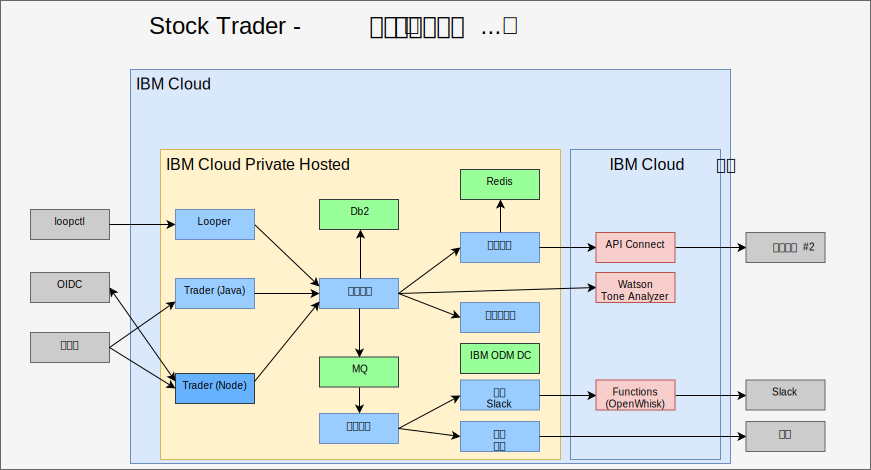

---

copyright:

  years:  2016, 2019

lastupdated: "2019-01-23"

---

# 使用 AI、Analytics 和其他公共云服务进行扩充

扩充 Stock Trader 并不是一次性步骤。对于 Todd 和 Jane 来说，这是一个迭代式过程。在下图中，您将看到 Jane 使用 ODM 决策中心添加了 Watson Tone Analyzer 服务和忠诚度级别规则。以下各项着重说明了 Stock Trader 是如何扩充的。

图 1. 进一步扩充 Stock Trader

## AI Watson Tone Analyzer

以下样本中用于扩充应用程序的方法虽然简单，但看上去十分强大。Jane 浏览 [{{site.data.keyword.cloud}} 目录](https://console.cloud.ibm.com/catalog/)以查找 [AI](https://console.cloud.ibm.com/catalog/?category=ai) 和 [Analytics](https://console.cloud.ibm.com/catalog/?category=analytics) 服务，并发现目录中有丰富的内容。

Jane 选择了 [Tone Analyzer](https://console.cloud.ibm.com/catalog/services/tone-analyzer)，再选择了标准套餐，然后获得了要调用的凭证。Jane 重构了 Stock Trader，并且仅创建了用于 Tone Analyzer 的 Kubernetes 私钥。这样，即使 Jane 更改套餐或区域，也无需重建代码。

借助重构，Jane 在不中断用户体验的情况下试验了各种用户界面框架。结果，提供了新的用户界面供使用，并帮助了解用户反馈的语气。

未来，Jane 可以根据可用于在私有云实例 ({{site.data.keyword.cloud_notm}} Private) 中运行的各种分析服务来提供预测性股票建议。

## 忠诚度级别业务规则

最初，Jane 的代码中有逻辑用于确定可能导致忠诚度下降的货币金额。但是，在 Stock Trader 市场营销主管反复请求更改范围后，Jane 决定用一个业务规则来分担该决策，这样市场营销主管就能在无需 Jane 参与的情况下变更范围。

Jane 与 Todd 交流后，Todd 添加了[服务](https://console.cloud.ibm.com/catalog/services/decision-optimization)，然后创建了该决策。

现在，每当要举行营销活动时，市场营销主管 Margaret 可以登录并更改忠诚度级别范围，而无需更改任何代码。

## 新的股票服务

您可能注意到股票服务已更改。在公共服务更改了所有者或其 API 结构时，可能会发生这种情况。但幸好，Jane 使用了 [API Connect](https://console.cloud.ibm.com/catalog/services/api-connect)。最初，她使用了 API Connect 来简化原始股票服务的响应，因为接收她在自己所获得的原始 API 中需要的数据并设置其格式有些繁琐。

现在，Jane 非常高兴，因为她更改股票服务时，只会更改将其映射到自己所创建的简化 API 的方式，而她的代码甚至无需重新启动。Stock Trader 解决方案仍然一直通过同一 API 请求数据，就好像它并没有更改一样。所有 API 更改都被隐藏在后台。

此外，通过 API Connect 中的监视和测量功能，Jane 能够跟踪谁在使用她的简化 API。

### 相关链接

* [vCenter Server on {{site.data.keyword.cloud_notm}} with Hybridity Bundle 概述](/docs/services/vmwaresolutions/archiref/vcs/vcs-hybridity-intro.html)
