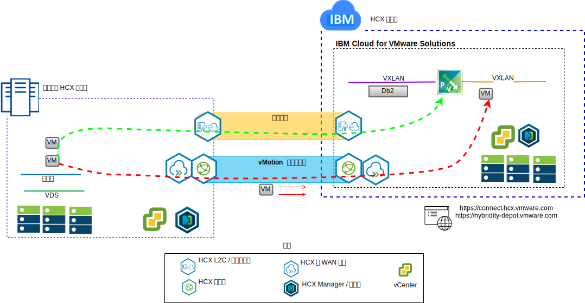

---

copyright:

  years:  2016, 2019

lastupdated: "2019-02-15"

---

# 提升 Stock Trader VM 并将其转移到 IBM Cloud
{: #vcscontent-hcx}

对于现代化之旅的第一步，Todd 希望将其内部部署的 VMware SDDC 实例无缝地扩展到 VMware vCenter Server on {{site.data.keyword.cloud}} 中。业务必须保持正常运行，并且停机时间必须保持在最低水平。

VMware vCenter Server on {{site.data.keyword.cloud_notm}} with Hybridity Bundle 支持在 vCenter Server 实例与内部部署 VMware 虚拟化数据中心之间创建无缝连接。

vCenter Server with Hybridity Bundle 组件（在 {{site.data.keyword.cloud_notm}} VMware 目标站点中部署为虚拟机）支持建立与安装到对等内部部署源站点中的 HCX 组件的连接。

图 1. vCenter Server with Hybridity Bundle

Hybridity 将在内部部署和 {{site.data.keyword.cloud_notm}} 之间创建松散耦合的互连，并支持以下功能：

* 简单互连 - 通过任何物理连接（包括公用因特网、专用 VPN 或直接链路）轻松建立逻辑网络连接。
* 第 2 层扩展 - 内部部署网络扩展到云中，并包括内部部署子网和 IP 寻址。
* 加密 - 安全地加密两个站点之间的网络流量。
* 优化的网络 - 选择最佳连接并高效处理洪流连接，以便网络流量尽快移动。
* 数据去重 - 最高可减少 50% 的网络流量。
* 智能路由 - 移动工作负载时，邻近路由可以更改网关，以便网络流量使用目标站点网关，而不会发生“发夹”问题而返回到源站点。
* 零停机时间迁移 - 可以使用 vMotion 将正在运行的系统移至云或从云移回原处。
* 安排的迁移 - 可以将任意数量的虚拟机复制到目标站点，然后在该站点上的指定时间激活，以替换在源站点上运行的系统。
* 安全策略迁移 - 如果 NSX 是以内部部署方式使用的，那么任何安全策略、防火墙和其他安全项都会随工作负载一起移动。

Todd 能够将 Stock Trader 从其内部部署 VMware 环境迁移到 VMware on {{site.data.keyword.cloud_notm}} 环境，满足了几乎或完全不发生停机时间，也无需重新配置应用程序的要求。

## 相关链接
{: #vcscontent-hcx-related}

* [vCenter Server on {{site.data.keyword.cloud_notm}} with Hybridity Bundle 概述](/docs/services/vmwaresolutions/archiref/vcs?topic=vmware-solutions-vcs-hybridity-intro)
