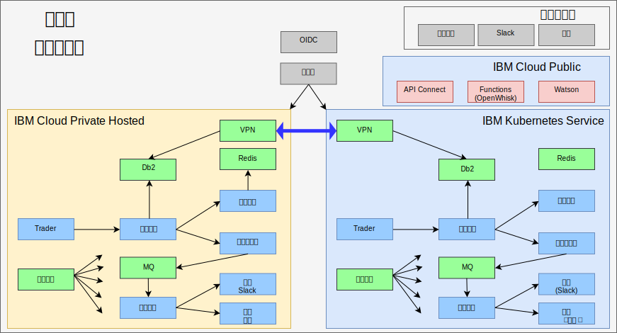

---

copyright:

  years:  2016, 2019

lastupdated: "2019-08-05"

subcollection: vmware-solutions

---

# 通过 IBM Cloud Kubernetes Service 实现真正的混合
{: #vcscontent-iks}

随着 Jane 的测试团队队伍壮大，她希望提供一个测试环境，用于运行其应用程序的主要部分，并且仍然使用在她自己的环境中拥有的数据。Jane 希望其测试团队专注于测试其应用程序，而不是管理 Kubernetes 集群。为此，Jane 和 Todd 决定支持 [{{site.data.keyword.cloud}} Kubernetes Service](https://www.ibm.com/cloud/container-service) 实例，并且 Jane 在未更改代码的情况下，在其中部署了 Stock Trader。

随后，Todd 添加了 strongSwan VPN，用于连接每个集群的专用网络。

