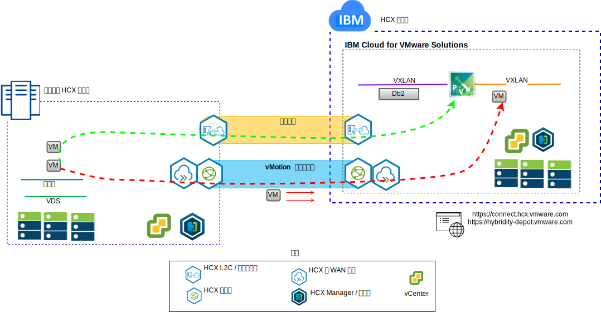

---

copyright:

  years:  2016, 2019

lastupdated: "2019-05-08"

subcollection: vmware-solutions

---

# VMware Hybrid Cloud Services 简介
{: #vcshcx-intro}

VMware Hybrid Cloud Services (HCX) 允许 vSphere 软件定义的数据中心 (SDDC) 的不同实例跨各种网络类型进行互操作。这些网络类型包括 LAN 或 WAN，不管是否在公用因特网上受到保护。HCX 旨在解决在尝试实现 vSphere 的多实例多站点部署，以在内部部署和云提供者边界之间扩展时，用户会遇到的安全性、兼容性、复杂性和性能问题。

HCX 是在 {{site.data.keyword.cloud}} 中的完全自动化 vSphere 产品与 vSphere 的任何其他已部署实例之间进行互操作的首选方法。HCX 现在是 {{site.data.keyword.vmwaresolutions_short}} 中的完全集成产品。

本指南旨在说明 HCX 的部署和操作，包括目前已广为人知且普遍接受的最佳实践和故障诊断。由于 HCX 是使用敏捷开发方法进行开发的，因此不要将本指南用作受支持版本或受支持平台的实际源。

## 相关链接
{: #vcshcx-intro-related}

* [vCenter Server on {{site.data.keyword.cloud_notm}} with Hybridity Bundle 概述](/docs/services/vmwaresolutions/archiref/vcs?topic=vmware-solutions-vcs-hybridity-intro)   
