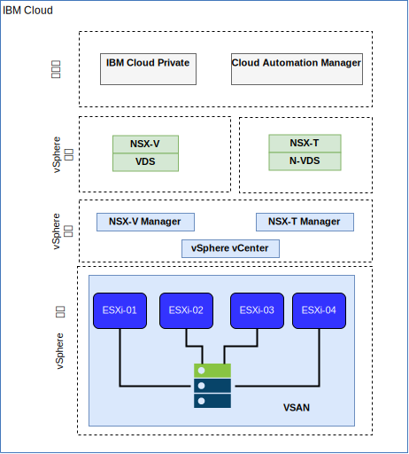

---

copyright:

  years:  2016, 2018

lastupdated: "2018-10-30"

---

# IBM Cloud 联网和基础架构

## 虚拟路由和转发 (VRF)

IBM Cloud 帐户还可以配置为 VRF 帐户。这提供了与 VLAN 生成类似的功能，支持子网 IP 块之间的自动路由。具有“直接链路”连接的所有帐户都必须转换为或创建为 VRF 帐户。

## 直接链路

IBM Cloud Direct Link Connect 通过本地 IBM Cloud Data Center，提供对 IBM Cloud 基础架构以及其他任何与网络服务供应商相链接的云的专用访问。此选项最适合于在单个环境中创建多云连接。我们使用共享带宽拓扑将客户连接到 IBM Cloud 专用网络。与所有直接链路产品一样，您也可以添加全局路由，这将使专用网络流量能够流至所有 IBM Cloud 位置。

## 虚拟专用网

### strongSwan VPN

strongSwan IPSec VPN 服务通过因特网提供基于业界标准因特网协议安全性 (IPSec) 协议套件的安全端到端通信信道。

### Hybridity (HCX)

VCS Hybridity Bundle on IBM Cloud 服务可以将内部部署数据中心的网络无缝扩展到 IBM Cloud，这允许虚拟机 (VM) 在不进行任何转换或更改的情况下，迁移到 IBM Cloud 或从中迁移出来。

## 物理结构

将 IBM Cloud Private (ICP) 生产实例部署到 VMware vCenter Server on IBM Cloud (VCS) 集群上所需的物理基础架构需要满足以下最低规范。

表 1. ICP 的 VCS 规范

| NFS 部署|vSAN 部署|
:--|:----:|:----:
服务器数|3|4
CPU|28 个核心，2.2 GHz| 28 个核心，2.2 GHz
内存|384 GB |384 GB
存储器|2000 GB 2 IOPS/GB 管理，2000 GB 4 IOPS/GB 工作负载，4000 GB 4 IOPS/GB ICP|最少 960 GB SSD（2 个）

除了 IBM Cloud Private 硬件需求外，您还必须在 ICP 环境中创建持久性卷，以用于存储 Cloud Automation Manager (CAM) 数据库和日志数据。虽然 CAM 支持 ICP 所支持的全部持久性卷类型，但建议用于 CAM 的两种存储配置是 NFS 和 GlusterFS。

## 虚拟结构

图 1. VCS 和 ICP 部署的物理结构

在 VCS 实例中，ICP 实例会部署有专用 NSX Edge 服务网关 (ESG) 和分布式逻辑路由器 (DLR)。ICP 安装将装入到上述组件中定义的 VXLAN 子网中。

ESG 配置了源 NAT 规则 (SNAT) 以允许出站流量，支持因特网连接以下载 ICP 必备软件，以及连接到 GitHub 和 Docker，或者可以使用 Web 代理来提供因特网连接。此外，ESG 还配置为提供对 DNS 和 NTP 服务的访问权。

ESG 还配置了目标 NAT 规则 (DNAT)，用于从 IBM Cloud 10.x 网络中的 ICP 主/代理虚拟 IP 地址路由到 VXLAN 环境。

### 相关链接

* [VCS Hybridity Bundle 概述](../vcs/vcs-hybridity-intro.html)
