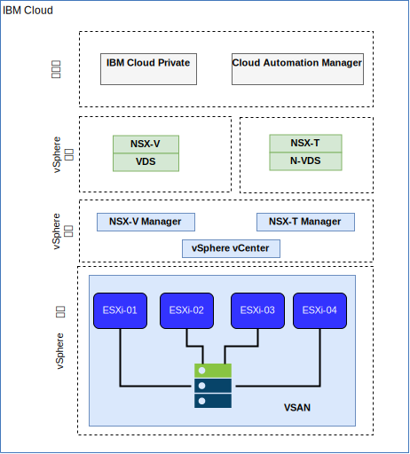

---

copyright:

  years:  2016, 2019

lastupdated: "2019-08-05"

subcollection: vmware-solutions

---

# IBM Cloud 联网和基础架构
{: #vcsicp-arch-overview-infrastructure}

## 虚拟路由和转发
{: #vcsicp-arch-overview-infrastructure-vrf}

您可以将 {{site.data.keyword.cloud}} 帐户配置为虚拟路由和转发 (VRF) 帐户，以使得子网 IP 块之间能够自动进行全局路由。具有 Direct Link 连接的所有帐户都必须转换为或创建为 VRF 帐户。

## 直接链路
{: #vcsicp-arch-overview-infrastructure-direct-link}

{{site.data.keyword.cloud_notm}} Direct Link Connect 通过本地 IBM Cloud Data Center，提供对 {{site.data.keyword.cloud_notm}} 基础架构以及其他任何与网络服务供应商相链接的云的专用访问。此选项最适合于在单个环境中创建多云连接。共享带宽拓扑用于将客户连接到 {{site.data.keyword.icpfull_notm}} 网络。与所有 Direct Link 产品一样，您也可以添加全局路由，这将使专用网络流量能够流至所有 {{site.data.keyword.cloud_notm}} 位置。

## 虚拟专用网
{: #vcsicp-arch-overview-infrastructure-vp-networks}

### strongSwan VPN
{: #vcsicp-arch-overview-infrastructure-strongswan}

strongSwan IPSec VPN 服务通过因特网提供基于业界标准因特网协议安全性 (IPSec) 协议套件的安全端到端通信信道。

### Hybridity (HCX)
{: #vcsicp-arch-overview-infrastructure-hcx}

vCenter Server on {{site.data.keyword.cloud_notm}} with Hybridity Bundle 可以将内部部署数据中心的网络无缝扩展到 {{site.data.keyword.cloud_notm}}。此过程允许虚拟机 (VM) 在不进行任何转换或更改的情况下，迁移到 {{site.data.keyword.cloud_notm}} 或从中迁移出来。

## 物理结构
{: #vcsicp-arch-overview-infrastructure-phys-struct}

将 {{site.data.keyword.icpfull_notm}} 生产实例部署到 VMware vCenter Server on {{site.data.keyword.cloud_notm}} 集群上所需的物理基础架构需要满足以下最低规范。

表 1. {{site.data.keyword.icpfull_notm}} 的 vCenter Server 规范

| NFS 部署|vSAN 部署|
:--|:----:|:----:
服务器数|3|4
CPU|28 个核心，2.2 GHz| 28 个核心，2.2 GHz
内存|384 GB |384 GB
存储器|2000 GB，2 IOPS/GB（用于管理）；2000 GB，4 IOPS/GB（用于工作负载）；4000 GB，4 IOPS/GB（用于 {{site.data.keyword.icpfull_notm}}）|最少 960 GB SSD（2个）

除了 {{site.data.keyword.icpfull_notm}} 硬件需求外，您还必须在 {{site.data.keyword.icpfull_notm}} 环境中创建持久性卷，以用于存储 Cloud Automation Manager (CAM) 数据库和日志数据。虽然 CAM 支持 {{site.data.keyword.icpfull_notm}} 所支持的全部持久性卷类型，但建议用于 CAM 的两种存储配置是 NFS 和 GlusterFS。

## 虚拟结构
{: #vcsicp-arch-overview-infrastructure-virtual-struct}

在 vCenter Server 实例中，{{site.data.keyword.icpfull_notm}} 实例部署有专用 NSX Edge 服务网关 (ESG) 和分布式逻辑路由器 (DLR)。{{site.data.keyword.icpfull_notm}} 安装将装入到先前组件中定义的 VXLAN 子网中。

ESG 配置了源 NAT (SNAT) 规则以允许出站流量，支持因特网连接以下载 {{site.data.keyword.icpfull_notm}} 必备软件，以及连接到 GitHub 和 Docker。或者，可以使用 Web 代理进行因特网连接。此外，还将 ESG 配置为能够提供对 DNS 和 NTP 服务的访问权。

ESG 还配置了目标 NAT 规则 (DNAT)，用于从 {{site.data.keyword.cloud_notm}} 10.x 网络中的 {{site.data.keyword.icpfull_notm}} 主/代理虚拟 IP 地址路由到 VXLAN 环境。
