---

copyright:

  years:  2016, 2018

lastupdated: "2018-10-30"

---

# 体系结构概述

IBM Cloud for VMware 产品提供了自动化功能，可将 VMware 技术组件部署到全球范围的 IBM Cloud 数据中心。该体系结构包含一个云区域，并支持扩展到其他地理位置中的更多云区域和/或同一数据中心内其他 IBM Cloud pod 的功能。

IBM Cloud Private (ICP) 和 Cloud Automation Manager (CAM) 产品可以手动部署到内部部署虚拟化平台中，从而支持通过内部部署位置进行云管理。或者，ICP 和 CAM 可借助自动化功能，作为服务扩展提供给现有或新的 VMware vCenter Server on IBM Cloud (VCS) 部署，从而支持通过 IBM Cloud 进行云管理。

ICP 是一种用于开发和管理内部部署容器化应用程序的应用程序平台。这是用于管理容器的集成环境，包括容器编排器 Kubernetes、专用映像存储库、管理控制台和监视框架。

IBM Multi-Cluster Manager (MCM) 在各种云和集群中提供用户可视性、以应用程序为中心的管理（策略、部署、运行状况和操作）以及基于策略的合规性。通过 MCM，您可以控制 Kubernetes 集群。您可以确保集群是安全的、在高效运行，并且交付在 ICP 上运行的服务管理平台，支持开发者和管理员满足其业务需求。Cloud Automation Manager Service Composer 支持您在 ICP 目录中公开混合云服务。

## IBM Cloud 端云管理平台

图 1. 云端的云管理

上图表示通过 IBM Cloud 基础架构部署的 ICP 和 CAM，连接到内部部署 vCenter 和 IBM Cloud 上部署的 IBM Kubernetes Services (IKS) 服务。用户能够内部部署虚拟机，也可以将虚拟机部署到 ICP 和 IKS 集群的 VCS 实例与容器中。

在该图中，CAM 在逻辑上创建与 vCenter、云提供者、ICP 和 IKS 环境的云连接。ICP 集群应该部署到每个数据中心/云环境，其中 MCM 提供将 ICP 集群连接到单个管理视图的机制。

可以使用 NSX-V 或 NSX-T 组件来部署 ICP。通过使用 NSX-V 的 ICP，支持 ICP 虚拟机在 VXLAN 网络上运行，并利用 Kubernetes Calico 内部联网。

通过使用 NSX-T 的 ICP，用户可以在中央 UI (NSX T Manager) 中控制和配置联网、子网和策略。请参阅 [vCenter Server 联网指南](../vcsnsxt/vcsnsxt-intro.html)，以了解 NSX-V 和 NSX-T 之间的差异。

## 内部部署云管理平台

图 2. 内部部署端的云管理

上图表示内部部署基础架构中部署的 ICP 和 CAM，连接到 IBM Cloud 上部署的 vCenter 和 IKS。用户能够内部部署虚拟机和容器，也可以将虚拟机部署到 IKS 集群的 vCenter Server 实例与容器中。

strongSwan VPN 用于与已部署的 IKS 容器建立连接，最终可能会将其替换为直接链路连接。

在该图中，CAM 在逻辑上创建与 vCenter、云提供者、ICP 和 IKS 环境的云连接。ICP 集群应该部署到每个数据中心/云环境，其中 MCM 提供将 ICP 集群连接到单个管理视图的机制。

### 相关链接

* [VCS Hybridity Bundle 概述](../vcs/vcs-hybridity-intro.html)
