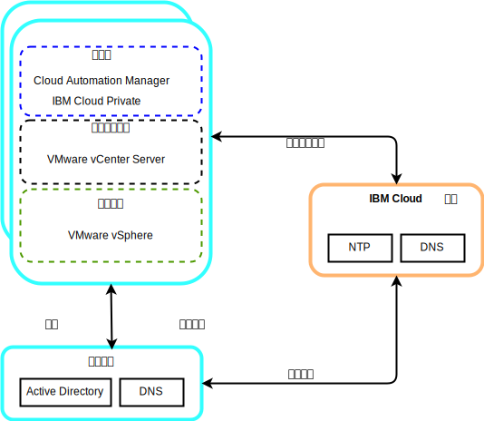
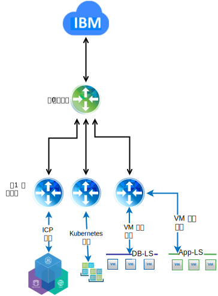

---

copyright:

  years:  2016, 2019

lastupdated: "2019-02-15"

subcollection: vmware-solutions

---

# 详细设计
{: #vcsicp-detail-design}

## 公共服务组件
{: #vcsicp-detail-design-common-services}

公共服务提供由云管理平台中其他服务使用的服务。公共服务包括身份和访问权服务、域名服务和 NTP 服务。

图 1. {{site.data.keyword.icpfull_notm}} 公共服务

### 身份和访问权服务
{: #vcsicp-detail-design-identity}

作为 VMware vCenter Server on {{site.data.keyword.cloud}} 自动化的一部分，Microsoft Active Directory (AD) 用于身份管理。部署了单个 AD 虚拟服务器实例 (VSI)。vCenter 配置为使用 AD 认证，并且可以将 {{site.data.keyword.icpfull_notm}} 配置为进行 LDAP 认证。

###	域名服务
{: #vcsicp-detail-design-dns}

vCenter Server 部署使用已部署的 AD VSI 作为实例的 DNS 服务器。所有部署的组件（例如，vCenter、PSC、NSX 和 ESXi 主机）都配置为指向作为其缺省 DNS 的 AD。

###	NTP 服务
{: #vcsicp-detail-design-ntp}

vCenter Server 部署使用 {{site.data.keyword.cloud_notm}} 基础架构 NTP 服务器。所有部署的组件均配置为使用这些 NTP 服务器。使设计中的所有组件都使用相同的 NTP 服务器对于证书和 AD 认证正常运行至关重要。

## 联网
{: #vcsicp-detail-design-networking}

### NSX-V 联网
{: #vcsicp-detail-design-nsx-v}

NSX-V 设计为使一个 NSX-V Manager 平台与一个 vCenter Server 实例相关联。它为在 vSphere 环境中运行的应用程序提供联网服务。

通过使用 VCS 部署中包含的 NSX-V 联网，我们可以将 {{site.data.keyword.icpfull_notm}} 部署到 VXLAN 覆盖网络中。

{{site.data.keyword.icpfull_notm}} 部署有 Kubernetes 的缺省 Calico 网络堆栈，用于提供集群内的网络隔离。

图 2. 使用 NSX-V 联网的 {{site.data.keyword.icpfull_notm}}

有关更多信息，请参阅 [vCenter Server 联网指南](/docs/services/vmwaresolutions/archiref/vcsnsxt?topic=vmware-solutions-vcsnsxt-intro)。

### NSX-T 联网
{: #vcsicp-detail-design-nst-t}

NSX-T 设计为使一个可以连接到任何类型应用程序（基于虚拟机或容器）的联网平台在 vSphere 环境内部或外部运行。

{{site.data.keyword.icpfull_notm}} 提供了一个选项，用于将 Calico 联网替换为 NSX-T 实例，从而提供单个位置来管理网络和安全性。

图 3. 使用 NSX-T 联网的 {{site.data.keyword.icpfull_notm}}

## 相关链接
{: #vcsicp-detail-design-related}

* [vCenter Server on {{site.data.keyword.cloud_notm}} with Hybridity Bundle 概述](/docs/services/vmwaresolutions/archiref/vcs?topic=vmware-solutions-vcs-hybridity-intro)
