---

copyright:

  years:  2016, 2018

lastupdated: "2018-11-16"

---

# 应用程序现代化概述

下图显示了 Acme Skateboards 部署的应用程序现代化参考体系结构，在此系列文档中对该体系结构进行了深入描述。

图 1. 体系结构概览图

此混合体系结构支持 Acme Skateboards 实现：
- 将 VMware 虚拟机 (VM) 从内部部署迁移到 {{site.data.keyword.cloud}}，几乎或完全没有停机时间，也无需重新配置应用程序。
- 通过允许专注于对更简单的 Web 界面和中间件进行容器化，同时允许更复杂的数据库保留为 VM，从而开始应用程序现代化之旅。
- 使用 Automation Manager (CAM) 来编写基础架构即代码 (IaC) 的脚本，以编写和编排通过 VM 和容器创建的服务，从而与其 DevOps 工具链及其 ITSM 解决方案集成。

参考体系结构具有以下关键组件：
- **内部部署虚拟化** - 内部部署虚拟化是当前托管 Acme Skateboards VM 的 VMware 集群。这些 VM 当前托管的是要进行现代化的应用程序。此集群需要满足 [VMware HCX on {{site.data.keyword.cloud_notm}} 解决方案体系结构](https://www.ibm.com/cloud/garage/files/HCX_Architecture_Design.pdf)的先决条件，才能运行 HCX。

HCX 将内部部署网络扩展到 {{site.data.keyword.cloud_notm}} 中，支持客户将 VM 迁移到在 {{site.data.keyword.cloud_notm}} 上运行的 VMware vCenter Server on {{site.data.keyword.cloud_notm}} 实例中，并支持根据需要迁移回原来的位置。
- **{{site.data.keyword.cloud_notm}} for VMware Solutions** - vCenter Server 实例提供自动部署 VMware 软件定义的数据中心 (SDDC) 解决方案所需的基本 VMware 构建块，例如 vSphere、vCenter Server、NSX-V 和存储选项（包括 vSAN 或 {{site.data.keyword.cloud_notm}} 耐久性存储器）。VMware 集群是已迁移 VM 的目标以及在 ICP 中托管的容器中某些现代化应用程序的目标。vCenter Server 中的关键组件如下：
  - **NSX-V** - NSX-V 在 vCenter 中提供网络虚拟化层，用于为 Acme Skateboards VM 提供网络覆盖。NSX-V 支持 BYOIP，并使工作负载网络与 {{site.data.keyword.cloud_notm}} 网络相隔离。NSX-V 由 HCX 编程为创建 Acme Skateboards 将从内部部署扩展的网络。
  - **NSX-T** - NSX-T 提供了一组通用工具，用于管理容器和 VM 上的网络和安全性。NSX-T 与 Kubernetes 容器联网接口 (CNI) 完全兼容，并与 CNI 集成以提供容器联网。NSX-T 提供了现代化应用程序使用的覆盖网络，并将取代由 ICP 和 IKS 本机使用的 Calico。

- **{{site.data.keyword.cloud_notm}} Private** - ICP 是用于开发和管理容器化应用程序的应用程序平台。ICP 是一个集成环境，包含容器编排器 Kubernetes、专用映像存储库、管理控制台、监视框架和图形用户界面，该界面提供了一个集中位置供 Acme Skateboards 部署、管理、监视和扩展其应用程序。vCenter Server 实例托管 ICP 组件、主节点和工作程序节点等，并将这些项作为 VM 运行。ICP 托管以下各项：
- **{{site.data.keyword.cloud_notm}} Automation Manager** - CAM 是一种企业就绪型基础架构即代码 (IaC) 平台，它提供了一个窗格，可使用模板来供应 VM 工作负载（内部部署或在 vCenter Server 上）以及 Kubernetes 工作负载（在 ICP 或 IKS 中）。CAM 是一种 Docker 容器化应用程序，在 ICP 上运行，并紧密集成以用于授权、基于角色的访问控制 (RBAC) 和其他功能。
    - 客户要部署在此环境中的容器化 Acme Skateboards 应用程序。

- **IBM Kubernetes Service** - IKS 支持 Acme Skateboards 将其现代化应用程序部署到在 Kubernetes 集群中运行的 Docker 容器中。主节点由 IBM 完全管理，而工作程序池中的工作程序节点将部署到与其 vCenter Server 实例相同的 {{site.data.keyword.cloud_notm}} 帐户中。工作程序节点可以是：裸机、公共或专用虚拟服务器实例。Calico 将在 IKS 中自动安装和配置。Calico 为容器提供安全网络连接，在 IKS 中配置为对在子网之间传输的包使用 IP-in-IP 封装，并将 NAT 用于容器的传出连接。

- **Direct Link** - {{site.data.keyword.cloud_notm}} Direct Link 使用 Acme Skateboards 的 WAN 提供者将其数据中心连接到 {{site.data.keyword.cloud_notm}}，以提供可靠、安全、等待时间短的网络连接。此连接提供：
  - 企业用户对云托管的应用程序的访问。
  - 内部部署 VM 与云 VM 之间的 VM 间流量。
  - 内部部署数据中心内的遗留系统与云 VM 之间的流量。

## Acme Skateboards 的主要优点

vCenter Server 提供了灵活设计最适合客户工作负载的 VMware 软件定义的数据中心 (SDDC) 解决方案所需的基本构建块，包括 VMware vSphere、vCenter Server、NSX 和共享存储选项（包括 vSAN）。

总之，{{site.data.keyword.cloud_notm}} for VMware 产品的优点如下：
* 通过将采购资源、构建资源体系结构、实施和部署资源所需的时间从数周甚至数月缩短到数小时，加速向开发者和业务线交付 IT 项目。
* 通过托管的私有云中的专用裸机服务器来增强安全性，包括将专用端点部署到 {{site.data.keyword.cloud_notm}} 服务（包括 IKS 和 KMIP）。
* 通过提供对虚拟化管理的全面管理访问权，支持对部署的混合云进行一致管理和监管。通过管理，可保护现有 VMware 工具、脚本和训练投资。
* 通过遍布全球 30 多家 {{site.data.keyword.CloudDataCents_notm}} 的 IBM 专业和受管服务来利用全球范围的 VMware 专业知识。

{{site.data.keyword.cloud_notm}} Kubernetes Service (IKS) 是一种受管 Kubernetes 产品，可交付强大的管理工具、直观的用户体验、内置安全性和隔离性，从而支持在使用云服务（包括 Watson 的认知功能）的同时快速交付应用程序。IBM 是 Cloud Native Computing Foundation (CNCF) 铂金成员，我们的产品符合 CNCF Kubernetes 一致性测试计划。

IKS 提供了多种本机 Kubernetes 功能，例如：

-   智能安排：通过以确保 CPU 密集型和 RAM 密集型 pod 并置的方式来部署应用程序，从而最大限度地利用底层集群资源。
-   自我复原：用于容器化应用程序和微服务，确保在发生某种错误时自动重新部署这些组件。
-   水平扩展：支持配置部署策略，编排器可使用部署策略来确保工作负载具有必需的容量。
-   服务发现和负载均衡：在 Kubernetes 集群内提供轻量级 DNS，允许服务注册自身，并且无需对微服务进行静态编码。负载均衡用于将入局请求分配到在体系结构中运行的多个实例上。
-   自动应用和回滚：支持团队以受控方式部署新功能和修订。如果出现问题，可以自动回滚到先前已知良好版本的映像。
-   私钥和配置管理。私钥是 Kubernetes 内的一个对象，用于存储敏感数据，例如密码、令牌或密钥。缺省情况下，这些私钥已加密，可确保控制对这些敏感数据的访问。

向云本机应用程序平台（如 ICP 和 IKS）迁移的客户可专注于速度和创新，而不必时刻关注安全性和联网。等待联网或安全团队供应负载均衡器、防火墙、交换机和路由器等服务可缩短应用程序的价值实现时间。此参考体系结构显示了 vCenter Server、ICP 和 IKS 如何在应用程序现代化的旅程中安全地迁移 Acme Skateboards。

### 相关链接

* [vCenter Server on {{site.data.keyword.cloud_notm}} with Hybridity Bundle 概述](../vcs/vcs-hybridity-intro.html)
