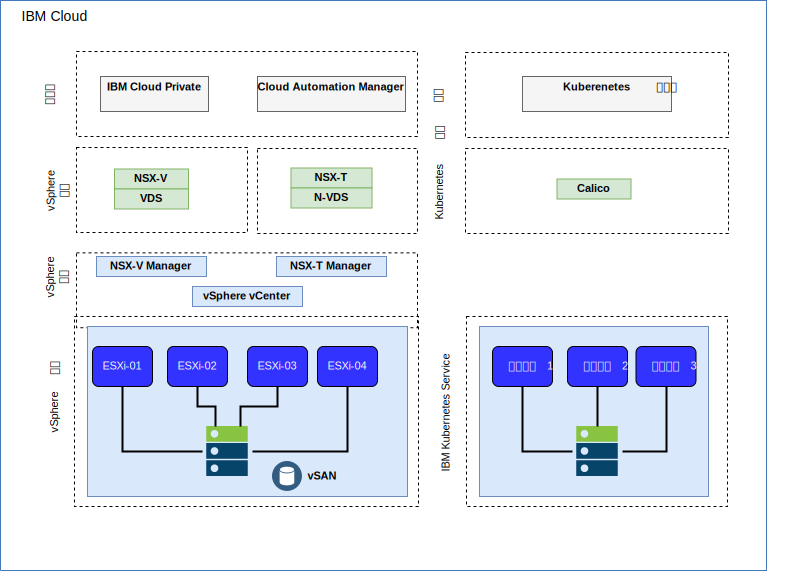
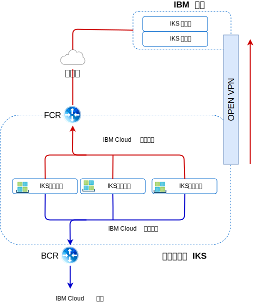

---

copyright:

  years:  2016, 2018

lastupdated: "2018-11-16"

---

# IBM Cloud 联网和基础架构

## 虚拟路由和转发 (VRF)
{{site.data.keyword.cloud}} 帐户还可以配置为 VRF 帐户。VRF 帐户提供了与 VLAN 生成类似的功能，支持子网 IP 块之间的自动路由。具有“直接链路”连接的所有帐户都必须转换为或创建为 VRF 帐户。

## 直接链路
{{site.data.keyword.cloud_notm}} Direct Link Connect 通过本地 IBM Cloud {{site.data.keyword.CloudDataCent_notm}}，提供对 {{site.data.keyword.cloud_notm}} 基础架构以及其他任何与网络服务供应商相链接的云的专用访问。此选项最适合于在单个环境中创建多云连接。我们使用共享带宽拓扑将客户连接到 {{site.data.keyword.cloud_notm}} Private 网络。与所有直接链路产品一样，您也可以添加全局路由，这将使专用网络流量能够流至所有 {{site.data.keyword.cloud_notm}} 位置。

## 虚拟专用网

### strongSwan VPN
strongSwan IPSec VPN 服务通过因特网提供基于业界标准因特网协议安全性 (IPSec) 协议套件的安全端到端通信信道。

### Hybridity (HCX)
VMware vCenter Server on {{site.data.keyword.cloud_notm}} with Hybridity Bundle 可以将内部部署数据中心的网络无缝扩展到 {{site.data.keyword.cloud_notm}}，这允许虚拟机 (VM) 在不进行任何转换或更改的情况下，迁移到 {{site.data.keyword.cloud_notm}} 或从中迁移出来。

## 物理结构

部署 vCenter Server 集群所需的物理基础架构需要满足以下最低规范。

表 1. vCenter Server 规范

  | NFS 部署|VSAN 部署
---|---|---
服务器数|3|4
CPU|28 个核心，2.2 GHZ|28 个核心，2.2 GHZ
内存|384 GB |384 GB
存储器|管理：2 TB 2 IOPS；工作负载：2 TB 4 IOPS|最小 SSD：960 GB（2 个）   

IKS 部署选项因您的工作程序节点需求而有所不同。

表 2. IKS 规范

  | 虚拟机|裸机
--|---|--
服务器数|3|3
CPU|2 - 56 个核心|4 - 28 个核心
内存|4 GB - 242 GB|32 GB - 512 GB
存储器|100 GB|SATA：2 TB / SSD：960 GB

## 虚拟结构

图 1. IKS 和 ICP 部署的物理结构

在 vCenter Server 实例中，客户 VMS 会部署到专用 NSX Edge 服务网关 (ESG) 和分布式逻辑路由器 (DLR)。

ESG 配置了 SNAT 以允许出站流量，支持因特网连接以下载 ICP 必备软件，以及连接到 GitHub 和 Docker，或者也可以使用 Web 代理来提供因特网连接。ESG 配置为通过专用网络来访问 DNS 和 NTP 服务。通过 vCenter Server 实例和 IKS 之间的 {{site.data.keyword.cloud_notm}} 联网，可以集成到 IKS 实例。

## vCenter Server 组件

图 2. vCenter Server 平台组件

### Platform Service Controller
vCenter Server 部署使用单个外部 Platform Services Controller (PSC)，后者安装在与管理 VM 关联的专用 VLAN 中的可移植子网上。其缺省网关设置为后端客户路由器 (BCR)。

### vCenter Server
与 PSC 类似，vCenter Server 也会部署为设备。此外，vCenter 还将安装在与管理 VM 关联的专用 VLAN 中的可移植子网上。其缺省网关设置为 BCR。

### NSX
Manager
NSX Manager 部署在初始 vCenter Server 集群上。此外，将从指定用于管理组件的专用可移植地址块中为 NSX Manager 分配 IP 地址。

### NSX
Controller
{{site.data.keyword.cloud_notm}} 自动化会在初始集群中部署三个 NSX Controller。将从指定用于管理组件的专用可移植子网中为控制器分配 IP 地址。

### NSX ESG / DLR
将部署 NSX Edge 服务网关 (ESG) 对。在所有情况下，都会使用一个网关对来处理位于专用网络中的自动化组件的出站流量。对于 vCenter Server 和 ICP，将部署另一个网关（称为 ICP 管理的 Edge），并将其配置为使用上行链路连接到公用网络，还会配置一个分配给专用网络的接口。管理员可以配置任何必需的 NSX 组件，例如分布式逻辑路由器 (DLR)、逻辑交换机和防火墙。有关作为解决方案的一部分部署的 NSX Edge 的更多信息，请参阅 [vCenter Server 联网指南](../vcsnsxt/vcsnsxt-intro.html)。

以下各表总结了 ICP ESG / DLR 规范。

表 3. ICP ESG 规范

属性|规范
--|--
Edge 服务网关|虚拟设备
Edge 大小 - 大型|2 个 vCPU
内存|1 GB
磁盘|本地数据存储上 1000 GB

表 4. ICP DLR 规范

属性|规范
--|--|
分布式逻辑路由器|	虚拟设备
Edge 大小 - 精简|1 个 vCPU
内存|512 MB
磁盘|本地数据存储上 1000 GB

## IKS 组件

图 3. IKS 组件

### Kubernetes 主节点

Kubernetes 主节点的任务是管理集群中的所有计算、网络和存储资源。Kubernetes 主节点可确保将容器化应用程序和服务均等部署到集群中的工作程序节点。

###	工作程序节点
每个工作程序节点都是一个物理机器（裸机）或在云环境中的物理硬件上运行的 VM。在供应工作程序节点时，您应确定可供在该工作程序节点上托管的容器使用的资源。工作程序节点现成设置为使用 IBM 管理的 Docker 引擎、不同的计算资源、联网和卷服务。内置安全功能提供了隔离、资源管理功能和工作节点安全合规性。

### 相关链接

* [vCenter Server on {{site.data.keyword.cloud_notm}} with Hybridity Bundle 概述](../vcs/vcs-hybridity-intro.html)
